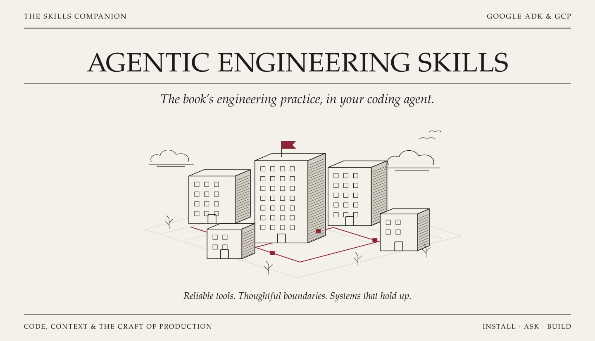
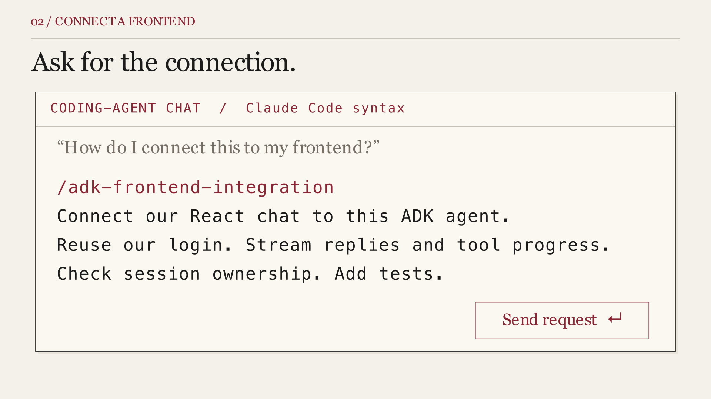

<p align="center">
  
</p>

<p align="center">
  <a href="#watch-the-walkthrough">Watch the walkthrough</a> ·
  <a href="#getting-started">Getting started</a> ·
  <a href="#the-skills">The skills</a> ·
  <a href="#using-skills-together">Using skills together</a> ·
  <a href="#compatibility--checks">What has been tested</a> ·
  <a href="#about-the-book">About the book</a>
</p>

# Agentic Engineering Skills

<p>
  <sub>
    <a href="https://github.com/google/adk-python">Google ADK</a> ·
    <a href="https://cloud.google.com/">Google Cloud</a> ·
    <a href="https://agentskills.io/">Agent Skills</a> ·
    <a href="LICENSE">MIT licensed</a>
  </sub>
</p>

Practical skills for building agent applications with Google's **Agent
Development Kit (ADK)** and **Google Cloud Platform (GCP)**. They accompany
**Agentic Engineering: Building Production-Grade Multi-Agent Systems with
Google ADK on GCP** by Ruslan Khissamiyev.

A **skill** is a folder of instructions, references and, where useful, helper
scripts that your coding agent can read while working on your project. These
skills help it apply the book's engineering practices to your own application:
handle failed tool calls, add memory, connect a browser interface, test agent
behaviour, or prepare a deployment.

Start with **adk-engineer** and describe the change you need. It selects the
relevant specialist and follows its workflow through the requested work.
If you already know the topic, you can call a specialist directly.

You do not need the book or its example repository to use the skills. Install
them in the project you want to work on. They guide your **coding agent**;
your application's ADK agents do not load them automatically.

<p align="center">
  
</p>

## Watch the Walkthrough

*Install. Ask. Review. · 2 minutes 20 seconds.*

Already have an ADK agent? See how to install the skills, ask for a streaming
frontend, and add a remembered language preference. This animated worked example
is backed by [runnable local code and checks](docs/video/skills-walkthrough/demo/README.md).

[](docs/video/skills-walkthrough/assets/walkthrough.mp4)

**[Watch or download the video — 2:20, MP4](docs/video/skills-walkthrough/assets/walkthrough.mp4)**

Music: “just turn it on and make something.” by
[hijaq.](https://hijaqmusic.bandcamp.com/track/just-turn-it-on-and-make-something),
used under the artist's published free-use permission.
[Full music credits](docs/video/skills-walkthrough/publishing.md#music-credits).

<p align="center">
  
</p>

## Getting Started

*Install the toolkit, open your project, and ask for a useful change.*

### 1. Install the skills

You need a coding agent that supports skills, Git, and Node.js **22.20 or later**
with npm, which provides `npx`. This is the current requirement of the
[Skills CLI](https://github.com/vercel-labs/skills/blob/main/package.json).
The installer downloads the skill files; it does not require Google Cloud
credentials or install ADK into your application.

From your application's project directory, run:

```bash
npx skills@latest add RuslanKhis/agentic-engineering-skills --skill '*'
```

Choose your coding agent when prompted. This installs **all twelve skills**
for the current project: `adk-engineer` and the eleven specialists it uses.
Keep the quotes around `'*'` so your shell passes it unchanged.

**Choosing a Google client?** Use Antigravity for Google consumer accounts.
Since 18 June 2026, Gemini CLI no longer serves Code Assist for individuals,
Google AI Pro or Google AI Ultra through Google sign-in. Gemini CLI remains
available through Code Assist Standard/Enterprise and supported paid API-key
routes. See the [Google setup guide](docs/integrations/google-coding-agents.md),
[Google's account guidance](https://developers.google.com/gemini-code-assist/docs/deprecations/code-assist-individuals)
and [supported Gemini CLI access](https://developers.googleblog.com/en/an-important-update-transitioning-gemini-cli-to-antigravity-cli/).

<details>
<summary>Choose a client explicitly, install globally, or select one specialist</summary>

To select a particular coding agent, use one of these project commands:

```bash
# Claude Code
npx skills@latest add RuslanKhis/agentic-engineering-skills --skill '*' -a claude-code

# Codex
npx skills@latest add RuslanKhis/agentic-engineering-skills --skill '*' -a codex

# Google Antigravity app or IDE
npx skills@latest add RuslanKhis/agentic-engineering-skills --skill '*' -a antigravity

# Google Antigravity CLI (agy)
npx skills@latest add RuslanKhis/agentic-engineering-skills --skill '*' -a antigravity-cli

# Gemini CLI with supported Standard/Enterprise or paid API-key access
npx skills@latest add RuslanKhis/agentic-engineering-skills --skill '*' -a gemini-cli
```

For Claude Code, Codex or Gemini CLI, add `-g` to install for your user account
across projects. For example:

```bash
npx skills@latest add RuslanKhis/agentic-engineering-skills --skill '*' -a codex -g
```

Antigravity's app, IDE and CLI document different global directories. Use the
project commands above or follow the [global directory guidance](docs/integrations/google-coding-agents.md#installation-scope)
for your client; the tested Skills CLI's `-g` destination differs from those paths.

If you already know the topic, install that specialist on its own:

```bash
npx skills@latest add RuslanKhis/agentic-engineering-skills --skill adk-memory-architecture
```

Each specialist includes its own references and helpers. Installing only
`adk-engineer` does not give you the specialists it needs to carry out the work.

To see the available skills without installing them:

```bash
npx skills@latest add RuslanKhis/agentic-engineering-skills --list
```

Leave out `--skill` for interactive skill selection. Other supported coding
agents can be selected in the installer; their invocation interface may differ.

</details>

### 2. Open your coding agent

Open your project after installation. If the coding agent was already running
and the new skills do not appear, restart its session. Type skill requests
**in the coding agent's chat**:

| Coding agent | Start with | Choose a specialist directly |
| --- | --- | --- |
| Claude Code | `/adk-engineer` | `/adk-memory-architecture` |
| Codex | `$adk-engineer` | `$adk-memory-architecture` |
| Antigravity app / IDE / CLI | `Use the adk-engineer skill to…` | `Use the adk-memory-architecture skill to…` |
| Gemini CLI, with supported access | `Use the adk-engineer skill to…` | `Use the adk-memory-architecture skill to…` |

<details>
<summary>How skill activation differs between clients</summary>

Claude Code supports `/name` for installed skills; Codex supports explicit
skill mentions using `$name`. See the respective
[Claude Code](https://code.claude.com/docs/en/skills) and
[Codex](https://developers.openai.com/codex/skills/) documentation.

Gemini CLI activates skills in response to the request; use `/skills list` to
check discovery and `/skills reload` after changes. Installing these skills
does not create `/adk-engineer` as a Gemini CLI command. Antigravity 2.0 and its
CLI also support named skill commands such as `/adk-engineer`; mentioning the
skill by name works across its app, IDE and CLI interfaces. Follow any
activation prompt the client shows.
[Gemini skill usage](https://geminicli.com/docs/cli/using-agent-skills/),
[Antigravity invocation](https://www.antigravity.google/docs/migration/workflows-to-skills/).

No separate setup command is needed for this toolkit. The skills inspect the
project's existing code and configuration when they run. Their descriptions also
allow a supporting coding agent to select them from a natural-language request;
an explicit command makes your intended skill clear.

</details>

### 3. Ask for a useful change

For example, in Claude Code:

```text
/adk-engineer Add memory so this support agent can remember a user's
preferred language between sessions. Keep our existing database and
include a way for the user to forget the preference.
```

In Codex, replace `/adk-engineer` with `$adk-engineer`. In Antigravity or
Gemini CLI, start with “Use the adk-engineer skill to” and keep the request.

The entry skill selects `adk-memory-architecture`, inspects how your application
identifies users and stores state, and chooses an appropriate design. For
implementation work, expect a project change, relevant checks and a clear account
of what remains unverified. For a design question, ask for a design.

Find **three practical examples for every skill** in the contents below.
For installation problems or later changes, see
[updating and troubleshooting](#updating-and-troubleshooting).

<p align="center">
  
</p>

## The Skills

*The contents · One entry point and eleven independently usable specialists.*

Choose a skill by the problem you need to solve. Each entry below explains
when it helps, what to ask for, and the command that selects it. The numbers
follow Chapters 0–10 of the book; no chapter reading is required.

| What you need | Skill |
| --- | --- |
| Help choosing an approach or combining concerns | [adk-engineer](#adk-engineer) |
| Sequential steps, parallel work or bounded loops | [adk-workflow-design](#adk-workflow-design) |
| Reliable API calls and protection against duplicate actions | [safe-api-tool-calls](#safe-api-tool-calls) |
| Usage limits, repeated-tool protection or human approval | [adk-operational-guardrails](#adk-operational-guardrails) |
| A hosting choice or deployment preparation | [deploy-adk-on-google-cloud](#deploy-adk-on-google-cloud) |
| Faster replies and lower model usage | [optimise-adk-on-google-cloud](#optimise-adk-on-google-cloud) |
| A browser interface, streaming or tool progress | [adk-frontend-integration](#adk-frontend-integration) |
| Conversation history, memory or document retrieval | [adk-memory-architecture](#adk-memory-architecture) |
| Repeatable tests and trustworthy evaluation results | [adk-agent-evaluation](#adk-agent-evaluation) |
| Sensitive-data controls across prompts, tools and replies | [protect-adk-sensitive-data](#protect-adk-sensitive-data) |
| Tool identity, credentials or per-user OAuth | [adk-tool-auth-and-secrets](#adk-tool-auth-and-secrets) |
| Controlled natural-language analytics and SQL execution | [adk-sql-agent-engineering](#adk-sql-agent-engineering) |

**Copy any example into your coding agent's chat.** Examples use Claude Code's
`/` prefix. In Codex, replace only the leading `/` with `$`; keep the skill name
and request the same. In Gemini CLI or an Antigravity IDE integration, replace
`/skill-name` with “Use the skill-name skill to” and keep the request.
Antigravity 2.0 and its CLI also support the slash form. Adapt the scenario to your project.

### [adk-engineer](skills/adk-engineer/SKILL.md)

*Start here · Choose the right specialist.*

Use this when you can describe the outcome but are unsure which skill fits.
It inspects your project, selects the relevant installed specialist, and follows
that skill through the requested explanation, design, code change or review.
It can combine specialists when a change crosses several concerns, and loads
their instructions as needed.

**Invoke:** Claude Code `/adk-engineer` · Codex `$adk-engineer`

Gemini CLI / Antigravity: “Use the adk-engineer skill to…”

<details>
<summary>Three practical examples</summary>

```text
/adk-engineer Add memory so our support agent remembers a user's preferred
language between conversations. Use our existing database and let users
change or forget the preference.
```

```text
/adk-engineer Our agent sometimes issues a refund twice after a timeout.
Trace the tool call, fix the cause and add a regression test.
```

```text
/adk-engineer We have a working Python ADK agent and an existing React app.
Plan how to connect them with streamed replies and private user sessions.
Identify the code and tests we will need.
```

</details>

### I. Foundations & safeguards

*Give the system a structure, then give it boundaries.*

#### [adk-workflow-design](skills/adk-workflow-design/SKILL.md)

*00 · Arrange the work and make sure it finishes.*

Use this to decide which steps run in order, which can run together, and when
a refinement loop should stop. It helps implement or repair the handoffs
between agents, shared state and final results. Ask for a workflow design,
a focused code change, or tests that show each step produces the required output.

**Invoke:** Claude Code `/adk-workflow-design` · Codex `$adk-workflow-design`

Gemini CLI / Antigravity: “Use the adk-workflow-design skill to…”

<details>
<summary>Three practical examples</summary>

```text
/adk-workflow-design Build a workflow that researches a topic, drafts an
answer, then checks it. Pass each step's result to the next and test what
happens when the research step fails.
```

```text
/adk-workflow-design Our agent fetches a customer's orders and support
tickets one after the other. Run these independent lookups in parallel,
then combine both results without losing either one.
```

```text
/adk-workflow-design Our writer and reviewer keep revising forever.
Limit them to three revision rounds and return an explicit result when
the reviewer still rejects the draft.
```

</details>

#### [safe-api-tool-calls](skills/safe-api-tool-calls/SKILL.md)

*01 · Handle unreliable APIs without repeating an action by accident.*

Use this when a tool calls an external service that can fail, hang or return
an unclear result. It helps add selective retries, time limits and protection
against duplicate writes where the provider supports it. The result should
include tests for failures and an honest response when an action's outcome
cannot yet be confirmed.

**Invoke:** Claude Code `/safe-api-tool-calls` · Codex `$safe-api-tool-calls`

Gemini CLI / Antigravity: “Use the safe-api-tool-calls skill to…”

<details>
<summary>Three practical examples</summary>

```text
/safe-api-tool-calls Our order lookup fails on occasional 429 and 503
responses. Add retries for recoverable failures, respect Retry-After,
and keep the complete lookup within a five-second budget.
```

```text
/safe-api-tool-calls This refund tool retries after a timeout and can
refund twice. Inspect the provider's duplicate-request guarantees and
fix the tool to preserve one logical refund across supported retries.
```

```text
/safe-api-tool-calls The booking API may accept a reservation before our
connection drops. Add an uncertain-result path and a status check so
the agent does not blindly submit another booking.
```

</details>

#### [adk-operational-guardrails](skills/adk-operational-guardrails/SKILL.md)

*02 · Put limits and approval checks around agent actions.*

Use this when an agent repeats tools, consumes too much model usage, runs too
long, or needs a person to approve an action. It helps put enforcement in the
application code that actually runs the work, with tests showing that blocked
actions never execute. It also helps design usage accounting across turns
and application controls for reducing spend.

**Invoke:** Claude Code `/adk-operational-guardrails` · Codex `$adk-operational-guardrails`

Gemini CLI / Antigravity: “Use the adk-operational-guardrails skill to…”

<details>
<summary>Three practical examples</summary>

```text
/adk-operational-guardrails Our agent keeps calling the same failing tool.
Stop repeated calls with identical arguments, cap model calls at ten per
request, and test that blocked calls never reach the tool.
```

```text
/adk-operational-guardrails Add a token allowance that accumulates across
a user's conversation. Refuse further model work when it is exhausted
and return a clear message without another model call.
```

```text
/adk-operational-guardrails Require human approval before the agent
cancels an order. Bind approval to that specific cancellation and test
rejection, repeated approval and attempted execution before approval.
```

</details>

### II. From runtime to interface

*Find a home for the agent, refine its performance, and open the conversation.*

#### [deploy-adk-on-google-cloud](skills/deploy-adk-on-google-cloud/SKILL.md)

*03 · Choose a host and prepare the files needed to run there.*

Use this to compare Cloud Run, managed Agent Runtime and Google Kubernetes
Engine (GKE), or adapt an existing project for your chosen host. It helps
prepare packaging, runtime identity, configuration, health checks and
verification steps. You can request a recommendation or locally checked
deployment files before doing any cloud deployment.

**Invoke:** Claude Code `/deploy-adk-on-google-cloud` · Codex `$deploy-adk-on-google-cloud`

Gemini CLI / Antigravity: “Use the deploy-adk-on-google-cloud skill to…”

<details>
<summary>Three practical examples</summary>

```text
/deploy-adk-on-google-cloud We have an ADK agent behind a custom FastAPI
service and no Kubernetes platform. Compare Cloud Run and Agent Runtime
for our project and recommend a host with a concrete deployment plan.
```

```text
/deploy-adk-on-google-cloud Prepare this existing API for Cloud Run.
Add the container configuration, a health check and a deployment runbook.
Validate locally and leave cloud deployment for later.
```

```text
/deploy-adk-on-google-cloud Review our agent's GKE manifests. Check the
runtime identity, startup and readiness probes, configuration and session
storage. Report specific changes with verification steps.
```

</details>

#### [optimise-adk-on-google-cloud](skills/optimise-adk-on-google-cloud/SKILL.md)

*04 · Find where time and model usage go before changing the system.*

Use this for slow replies, growing token usage, startup delays or problems
under concurrent load. It traces the request through tools, model calls,
session storage and hosting, then targets a measured bottleneck. Expect a
focused improvement with a comparison plan, or instrumentation and hypotheses
when the project has no measurements yet.

**Invoke:** Claude Code `/optimise-adk-on-google-cloud` · Codex `$optimise-adk-on-google-cloud`

Gemini CLI / Antigravity: “Use the optimise-adk-on-google-cloud skill to…”

<details>
<summary>Three practical examples</summary>

```text
/optimise-adk-on-google-cloud Our replies take about twelve seconds.
Add timing around model calls, tools and session storage so we can locate
the delay, and show how to compare requests consistently.
```

```text
/optimise-adk-on-google-cloud Token usage grows on every turn because we
keep passing full tool results and conversation history. Inspect what
the model needs, reduce avoidable context and test answer completeness.
```

```text
/optimise-adk-on-google-cloud This Cloud Run service is slow on the first
request and under concurrent load. Review our startup path, configuration
and supplied traces, then propose changes with a measurement plan.
```

</details>

#### [adk-frontend-integration](skills/adk-frontend-integration/SKILL.md)

*05 · Connect the agent to the person using it.*

Use this to connect an existing browser interface to an ADK agent through a
JSON API or a streaming interface using AG-UI and CopilotKit. It helps define
requests and responses, connect conversations to authenticated users, and
display text, tool progress and failures correctly. Ask for a working
integration, an interface design, or a repair to the conversation flow.

**Invoke:** Claude Code `/adk-frontend-integration` · Codex `$adk-frontend-integration`

Gemini CLI / Antigravity: “Use the adk-frontend-integration skill to…”

<details>
<summary>Three practical examples</summary>

```text
/adk-frontend-integration Connect our existing React chat to this ADK
agent through a JSON API. Reuse our login system and ensure users can
only create and continue their own conversations.
```

```text
/adk-frontend-integration Add streaming replies and tool-progress cards
to our existing CopilotKit interface using AG-UI. Check our pinned
versions and test one complete request through the browser.
```

```text
/adk-frontend-integration Our chat shows duplicate text when a final
answer arrives, and errors after partial text look like success.
Fix both cases and add tests for the actual event sequence.
```

</details>

### III. Memory, evidence & care

*Decide what the system knows, how to test it, and what it must protect.*

#### [adk-memory-architecture](skills/adk-memory-architecture/SKILL.md)

*06 · Remember the right information for the right person.*

Use this when an agent needs to continue a conversation, remember facts across
sessions, answer from approved documents, or look up structured history. It
helps choose the right store and connect it to the agent, with explicit rules
for who can read the data, how long it stays and how it is forgotten. Exact
settings, such as a preferred language, may belong in an ordinary profile record.

**Invoke:** Claude Code `/adk-memory-architecture` · Codex `$adk-memory-architecture`

Gemini CLI / Antigravity: “Use the adk-memory-architecture skill to…”

<details>
<summary>Three practical examples</summary>

```text
/adk-memory-architecture Let users resume a conversation after the
server restarts. Use our existing database, enforce conversation
ownership and test that one user cannot load another user's history.
```

```text
/adk-memory-architecture Help our agent answer questions from approved
company manuals. Design document retrieval with source references,
document-version controls and access checks for each user.
```

```text
/adk-memory-architecture Add opt-in memory for low-risk facts users
share across sessions. Include correction, expiry and a forget action,
with offline tests for consent denial and cross-user access.
```

</details>

#### [adk-agent-evaluation](skills/adk-agent-evaluation/SKILL.md)

*07 · Test what the agent does as well as what it says.*

Use this to catch regressions in tool selection, arguments, action order,
stored effects and final answers. It helps write repeatable tests with a
scripted model, prepare evaluation cases for a real model, or audit a report
whose passing scores may hide missing checks. The output is a test strategy,
executable tests, evaluation assets or evidence-backed findings.

**Invoke:** Claude Code `/adk-agent-evaluation` · Codex `$adk-agent-evaluation`

Gemini CLI / Antigravity: “Use the adk-agent-evaluation skill to…”

<details>
<summary>Three practical examples</summary>

```text
/adk-agent-evaluation Add deterministic tests through our ADK runner
that force an invalid refund request. Assert that the refund tool
rejects it and no money-changing operation reaches the backend.
```

```text
/adk-agent-evaluation Create evaluation cases for a support agent that
must look up an order before cancelling it. Cover missing details,
refusal and successful cancellation. Validate the files offline.
```

```text
/adk-agent-evaluation Our evaluation report says every case passed,
but some tool failures were ignored. Audit the result files for missing
cases, failed actions and answers that falsely claim success.
```

</details>

#### [protect-adk-sensitive-data](skills/protect-adk-sensitive-data/SKILL.md)

*08 · Control what sensitive information reaches each part of the system.*

Use this when personal information or credentials could enter prompts, tools,
conversation history, logs or public replies. It helps implement or review
screening and data-handling rules, including Google Sensitive Data Protection
and Model Armor integrations. Ask for a traced data flow, a focused code
change and tests showing what happens when screening rejects data or fails.

**Invoke:** Claude Code `/protect-adk-sensitive-data` · Codex `$protect-adk-sensitive-data`

Gemini CLI / Antigravity: “Use the protect-adk-sensitive-data skill to…”

<details>
<summary>Three practical examples</summary>

```text
/protect-adk-sensitive-data Add a Sensitive Data Protection boundary
that replaces email addresses and rejects credentials before text is
saved or sent to the model. Test failures with a fake screening client.
```

```text
/protect-adk-sensitive-data Review this agent for customer data leaking
through tool results, session history, logs or traces. Map each path
and recommend specific fixes with regression cases.
```

```text
/protect-adk-sensitive-data Our API streams answers before screening
finishes. Buffer the answer, apply the configured Model Armor checks,
and test that blocked or uninspectable content is never released.
```

</details>

### IV. Trust in practice

*Secure the boundaries and work through a case study.*

#### [adk-tool-auth-and-secrets](skills/adk-tool-auth-and-secrets/SKILL.md)

*09 · Give each tool the right identity and keep credentials out of the conversation.*

Use this when tools need private Google Cloud access, an application secret,
or permission to act through a user's connected account. It helps separate
the authenticated user from the service's credentials, enforce access in
trusted code, and handle OAuth connection, refresh and disconnect flows.
Expect an implementation or review with tests for user isolation and
credential exposure.

**Invoke:** Claude Code `/adk-tool-auth-and-secrets` · Codex `$adk-tool-auth-and-secrets`

Gemini CLI / Antigravity: “Use the adk-tool-auth-and-secrets skill to…”

<details>
<summary>Three practical examples</summary>

```text
/adk-tool-auth-and-secrets Our tool loads a service-account key file.
Adapt it for keyless Google Cloud credentials and document the narrow
runtime permissions it needs. Keep IAM changes as a reviewable plan.
```

```text
/adk-tool-auth-and-secrets Move our third-party API key out of agent
state and load it from Secret Manager in trusted code. Test that tool
results, errors and session events do not expose the key.
```

```text
/adk-tool-auth-and-secrets Add a per-user OAuth connection for our
calendar tool, including refresh and disconnect. Test locally that
one user's session cannot select or use another user's credentials.
```

</details>

#### [adk-sql-agent-engineering](skills/adk-sql-agent-engineering/SKILL.md)

*10 · Turn business questions into controlled, read-only analytics.*

Use this to build or improve an agent that answers questions from a database.
It helps route familiar questions to reviewed SQL templates, give the model
only relevant authorised schema information, and check proposed queries in
application code before execution. Expect a small working query path, tests
for correct answers and rejected queries, or an architecture review.

**Invoke:** Claude Code `/adk-sql-agent-engineering` · Codex `$adk-sql-agent-engineering`

Gemini CLI / Antigravity: “Use the adk-sql-agent-engineering skill to…”

<details>
<summary>Three practical examples</summary>

```text
/adk-sql-agent-engineering Add a path for "What were monthly sales last
quarter?" using our approved revenue definition and a parameterised SQL
template. Test the totals and reject unsupported filters.
```

```text
/adk-sql-agent-engineering Our agent sends all 500 table schemas to the
model for every question. Retrieve only relevant authorised schemas
and test that unrelated or forbidden tables never enter its context.
```

```text
/adk-sql-agent-engineering Review our generated-query execution path.
Enforce read-only queries, allowed tables and resource limits in code,
and add tests proving rejected queries never reach the database.
```

</details>

<p align="center">
  
</p>

## Using Skills Together

*Bring complementary instructions to the same task.*

Both collections below are optional. Install them in the same project or user
scope, then name the skills you want your coding agent to combine.

### Using These with Google's Agents CLI

*Bring the project tools and the application design to the same task.*

[Google's Agents CLI](https://github.com/google/agents-cli) supplies commands,
project templates and seven skills for scaffolding, writing ADK code, evaluating,
deploying, publishing and observing agents. Its recipes also cover capabilities
such as memory, tool approval and credentials. This toolkit adds detailed
guidance for adapting those capabilities to your application's data, tools,
identity boundaries and tests. Agents CLI runs alongside the coding client
you use to work on the application.

Use Google's workflow when you want an Agents CLI project. Bring in an Agentic
Engineering specialist for the particular feature or engineering decision:

| Work you are doing | Agents CLI contributes | This toolkit contributes |
| --- | --- | --- |
| Add memory to a generated agent | Project conventions, ADK APIs and reference recipes | Choosing what to store, user isolation, consent and forgetting |
| Evaluate a tool that changes data | Dataset and metric formats, trace generation and grading commands | Deterministic checks of actual effects, coverage and result auditing |
| Prepare and operate a deployment | Generated infrastructure, deployment commands and telemetry integrations | Hosting and identity decisions, recovery, performance analysis and sensitive-data controls |
| Publish to Gemini Enterprise | Registration commands and platform-specific guidance | Relevant application authentication and data-boundary review |

To install Google's skills alongside these in a Claude Code project:

```bash
npx skills@latest add google/agents-cli --skill '*' -a claude-code
```

For Codex, use `-a codex`; for Google's coding agents, use `-a gemini-cli`,
`-a antigravity` or `-a antigravity-cli` in the same project scope.
This installs Google's skill files; using its platform
commands also requires the Agents CLI executable. See the
[combined setup guide](docs/integrations/agents-cli.md#install-them-together)
for the CLI installation and scope choices. Reload your coding-agent session
after installation.

For an existing Agents CLI project, try:

```text
/adk-engineer Add a remembered response-language preference to this
Agents CLI project. Use the installed google-agents-cli-adk-code skill
for its APIs and recipes, and adk-memory-architecture for storage,
consent, user isolation and forgetting. Preserve the generated project
structure and dependency pins. Implement and run offline tests;
prepare a separate plan for live evaluation.
```

In Codex, start with `$adk-engineer`. Use one entry command and name the other
installed skills in the request. Installing both collections makes their
guidance available; it does not establish an automatic integration or a rule
for resolving competing workflows. For a focused change, state the requested
scope: Google's full workflow expects scaffolding and live evaluation, while
an existing application may only need a local code change.

Read the [three worked usage examples](docs/integrations/agents-cli.md#three-practical-workflows)
for feature development, evaluation and deployment planning. That guide also
explains how Matt's `tdd` or `code-review` can supply the development method
alongside both collections.

### Using These with Matt Pocock's Skills

*Bring a development method and the ADK guidance to the same task.*

[Matt Pocock's skills](https://github.com/mattpocock/skills) cover general
engineering workflows. This toolkit contributes the ADK-specific decisions.
They can be installed alongside each other; neither collection is required
to use the other.

Some useful combinations:

| When you need to… | Matt's skill | ADK companion |
| --- | --- | --- |
| Clarify a feature and record its terminology | `grill-with-docs` | `adk-engineer` to carry out the resulting ADK work |
| Build a change through failing tests and small fixes | `tdd` | The relevant specialist, such as `adk-memory-architecture` |
| Investigate a slow agent | `diagnosing-bugs` | `optimise-adk-on-google-cloud` |
| Review the resulting change | `code-review` | The specialist's acceptance and validation guidance |

To add Matt's collection through the same installer:

```bash
npx skills@latest add mattpocock/skills --skill '*'
```

Choose the same coding agent and installation scope. Follow
[Matt's setup instructions](https://github.com/mattpocock/skills#installation-30-second-setup)
and run `setup-matt-pocock-skills` once per project: use
`/setup-matt-pocock-skills` in Claude Code or `$setup-matt-pocock-skills` in Codex.
That setup configures his workflow preferences. If you already use his Claude
Code plugin, keep that installation and use its command picker instead of
installing another copy through the CLI.

Then you can combine the installed skills in a request. In Claude Code:

```text
/adk-engineer Use the installed tdd skill to add cross-session memory
to this agent. Test user isolation and forgetting through our existing
storage interface.
```

In Codex, use `$adk-engineer` and mention `$tdd` in the same request.

The development method supplies the test-first loop; the memory specialist
supplies the ADK and data-lifecycle guidance. This is composition through the
coding agent's instructions, with no special integration service to configure.
The result still depends on the coding agent following both sets of guidance.

<p align="center">
  
</p>

## Updating and Troubleshooting

*Keep the installed skills current and find them when you need them.*

The [Skills CLI](https://github.com/vercel-labs/skills/blob/main/src/cli.ts)
can update installed skills. Choose the scope you used for installation:

```bash
# Update skills installed in the current project.
npx skills@latest update -p

# Or update skills installed for your user account.
npx skills@latest update -g
```

Each command updates installed skills in that scope, including other collections.
Keep any personal skill edits in version control before updating.

If a command is missing, confirm that you installed into the project you opened
and selected the correct coding agent, then restart its session. If the entry
skill reports a missing specialist, rerun the full-toolkit installation or
install the named specialist. If `npx` fails before showing the installer,
check `node --version` against the prerequisite above.

<details>
<summary>Try local edits before publishing them</summary>

Clone this repository, then run the installer from a separate project directory,
passing the path to your clone:

```bash
npx skills@latest add "/path/to/agentic-engineering-skills" --skill '*'
```

Replace the example path with the real directory. This lets you try a changed
skill before it is available through the GitHub install command.

</details>

<p align="center">
  
</p>

## Compatibility & Checks

*What was installed, what generated code, and what the checks establish.*

The packages use the [Agent Skills format](https://agentskills.io/specification).
The specialists inspect your project's installed SDK versions before applying a
recipe; their references record compatibility, validation evidence and practical
limits. There is no single application environment to install at this
repository's root.

### Current revision · 16 September 2026

| Check | Result | Evidence |
| --- | --- | --- |
| Repository packages and helper / SDK tests | All 12 packages validated; 476 tests passed with zero skips. | [Laptop verification](docs/testing/updated-skills-laptop.md) |
| Claude Code and Codex | All 12 skills installed. Two fresh sessions generated refund and finite-streaming adapters; after review and repairs, 71 tests passed, including 17 independent acceptance checks. | [Generated examples and repairs](docs/testing/updated-skills-laptop.md) |
| Google client installation and discovery | Project installation checked for Gemini CLI, Antigravity and Antigravity CLI; Gemini CLI also discovered all 12 through its native skill interface. | [Google installation checks](docs/testing/google-coding-agents.md) |
| Antigravity IDE with Gemini 3.8 Flash | Used `safe-api-tool-calls` to repair a local refund adapter; 21 project tests and nine independent checks passed. | [Generation trial](docs/testing/google-client-generation.md) |
| Gemini CLI generation | Google sign-in succeeded, but the service rejected the consumer-account access route before skill activation or code generation. | [Attempt and account restriction](docs/testing/google-client-generation.md) |
| Standalone Antigravity app and CLI generation | Not yet tested. | [Test coverage and limits](docs/testing/google-client-generation.md) |

These are local checks and bounded coding trials. They do not establish that
every skill, model, SDK version or cloud integration has been exercised. No cloud
deployment was performed in these trials. The skills ask the coding agent to
report which checks actually ran and what remains unverified; cloud operations
follow the selected skill's scope and approval requirements.

<details>
<summary>Earlier revision: three Codex CLI trials</summary>

An earlier revision was tested in three fresh Codex CLI sessions against small
local projects: persistent user preferences, a refund tool with safe retries,
and a concurrent ADK workflow. The generated code passed 162 tests, including
37 independent acceptance checks. These are separate historical results;
they are not included in the current revision's counts above.

See the [CLI test results and generated code](docs/testing/codex-cli-smoke.md)
for the prompts, versions, source files and instructions for rerunning the checks.

</details>

<details>
<summary>Package layout and optional dependencies</summary>

Each specialist contains a `SKILL.md`, supporting resources and its own licence.
The `agents/openai.yaml` files provide optional Codex display and invocation
metadata. Some helpers use only Python's standard library; optional checks
require the ADK or cloud dependencies listed in the skill's references.

The `skills/<name>/SKILL.md` layout is supported by the
[Skills CLI](https://github.com/vercel-labs/skills#readme). See the
[distribution notes](docs/research/skill-distribution.md) for the packaging
investigation, installation checks and design rationale.

</details>

## Improving and Contributing

*Make the instructions easier to select, then verify the work they produce.*

The [maintainer guide](CONTRIBUTING.md) provides a local check command and the
conventions for changing a skill. Automated checks validate all twelve packages
and run their offline helper suites; GitHub Actions is configured to run them
on Python 3.11 and 3.12. These checks do not establish model or cloud behavior.

The [quality evaluation guide](docs/testing/skill-quality.md) separates natural
skill selection, explicit invocation, composition and implementation results.
It includes positive and near-miss cases for every skill, contextual scenarios,
and a procedure for comparing a change against an old-version or no-skill
baseline. See [the research behind these practices](docs/research/skill-quality-practices.md)
for sources and the limits of the available evidence.

## About the Book

These skills turn the engineering lessons in **Agentic Engineering: Building
Production-Grade Multi-Agent Systems with Google ADK on GCP** into workflows
you can apply to an existing project.

The [book's code companion](https://github.com/RuslanKhis/agentic-engineering-adk-gcp)
contains runnable chapter examples and their setup instructions. Start there
if you want to learn an idea through a small application. Start here when you
want your coding agent to help apply that idea to your own code.

**[Preorder the book on Amazon](https://www.amazon.com/dp/B0HK78328V?spcref=PUBLISHED_PREORDER_LIVE).**

## License

This project is licensed under the [MIT License](LICENSE). You can adapt the
skills to your projects. Each installable package includes its own licence.

An independent community project, not affiliated with or endorsed by Google
or Matt Pocock. Contributions and reproducible issue reports are welcome.

<p align="center">
  
</p>

<p align="center">
  
</p>

<p align="center">
  <a href="#getting-started">Install the skills</a> ·
  <a href="#the-skills">Return to the contents</a>
</p>
