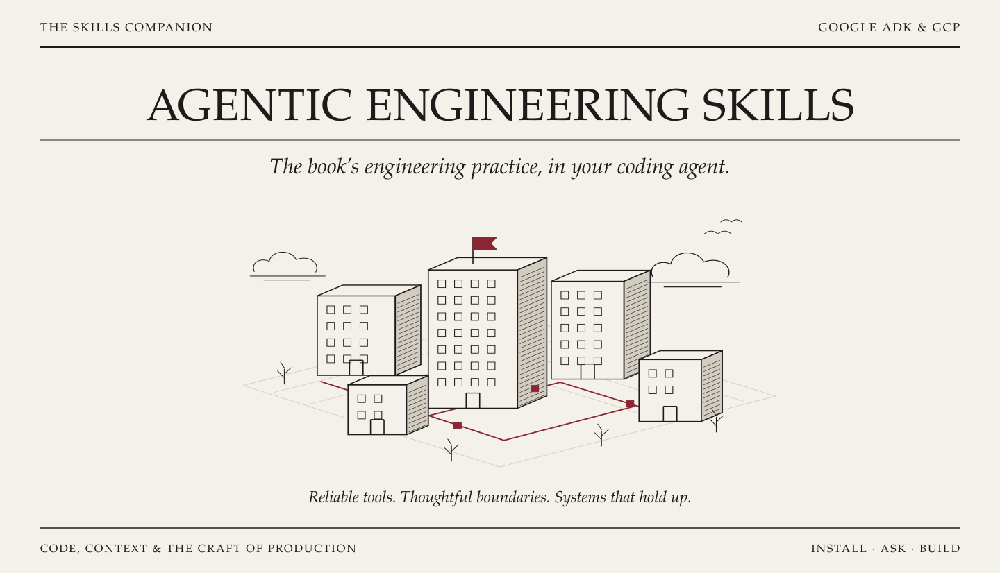
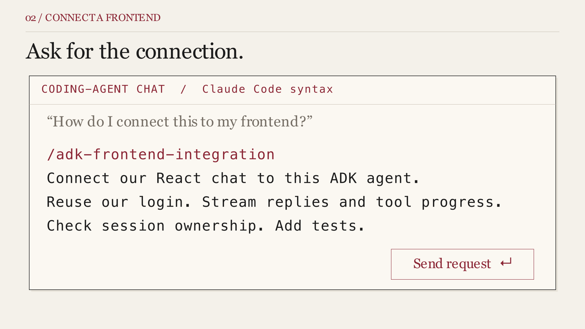

<p align="center">
  
</p>

<p align="center">
  <a href="#watch-the-walkthrough">Watch the walkthrough</a> ·
  <a href="#getting-started">Getting started</a> ·
  <a href="#the-skills">The skills</a> ·
  <a href="#using-skills-together">Using skills together</a> ·
  <a href="#compatibility--checks">What has been tested</a> ·
  <a href="#about-the-book">About the book</a>
</p>

# Agentic Engineering Skills

<p>
  <sub>
    <a href="https://github.com/google/adk-python">Google ADK</a> ·
    <a href="https://cloud.google.com/">Google Cloud</a> ·
    <a href="https://agentskills.io/">Agent Skills</a> ·
    <a href="LICENSE">MIT licensed</a>
  </sub>
</p>

Practical skills for building agent applications with Google's **Agent
Development Kit (ADK)** and **Google Cloud Platform (GCP)**. They accompany
**Agentic Engineering: Building Production-Grade Multi-Agent Systems with
Google ADK on GCP** by Ruslan Khissamiyev.

Let's connect on [LinkedIn](https://www.linkedin.com/in/ruslan-k-b6a48a1a6/).
Questions, feedback or ideas about the skills or the book? Feel free to write
to me at [khissamiyev@proton.me](mailto:khissamiyev@proton.me).

A **skill** is a folder of instructions, references and, where useful, helper
scripts that your coding agent can read while working on your project. These
skills help it apply the book's engineering practices to your own application:
handle failed tool calls, add memory, connect a browser interface, test agent
behaviour, or prepare a deployment.

Start with **adk-engineer** and describe the change you need. It selects the
relevant specialist and follows its workflow through the requested work.
If you already know the topic, you can call a specialist directly.

Designing the whole application first? Use **adk-system-designer** to work through
requirements and trade-offs, then capture the architecture and implementation plan.

Seven **cross-framework specialists** cover practices that apply to any agent
framework and are implemented here for ADK: how to write an agent's
instructions, how to design the tools a model sees, how to make structured
output and model settings dependable, how to threat-model and red-team the
agent, how to observe it in production, how to release it safely, and how to
connect it to MCP servers and other agents over A2A. See
[V. Cross-framework practices](#v-cross-framework-practices).
Follow the [design → tickets → implementation walkthrough](#from-design-to-working-tickets)
to continue with Matt Pocock's skills, or the
[time-boxed, quality-judged build order](#build-order-for-time-boxed-quality-judged-work)
when an evaluator will judge the output under a time limit.

You do not need the book or its example repository to use the skills. Install
them in the project you want to work on. They guide your **coding agent**;
your application's ADK agents do not load them automatically.

<p align="center">
  
</p>

## Watch the Walkthrough

*Install. Ask. Review. · 2 minutes 20 seconds.*

Already have an ADK agent? See how to install the skills, ask for a streaming
frontend, and add a remembered language preference. This animated worked example
is backed by [runnable local code and checks](docs/video/skills-walkthrough/demo/README.md).

[](docs/video/skills-walkthrough/assets/walkthrough.mp4)

**[Watch or download the video — 2:20, MP4](docs/video/skills-walkthrough/assets/walkthrough.mp4)**

Music: “just turn it on and make something.” by
[hijaq.](https://hijaqmusic.bandcamp.com/track/just-turn-it-on-and-make-something),
used under the artist's published free-use permission.
[Full music credits](docs/video/skills-walkthrough/publishing.md#music-credits).

<p align="center">
  
</p>

## Getting Started

*Install the toolkit, open your project, and ask for a useful change.*

### 1. Install the skills

You need a coding agent that supports skills, Git, and Node.js **22.20 or later**
with npm, which provides `npx`. This is the current requirement of the
[Skills CLI](https://github.com/vercel-labs/skills/blob/main/package.json).
The installer downloads the skill files; it does not require Google Cloud
credentials or install ADK into your application.

From your application's project directory, run:

```bash
npx skills@latest add RuslanKhis/agentic-engineering-skills --skill '*'
```

Choose your coding agent when prompted. This installs **all twenty skills**
for the current project: `adk-engineer`, `adk-system-designer`, the eleven
chapter specialists and the seven cross-framework specialists.
Keep the quotes around `'*'` so your shell passes it unchanged.

**Choosing a Google client?** Use Antigravity for Google consumer accounts.
Since 18 June 2026, Gemini CLI no longer serves Code Assist for individuals,
Google AI Pro or Google AI Ultra through Google sign-in. Gemini CLI remains
available through Code Assist Standard/Enterprise and supported paid API-key
routes. See the [Google setup guide](docs/integrations/google-coding-agents.md),
[Google's account guidance](https://developers.google.com/gemini-code-assist/docs/deprecations/code-assist-individuals)
and [supported Gemini CLI access](https://developers.googleblog.com/en/an-important-update-transitioning-gemini-cli-to-antigravity-cli/).

<details>
<summary>Choose a client explicitly, install globally, or select one specialist</summary>

To select a particular coding agent, use one of these project commands:

```bash
# Claude Code
npx skills@latest add RuslanKhis/agentic-engineering-skills --skill '*' -a claude-code

# Codex
npx skills@latest add RuslanKhis/agentic-engineering-skills --skill '*' -a codex

# Google Antigravity app or IDE
npx skills@latest add RuslanKhis/agentic-engineering-skills --skill '*' -a antigravity

# Google Antigravity CLI (agy)
npx skills@latest add RuslanKhis/agentic-engineering-skills --skill '*' -a antigravity-cli

# Gemini CLI with supported Standard/Enterprise or paid API-key access
npx skills@latest add RuslanKhis/agentic-engineering-skills --skill '*' -a gemini-cli
```

For Claude Code, Codex or Gemini CLI, add `-g` to install for your user account
across projects. For example:

```bash
npx skills@latest add RuslanKhis/agentic-engineering-skills --skill '*' -a codex -g
```

Antigravity's app, IDE and CLI document different global directories. Use the
project commands above or follow the [global directory guidance](docs/integrations/google-coding-agents.md#installation-scope)
for your client; the tested Skills CLI's `-g` destination differs from those paths.

If you already know the topic, install that specialist on its own:

```bash
npx skills@latest add RuslanKhis/agentic-engineering-skills --skill adk-memory-architecture
```

Each specialist includes its own references and helpers. Installing only
`adk-engineer` does not give you the specialists it needs to carry out the work.

To see the available skills without installing them:

```bash
npx skills@latest add RuslanKhis/agentic-engineering-skills --list
```

Leave out `--skill` for interactive skill selection. Other supported coding
agents can be selected in the installer; their invocation interface may differ.

</details>

### 2. Open your coding agent

Open your project after installation. If the coding agent was already running
and the new skills do not appear, restart its session. Type skill requests
**in the coding agent's chat**:

| Coding agent | Start with | Choose a specialist directly |
| --- | --- | --- |
| Claude Code | `/adk-engineer` | `/adk-memory-architecture` |
| Codex | `$adk-engineer` | `$adk-memory-architecture` |
| Antigravity app / IDE / CLI | `Use the adk-engineer skill to…` | `Use the adk-memory-architecture skill to…` |
| Gemini CLI, with supported access | `Use the adk-engineer skill to…` | `Use the adk-memory-architecture skill to…` |

<details>
<summary>How skill activation differs between clients</summary>

Claude Code supports `/name` for installed skills; Codex supports explicit
skill mentions using `$name`. See the respective
[Claude Code](https://code.claude.com/docs/en/skills) and
[Codex](https://developers.openai.com/codex/skills/) documentation.

Gemini CLI activates skills in response to the request; use `/skills list` to
check discovery and `/skills reload` after changes. Installing these skills
does not create `/adk-engineer` as a Gemini CLI command. Antigravity 2.0 and its
CLI also support named skill commands such as `/adk-engineer`; mentioning the
skill by name works across its app, IDE and CLI interfaces. Follow any
activation prompt the client shows.
[Gemini skill usage](https://geminicli.com/docs/cli/using-agent-skills/),
[Antigravity invocation](https://www.antigravity.google/docs/migration/workflows-to-skills/).

No separate setup command is needed for this toolkit. The skills inspect the
project's existing code and configuration when they run. Their descriptions also
allow a supporting coding agent to select them from a natural-language request;
an explicit command makes your intended skill clear.

</details>

### 3. Ask for a useful change

For example, in Claude Code:

```text
/adk-engineer Add memory so this support agent can remember a user's
preferred language between sessions. Keep our existing database and
include a way for the user to forget the preference.
```

In Codex, replace `/adk-engineer` with `$adk-engineer`. In Antigravity or
Gemini CLI, start with “Use the adk-engineer skill to” and keep the request.

The entry skill selects `adk-memory-architecture`, inspects how your application
identifies users and stores state, and chooses an appropriate design. For
implementation work, expect a project change, relevant checks and a clear account
of what remains unverified. For a design question, ask for a design.

Find **three practical examples for every skill** in the contents below.
For installation problems or later changes, see
[updating and troubleshooting](#updating-and-troubleshooting).

<p align="center">
  
</p>

## The Skills

*The contents · One entry point, a system designer, eleven chapter specialists and seven cross-framework specialists.*

Choose a skill by the problem you need to solve. Each entry below explains
when it helps, what to ask for, and the command that selects it. The numbered
specialists follow Chapters 0–10 of the book; no chapter reading is required.

| What you need | Skill |
| --- | --- |
| Help choosing an approach or combining concerns | [adk-engineer](#adk-engineer) |
| A system-design conversation and architecture before implementation | [adk-system-designer](#adk-system-designer) |
| Sequential steps, parallel work or bounded loops | [adk-workflow-design](#adk-workflow-design) |
| Reliable API calls and protection against duplicate actions | [safe-api-tool-calls](#safe-api-tool-calls) |
| Usage limits, repeated-tool protection or human approval | [adk-operational-guardrails](#adk-operational-guardrails) |
| A hosting choice or deployment preparation | [deploy-adk-on-google-cloud](#deploy-adk-on-google-cloud) |
| Faster replies and lower model usage | [optimise-adk-on-google-cloud](#optimise-adk-on-google-cloud) |
| A browser interface, streaming or tool progress | [adk-frontend-integration](#adk-frontend-integration) |
| Conversation history, memory or document retrieval | [adk-memory-architecture](#adk-memory-architecture) |
| Repeatable tests and trustworthy evaluation results | [adk-agent-evaluation](#adk-agent-evaluation) |
| Sensitive-data controls across prompts, tools and replies | [protect-adk-sensitive-data](#protect-adk-sensitive-data) |
| Tool identity, credentials or per-user OAuth | [adk-tool-auth-and-secrets](#adk-tool-auth-and-secrets) |
| Controlled natural-language analytics and SQL execution | [adk-sql-agent-engineering](#adk-sql-agent-engineering) |
| Agent instructions, state templating and sub-agent descriptions | [adk-agent-instructions](#adk-agent-instructions) |
| Tool docstrings, parameter schemas, tool count and result shape | [adk-tool-interface-design](#adk-tool-interface-design) |
| Structured output, model choice, thinking settings and failover | [adk-model-and-output-contracts](#adk-model-and-output-contracts) |
| Prompt-injection resilience, MCP vetting, sandboxing and red-teaming | [adk-agent-security](#adk-agent-security) |
| Tracing, metrics, SLOs, alerts and production-to-evaluation hand-off | [adk-agent-observability](#adk-agent-observability) |
| Version pinning, CI eval gates, model migration, canary and rollback | [adk-release-engineering](#adk-release-engineering) |
| MCP servers, remote A2A agents, agent cards and registration | [adk-agent-interoperability](#adk-agent-interoperability) |

**Copy any example into your coding agent's chat.** Examples use Claude Code's
`/` prefix. In Codex, replace only the leading `/` with `$`; keep the skill name
and request the same. In Gemini CLI or an Antigravity IDE integration, replace
`/skill-name` with “Use the skill-name skill to” and keep the request.
Antigravity 2.0 and its CLI also support the slash form. Adapt the scenario to your project.

### [adk-engineer](skills/adk-engineer/SKILL.md)

*Start here · Choose the right specialist.*

Use this when you can describe the outcome but are unsure which skill fits.
It inspects your project, selects the relevant installed specialist, and follows
that skill through the requested explanation, design, code change or review.
It can combine specialists when a change crosses several concerns, and loads
their instructions as needed.

**Invoke:** Claude Code `/adk-engineer` · Codex `$adk-engineer`

Gemini CLI / Antigravity: “Use the adk-engineer skill to…”

<details>
<summary>Three practical examples</summary>

```text
/adk-engineer Add memory so our support agent remembers a user's preferred
language between conversations. Use our existing database and let users
change or forget the preference.
```

```text
/adk-engineer Our agent sometimes issues a refund twice after a timeout.
Trace the tool call, fix the cause and add a regression test.
```

```text
/adk-engineer We have a working Python ADK agent and an existing React app.
Plan how to connect them with streamed replies and private user sessions.
Identify the code and tests we will need.
```

</details>

### [adk-system-designer](skills/adk-system-designer/SKILL.md)

*Design first · Work out what the application must guarantee.*

Use this to design a new ADK/GCP application, rethink an existing architecture,
or review decisions that span several parts of the system. It asks a few useful
questions at a time, explains trade-offs and helps choose the smallest architecture
that meets your requirements.

It explains important decisions as **requirement → design choice → reason →
tradeoff → verification**: what you need, what it proposes, why it fits, what
you give up, and how to check it. As your answers change the requirements, it
updates the choices and their checks.

The result is a system design with component and request-flow diagrams where
useful, data ownership, identity and tool permissions, failure recovery, latency
and cost assumptions, plus an implementation plan. Each important choice includes
an ADK or application component, its GCP responsibility and the skill that can
help implement it. Goals record dependencies, acceptance checks, blockers and a
prompt for continuing the work in another session. Decisions and open questions
stay explicit. A focused request such as “add memory” still belongs with the
memory specialist.

The usual artifacts are `docs/architecture/<topic>.md` and
`docs/plans/<topic>.md`, adapted to your project. A small plan can stay in the
design document. See the [copyable design-to-tickets walkthrough](#from-design-to-working-tickets)
and [guide to continuing the work](docs/integrations/design-to-implementation.md).

**Invoke:** Claude Code `/adk-system-designer` · Codex `$adk-system-designer`

Gemini CLI / Antigravity: “Use the adk-system-designer skill to…”

<details>
<summary>Three practical examples</summary>

```text
/adk-system-designer I want a customer-support agent using ADK and GCP.
It should explain case status and create escalations. Talk me through
the requirements and trade-offs, then write the architecture before we code.
```

```text
/adk-system-designer We already have React, OIDC login and PostgreSQL.
Help design an ADK assistant that can request refunds. Work through user
permissions, approval, duplicate requests, recovery and cost controls.
Keep our existing stack and capture the decisions in docs/architecture/.
```

```text
/adk-system-designer Review our proposed multi-agent architecture on GCP.
Trace a successful request, a denied user, a lost tool response and a worker
restart. Identify unnecessary components and gaps in our guarantees.
Give us a revised design and acceptance plan; do not implement it yet.
```

</details>

### I. Foundations & safeguards

*Give the system a structure, then give it boundaries.*

#### [adk-workflow-design](skills/adk-workflow-design/SKILL.md)

*00 · Arrange the work and make sure it finishes.*

Use this to decide which steps run in order, which can run together, and when
a refinement loop should stop. It helps implement or repair the handoffs
between agents, shared state and final results. Ask for a workflow design,
a focused code change, or tests that show each step produces the required output.

**Invoke:** Claude Code `/adk-workflow-design` · Codex `$adk-workflow-design`

Gemini CLI / Antigravity: “Use the adk-workflow-design skill to…”

<details>
<summary>Three practical examples</summary>

```text
/adk-workflow-design Build a workflow that researches a topic, drafts an
answer, then checks it. Pass each step's result to the next and test what
happens when the research step fails.
```

```text
/adk-workflow-design Our agent fetches a customer's orders and support
tickets one after the other. Run these independent lookups in parallel,
then combine both results without losing either one.
```

```text
/adk-workflow-design Our writer and reviewer keep revising forever.
Limit them to three revision rounds and return an explicit result when
the reviewer still rejects the draft.
```

</details>

#### [safe-api-tool-calls](skills/safe-api-tool-calls/SKILL.md)

*01 · Handle unreliable APIs without repeating an action by accident.*

Use this when a tool calls an external service that can fail, hang or return
an unclear result. It helps add selective retries, time limits and protection
against duplicate writes where the provider supports it. The result should
include tests for failures and an honest response when an action's outcome
cannot yet be confirmed.

**Invoke:** Claude Code `/safe-api-tool-calls` · Codex `$safe-api-tool-calls`

Gemini CLI / Antigravity: “Use the safe-api-tool-calls skill to…”

<details>
<summary>Three practical examples</summary>

```text
/safe-api-tool-calls Our order lookup fails on occasional 429 and 503
responses. Add retries for recoverable failures, respect Retry-After,
and keep the complete lookup within a five-second budget.
```

```text
/safe-api-tool-calls This refund tool retries after a timeout and can
refund twice. Inspect the provider's duplicate-request guarantees and
fix the tool to preserve one logical refund across supported retries.
```

```text
/safe-api-tool-calls The booking API may accept a reservation before our
connection drops. Add an uncertain-result path and a status check so
the agent does not blindly submit another booking.
```

</details>

#### [adk-operational-guardrails](skills/adk-operational-guardrails/SKILL.md)

*02 · Put limits and approval checks around agent actions.*

Use this when an agent repeats tools, consumes too much model usage, runs too
long, or needs a person to approve an action. It helps put enforcement in the
application code that actually runs the work, with tests showing that blocked
actions never execute. It also helps design usage accounting across turns
and application controls for reducing spend.

**Invoke:** Claude Code `/adk-operational-guardrails` · Codex `$adk-operational-guardrails`

Gemini CLI / Antigravity: “Use the adk-operational-guardrails skill to…”

<details>
<summary>Three practical examples</summary>

```text
/adk-operational-guardrails Our agent keeps calling the same failing tool.
Stop repeated calls with identical arguments, cap model calls at ten per
request, and test that blocked calls never reach the tool.
```

```text
/adk-operational-guardrails Add a token allowance that accumulates across
a user's conversation. Refuse further model work when it is exhausted
and return a clear message without another model call.
```

```text
/adk-operational-guardrails Require human approval before the agent
cancels an order. Bind approval to that specific cancellation and test
rejection, repeated approval and attempted execution before approval.
```

</details>

### II. From runtime to interface

*Find a home for the agent, refine its performance, and open the conversation.*

#### [deploy-adk-on-google-cloud](skills/deploy-adk-on-google-cloud/SKILL.md)

*03 · Choose a host and prepare the files needed to run there.*

Use this to compare Cloud Run, managed Agent Runtime and Google Kubernetes
Engine (GKE), or adapt an existing project for your chosen host. It helps
prepare packaging, runtime identity, configuration, health checks and
verification steps. You can request a recommendation or locally checked
deployment files before doing any cloud deployment.

**Invoke:** Claude Code `/deploy-adk-on-google-cloud` · Codex `$deploy-adk-on-google-cloud`

Gemini CLI / Antigravity: “Use the deploy-adk-on-google-cloud skill to…”

<details>
<summary>Three practical examples</summary>

```text
/deploy-adk-on-google-cloud We have an ADK agent behind a custom FastAPI
service and no Kubernetes platform. Compare Cloud Run and Agent Runtime
for our project and recommend a host with a concrete deployment plan.
```

```text
/deploy-adk-on-google-cloud Prepare this existing API for Cloud Run.
Add the container configuration, a health check and a deployment runbook.
Validate locally and leave cloud deployment for later.
```

```text
/deploy-adk-on-google-cloud Review our agent's GKE manifests. Check the
runtime identity, startup and readiness probes, configuration and session
storage. Report specific changes with verification steps.
```

</details>

#### [optimise-adk-on-google-cloud](skills/optimise-adk-on-google-cloud/SKILL.md)

*04 · Find where time and model usage go before changing the system.*

Use this for slow replies, growing token usage, startup delays or problems
under concurrent load. It traces the request through tools, model calls,
session storage and hosting, then targets a measured bottleneck. Expect a
focused improvement with a comparison plan, or instrumentation and hypotheses
when the project has no measurements yet.

**Invoke:** Claude Code `/optimise-adk-on-google-cloud` · Codex `$optimise-adk-on-google-cloud`

Gemini CLI / Antigravity: “Use the optimise-adk-on-google-cloud skill to…”

<details>
<summary>Three practical examples</summary>

```text
/optimise-adk-on-google-cloud Our replies take about twelve seconds.
Add timing around model calls, tools and session storage so we can locate
the delay, and show how to compare requests consistently.
```

```text
/optimise-adk-on-google-cloud Token usage grows on every turn because we
keep passing full tool results and conversation history. Inspect what
the model needs, reduce avoidable context and test answer completeness.
```

```text
/optimise-adk-on-google-cloud This Cloud Run service is slow on the first
request and under concurrent load. Review our startup path, configuration
and supplied traces, then propose changes with a measurement plan.
```

</details>

#### [adk-frontend-integration](skills/adk-frontend-integration/SKILL.md)

*05 · Connect the agent to the person using it.*

Use this to connect an existing browser interface to an ADK agent through a
JSON API or a streaming interface using AG-UI and CopilotKit. It helps define
requests and responses, connect conversations to authenticated users, and
display text, tool progress and failures correctly. Ask for a working
integration, an interface design, or a repair to the conversation flow.

**Invoke:** Claude Code `/adk-frontend-integration` · Codex `$adk-frontend-integration`

Gemini CLI / Antigravity: “Use the adk-frontend-integration skill to…”

<details>
<summary>Three practical examples</summary>

```text
/adk-frontend-integration Connect our existing React chat to this ADK
agent through a JSON API. Reuse our login system and ensure users can
only create and continue their own conversations.
```

```text
/adk-frontend-integration Add streaming replies and tool-progress cards
to our existing CopilotKit interface using AG-UI. Check our pinned
versions and test one complete request through the browser.
```

```text
/adk-frontend-integration Our chat shows duplicate text when a final
answer arrives, and errors after partial text look like success.
Fix both cases and add tests for the actual event sequence.
```

</details>

### III. Memory, evidence & care

*Decide what the system knows, how to test it, and what it must protect.*

#### [adk-memory-architecture](skills/adk-memory-architecture/SKILL.md)

*06 · Remember the right information for the right person.*

Use this when an agent needs to continue a conversation, remember facts across
sessions, answer from approved documents, or look up structured history. It
helps choose the right store and connect it to the agent, with explicit rules
for who can read the data, how long it stays and how it is forgotten. Exact
settings, such as a preferred language, may belong in an ordinary profile record.

**Invoke:** Claude Code `/adk-memory-architecture` · Codex `$adk-memory-architecture`

Gemini CLI / Antigravity: “Use the adk-memory-architecture skill to…”

<details>
<summary>Three practical examples</summary>

```text
/adk-memory-architecture Let users resume a conversation after the
server restarts. Use our existing database, enforce conversation
ownership and test that one user cannot load another user's history.
```

```text
/adk-memory-architecture Help our agent answer questions from approved
company manuals. Design document retrieval with source references,
document-version controls and access checks for each user.
```

```text
/adk-memory-architecture Add opt-in memory for low-risk facts users
share across sessions. Include correction, expiry and a forget action,
with offline tests for consent denial and cross-user access.
```

</details>

#### [adk-agent-evaluation](skills/adk-agent-evaluation/SKILL.md)

*07 · Test what the agent does as well as what it says.*

Use this to catch regressions in tool selection, arguments, action order,
stored effects and final answers. It helps write repeatable tests with a
scripted model, prepare evaluation cases for a real model, or audit a report
whose passing scores may hide missing checks. The output is a test strategy,
executable tests, evaluation assets or evidence-backed findings.

**Invoke:** Claude Code `/adk-agent-evaluation` · Codex `$adk-agent-evaluation`

Gemini CLI / Antigravity: “Use the adk-agent-evaluation skill to…”

<details>
<summary>Three practical examples</summary>

```text
/adk-agent-evaluation Add deterministic tests through our ADK runner
that force an invalid refund request. Assert that the refund tool
rejects it and no money-changing operation reaches the backend.
```

```text
/adk-agent-evaluation Create evaluation cases for a support agent that
must look up an order before cancelling it. Cover missing details,
refusal and successful cancellation. Validate the files offline.
```

```text
/adk-agent-evaluation Our evaluation report says every case passed,
but some tool failures were ignored. Audit the result files for missing
cases, failed actions and answers that falsely claim success.
```

</details>

#### [protect-adk-sensitive-data](skills/protect-adk-sensitive-data/SKILL.md)

*08 · Control what sensitive information reaches each part of the system.*

Use this when personal information or credentials could enter prompts, tools,
conversation history, logs or public replies. It helps implement or review
screening and data-handling rules, including Google Sensitive Data Protection
and Model Armor integrations. Ask for a traced data flow, a focused code
change and tests showing what happens when screening rejects data or fails.

**Invoke:** Claude Code `/protect-adk-sensitive-data` · Codex `$protect-adk-sensitive-data`

Gemini CLI / Antigravity: “Use the protect-adk-sensitive-data skill to…”

<details>
<summary>Three practical examples</summary>

```text
/protect-adk-sensitive-data Add a Sensitive Data Protection boundary
that replaces email addresses and rejects credentials before text is
saved or sent to the model. Test failures with a fake screening client.
```

```text
/protect-adk-sensitive-data Review this agent for customer data leaking
through tool results, session history, logs or traces. Map each path
and recommend specific fixes with regression cases.
```

```text
/protect-adk-sensitive-data Our API streams answers before screening
finishes. Buffer the answer, apply the configured Model Armor checks,
and test that blocked or uninspectable content is never released.
```

</details>

### IV. Trust in practice

*Secure the boundaries and work through a case study.*

#### [adk-tool-auth-and-secrets](skills/adk-tool-auth-and-secrets/SKILL.md)

*09 · Give each tool the right identity and keep credentials out of the conversation.*

Use this when tools need private Google Cloud access, an application secret,
or permission to act through a user's connected account. It helps separate
the authenticated user from the service's credentials, enforce access in
trusted code, and handle OAuth connection, refresh and disconnect flows.
Expect an implementation or review with tests for user isolation and
credential exposure.

**Invoke:** Claude Code `/adk-tool-auth-and-secrets` · Codex `$adk-tool-auth-and-secrets`

Gemini CLI / Antigravity: “Use the adk-tool-auth-and-secrets skill to…”

<details>
<summary>Three practical examples</summary>

```text
/adk-tool-auth-and-secrets Our tool loads a service-account key file.
Adapt it for keyless Google Cloud credentials and document the narrow
runtime permissions it needs. Keep IAM changes as a reviewable plan.
```

```text
/adk-tool-auth-and-secrets Move our third-party API key out of agent
state and load it from Secret Manager in trusted code. Test that tool
results, errors and session events do not expose the key.
```

```text
/adk-tool-auth-and-secrets Add a per-user OAuth connection for our
calendar tool, including refresh and disconnect. Test locally that
one user's session cannot select or use another user's credentials.
```

</details>

#### [adk-sql-agent-engineering](skills/adk-sql-agent-engineering/SKILL.md)

*10 · Turn business questions into controlled, read-only analytics.*

Use this to build or improve an agent that answers questions from a database.
It helps route familiar questions to reviewed SQL templates, give the model
only relevant authorised schema information, and check proposed queries in
application code before execution. Expect a small working query path, tests
for correct answers and rejected queries, or an architecture review.

**Invoke:** Claude Code `/adk-sql-agent-engineering` · Codex `$adk-sql-agent-engineering`

Gemini CLI / Antigravity: “Use the adk-sql-agent-engineering skill to…”

<details>
<summary>Three practical examples</summary>

```text
/adk-sql-agent-engineering Add a path for "What were monthly sales last
quarter?" using our approved revenue definition and a parameterised SQL
template. Test the totals and reject unsupported filters.
```

```text
/adk-sql-agent-engineering Our agent sends all 500 table schemas to the
model for every question. Retrieve only relevant authorised schemas
and test that unrelated or forbidden tables never enter its context.
```

```text
/adk-sql-agent-engineering Review our generated-query execution path.
Enforce read-only queries, allowed tables and resource limits in code,
and add tests proving rejected queries never reach the database.
```

</details>

### V. Cross-framework practices

*What the model sees and emits · Practices from across the field, implemented for ADK.*

These seven specialists did not come from a book chapter. They came from a
review of current AI-engineering practice (vendor guidance from Google,
Anthropic and OpenAI, independent studies, the official ADK documentation,
Google's samples and the ADK issue tracker) against what the toolkit already
covered. The first three own what the model sees and emits: the instruction
text, the tool declarations and the output contract. The next three own the
production lifecycle: the agent's security posture, its telemetry, and its
releases. The last owns the process boundary: MCP servers and A2A peers. Their
mechanics were checked against the google-adk 2.8.0 source and
the later changelog; see the
[gap review](docs/research/ai-engineering-practices-gap-review.md).

#### [adk-agent-instructions](skills/adk-agent-instructions/SKILL.md)

*Write the instruction that carries the judgment, and keep it owned and tested.*

Use this when an agent follows its prompt poorly, calls tools too eagerly or
not at all, routes requests to the wrong sub-agent, or raises a templating
error on a placeholder. It covers instruction structure and altitude, ADK
session-state templating, tool-use guidance inside the prompt, sub-agent
descriptions as routing contracts, few-shot exemplars, the division between
prompt and code, model-generation notes and a prompt-as-code layout with a
contract test. A read-only linter reports unresolved placeholders, literal
braces, shouting modifiers, mandated tool calls and near-duplicate sibling
descriptions. The measured improvement loop stays with
[adk-agent-evaluation](#adk-agent-evaluation).

**Invoke:** Claude Code `/adk-agent-instructions` · Codex `$adk-agent-instructions`

Gemini CLI / Antigravity: “Use the adk-agent-instructions skill to…”

<details>
<summary>Three practical examples</summary>

```text
/adk-agent-instructions Our coordinator keeps sending refund questions to
the billing agent instead of the refunds agent. Fix the sub-agent
descriptions and the root instruction, and show me the request the
model actually receives.
```

```text
/adk-agent-instructions Rewrite the system instruction for our Gemini 3
support agent. It is 1,800 words of MUST and NEVER rules, calls search on
every turn and nobody can review changes to it.
```

```text
/adk-agent-instructions Add a {customer_tier} placeholder and a JSON
output example to this agent's instruction without breaking state
templating on our pinned ADK, and give me a test that catches regressions.
```

</details>

#### [adk-tool-interface-design](skills/adk-tool-interface-design/SKILL.md)

*Design the tool the way the model will see it.*

Use this when the model picks the wrong tool or fills parameters wrongly, when
tool results flood the context, or when a new tool, toolset or MCP server needs
a model-facing schema. It covers FunctionTool docstrings and parameter rules
for the pinned ADK, naming and consolidation, tool-count budgets and dynamic
toolsets, result shaping and size, actionable error returns, and the choice
between AgentTool, sub-agents and single-turn mode. A read-only linter checks
declarations and a second helper measures tool-result sizes from recorded
events. Retries and idempotency of the external call stay with
[safe-api-tool-calls](#safe-api-tool-calls).

**Invoke:** Claude Code `/adk-tool-interface-design` · Codex `$adk-tool-interface-design`

Gemini CLI / Antigravity: “Use the adk-tool-interface-design skill to…”

<details>
<summary>Three practical examples</summary>

```text
/adk-tool-interface-design Our agent keeps calling search_orders when it
should call get_order, and sometimes passes the customer name where the
order ID goes. Review the tool declarations and fix what the model sees.
```

```text
/adk-tool-interface-design We are adding a 40-tool MCP server. Help us
decide which tools to expose, how to name and filter them, and whether to
load them dynamically.
```

```text
/adk-tool-interface-design Write the docstrings, return shapes and error
messages for three new BigQuery lookup tools so Gemini uses them
reliably, and tell me how to check it.
```

</details>

#### [adk-model-and-output-contracts](skills/adk-model-and-output-contracts/SKILL.md)

*Decide what the model emits, which model emits it, and how code proves it.*

Use this when structured output arrives as prose, fenced JSON or invalid data,
when a response schema needs designing within Gemini's limits, when a model
must be chosen or escalated, or when thinking, temperature or failover settings
need to change. It covers output_schema contracts and their validation path on
the pinned ADK, repair loops with an attempt budget, output_schema together
with tools on each backend, current Gemini model IDs and lifecycle dates,
thinking_level and sampling rules for Gemini 3, and FallbackModel. Two helpers
check a response schema against the documented Gemini subset and audit a
project's model configuration. Measuring quality on a labelled set stays with
[adk-agent-evaluation](#adk-agent-evaluation).

**Invoke:** Claude Code `/adk-model-and-output-contracts` · Codex `$adk-model-and-output-contracts`

Gemini CLI / Antigravity: “Use the adk-model-and-output-contracts skill to…”

<details>
<summary>Three practical examples</summary>

```text
/adk-model-and-output-contracts Our extraction agent returns fenced JSON
and sometimes plain prose instead of the Pydantic schema, and it has two
tools. Make the structured output reliable without breaking tool use.
```

```text
/adk-model-and-output-contracts Everything runs on gemini-2.5-pro with
temperature 0.2 and thinking_budget 2048. Move the right agents to a
current Flash model, set thinking per agent and add a fallback for 429s.
```

```text
/adk-model-and-output-contracts Design the response schema for our
classification agent: 40 enum values, a nested evidence list and a
nullable refusal. Keep it within Gemini's limits and tell me what the
code should validate versus what the model should decide.
```

</details>

#### [adk-agent-security](skills/adk-agent-security/SKILL.md)

*Assume the injection succeeds, and make sure it cannot do harm.*

Use this when an agent reads content it did not write (emails, documents,
search results, tool output, other agents' replies) and can also act, before
exposing MCP servers or code execution, or for a security review before
release. It threat-models the agent as a system (what it can read, what it can
change, where data can leave), maps prompt-injection design patterns onto ADK
structure, vets and pins tool and MCP supply chains, tiers tools with
confirmation, selects a sandboxed code executor, and seeds an adversarial suite
whose assertions are deterministic: a forbidden tool is never called and data
never leaves. A read-only inspector reports each agent's exposure. Findings map
to OWASP identifiers. Data screening and Model Armor stay with
[protect-adk-sensitive-data](#protect-adk-sensitive-data).

**Invoke:** Claude Code `/adk-agent-security` · Codex `$adk-agent-security`

Gemini CLI / Antigravity: “Use the adk-agent-security skill to…”

<details>
<summary>Three practical examples</summary>

```text
/adk-agent-security Our support agent reads customer emails and can issue
refunds and send replies. Review it before launch and tell me what an
attacker could make it do through a poisoned email or tool result.
```

```text
/adk-agent-security We are adding three third-party MCP servers. Help us
vet, filter and pin their tools, and write tests proving a poisoned tool
description cannot make the agent leak data.
```

```text
/adk-agent-security Write adversarial test cases for indirect injection
through RAG chunks and tool results, asserting the agent never calls
delete_record or send_email without confirmation.
```

</details>

#### [adk-agent-observability](skills/adk-agent-observability/SKILL.md)

*See what the agent did, what it cost, and where the time went.*

Use this when telemetry is missing or duplicated, when token or cost
attribution is unclear, when you need SLOs, alerts or dashboards, or during a
production incident. It covers the spans, metrics and logs ADK emits and the
environment gates that control them, the exporter for each host (Cloud Run,
GKE, Agent Runtime, OTLP third parties), BigQuery Agent Analytics, feedback
capture, debugging from an alert to a trace to a session, and turning
production traces into redacted evaluation cases. Two helpers summarise
invocations from a saved session and convert sessions into an ADK eval set.
Content-redaction policy stays with
[protect-adk-sensitive-data](#protect-adk-sensitive-data).

**Invoke:** Claude Code `/adk-agent-observability` · Codex `$adk-agent-observability`

Gemini CLI / Antigravity: “Use the adk-agent-observability skill to…”

<details>
<summary>Three practical examples</summary>

```text
/adk-agent-observability p95 latency on our Agent Runtime agent doubled
this week. Add tracing and metrics so we can tell model time from tool
time from session loading, and set an alert on it.
```

```text
/adk-agent-observability Define SLOs for the support agent: task success,
tool error rate and cost per resolved conversation, wired to Cloud
Monitoring dashboards and alerts. Keep prompts out of the traces.
```

```text
/adk-agent-observability Pull the thumbs-down conversations from BigQuery
Agent Analytics into an ADK eval set for regression, with personal data
removed, and show me what was redacted.
```

</details>

#### [adk-release-engineering](skills/adk-release-engineering/SKILL.md)

*Ship the prompt, the model and the tools as one release, and be able to undo it.*

Use this when a release, a CI gate, a model deprecation notice, a canary, a
rollback or a stale eval set is the concern. It covers prompt and configuration
versioning, pinned model and judge IDs, evaluation gates in CI with threshold,
repeat and cost policy, model-version migration with re-baselining, staged
promotion on Cloud Run and Agent Runtime, joint rollback of prompt, model,
tool schema and secrets, and refreshing eval sets from production. It records
that `adk eval` exits successfully even when cases fail, so the gate must use
pytest or conformance replay. A helper inventories every model, judge, prompt
hash, eval set and deploy artefact into a release manifest. Writing the eval
cases stays with [adk-agent-evaluation](#adk-agent-evaluation).

**Invoke:** Claude Code `/adk-release-engineering` · Codex `$adk-release-engineering`

Gemini CLI / Antigravity: “Use the adk-release-engineering skill to…”

<details>
<summary>Three practical examples</summary>

```text
/adk-release-engineering Google emailed that our Gemini model is retiring
next month. Plan the upgrade so our eval scores do not silently drop,
including the judge model our CI uses.
```

```text
/adk-release-engineering Add an eval gate to GitHub Actions so pull
requests that change the agent instruction are blocked on regressions,
without being flaky or expensive.
```

```text
/adk-release-engineering Canary the new system prompt to 10% of traffic
on Cloud Run and tell me how we roll back the prompt, model and tool
schema together if it misbehaves.
```

</details>

#### [adk-agent-interoperability](skills/adk-agent-interoperability/SKILL.md)

*Cross a process, team or protocol boundary without losing the contract.*

Use this when an agent must consume or offer capabilities across a boundary:
connecting to MCP servers, exposing an ADK agent as an MCP server, deciding
between in-process sub-agents and a remote A2A agent, consuming a remote agent
through its agent card, exposing an agent over A2A, or registering it with
Agent Runtime, Agent Registry or Gemini Enterprise. It covers tool-source
selection, McpToolset lifecycle and session pooling, filters and per-user
headers, SDK version contracts for both protocols, agent-card contents, task
states and failure handling, and how to test a remote peer with a fake server.
Two helpers inventory an MCP server's tools into a pinned manifest and validate
an agent card in both the 0.3 and 1.0 shapes. The MCP threat model stays with
[adk-agent-security](#adk-agent-security); in-process orchestration stays with
[adk-workflow-design](#adk-workflow-design).

**Invoke:** Claude Code `/adk-agent-interoperability` · Codex `$adk-agent-interoperability`

Gemini CLI / Antigravity: “Use the adk-agent-interoperability skill to…”

<details>
<summary>Three practical examples</summary>

```text
/adk-agent-interoperability Connect our agent to the company's GitHub and
Postgres MCP servers on Cloud Run, exposing only read tools with per-user
tokens, and pin the tool lists so we notice when a server changes them.
```

```text
/adk-agent-interoperability The billing team's agent runs in Java. Should
our ADK agent delegate refund questions to it over A2A or call their API,
and what must the agent card and failure handling look like?
```

```text
/adk-agent-interoperability Expose our research agent so Gemini Enterprise
users can invoke it, with an agent card and authentication, and validate
the card before we register it.
```

</details>

<p align="center">
  
</p>

## Using Skills Together

*Bring complementary instructions to the same task.*

Both collections below are optional. Install them in the same project or user
scope, then name the skills you want your coding agent to combine.

### Using These with Google's Agents CLI

*Bring the project tools and the application design to the same task.*

[Google's Agents CLI](https://github.com/google/agents-cli) supplies commands,
project templates and seven skills for scaffolding, writing ADK code, evaluating,
deploying, publishing and observing agents. Its recipes also cover capabilities
such as memory, frontends, tool approval and credentials. This toolkit adds detailed
guidance for adapting those capabilities to your application's data, tools,
identity boundaries and tests. Agents CLI runs alongside the coding client
you use to work on the application.

**How are these different from Google's skills?** This collection concentrates
on implementing and checking the application-specific details in an existing
Python ADK project, while preserving its authentication, storage and dependency
pins. It can be used without adopting the Agents CLI lifecycle:

- **[Memory](skills/adk-memory-architecture/SKILL.md):** choose between session
  state, exact preferences, semantic memory and retrieval; test consent, user
  isolation and whether a retry can restore forgotten data.
- **[API tools](skills/safe-api-tool-calls/SKILL.md):** preserve one logical
  operation across retries and reconcile a refund whose reply was lost after
  the provider accepted it.
- **[Frontends](skills/adk-frontend-integration/SKILL.md):** connect JSON or
  AG-UI/CopilotKit interfaces with session ownership, cancellation and correct
  handling of errors after streamed text.
- **[Evaluation](skills/adk-agent-evaluation/SKILL.md):** assert actual tool
  effects through deterministic Runner tests, audit missing results, and
  distinguish offline evidence from live-model evaluation.

This adds focused implementation and verification guidance on topics that
overlap with Google's recipes. See the [source comparison](docs/research/agents-cli-comparison-2026-09-23.md).

Use Google's workflow when you want an Agents CLI project. Bring in an Agentic
Engineering specialist for the particular feature or engineering decision:

| Work you are doing | Agents CLI contributes | This toolkit contributes |
| --- | --- | --- |
| Add memory to a generated agent | Project conventions, ADK APIs and reference recipes | Choosing what to store, user isolation, consent and forgetting |
| Evaluate a tool that changes data | Dataset and metric formats, trace generation and grading commands | Deterministic checks of actual effects, coverage and result auditing |
| Prepare and operate a deployment | Generated infrastructure, deployment commands and telemetry integrations | Hosting and identity decisions, recovery, performance analysis and sensitive-data controls |
| Publish to Gemini Enterprise | Registration commands and platform-specific guidance | Relevant application authentication and data-boundary review |

To install Google's skills alongside these in a Claude Code project:

```bash
npx skills@latest add google/agents-cli --skill '*' -a claude-code
```

For Codex, use `-a codex`; for Google's coding agents, use `-a gemini-cli`,
`-a antigravity` or `-a antigravity-cli` in the same project scope.
This installs Google's skill files; using its platform
commands also requires the Agents CLI executable. See the
[combined setup guide](docs/integrations/agents-cli.md#install-them-together)
for the CLI installation and scope choices. Reload your coding-agent session
after installation.

For an existing Agents CLI project, try:

```text
/adk-engineer Add a remembered response-language preference to this
Agents CLI project. Use the installed google-agents-cli-adk-code skill
for its APIs and recipes, and adk-memory-architecture for storage,
consent, user isolation and forgetting. Preserve the generated project
structure and dependency pins. Implement and run offline tests;
prepare a separate plan for live evaluation.
```

In Codex, start with `$adk-engineer`. Use one entry command and name the other
installed skills in the request. Installing both collections makes their
guidance available; it does not establish an automatic integration or a rule
for resolving competing workflows. For a focused change, state the requested
scope: Google's full workflow expects scaffolding and live evaluation, while
an existing application may only need a local code change.

Read the [three worked usage examples](docs/integrations/agents-cli.md#three-practical-workflows)
for feature development, evaluation and deployment planning. That guide also
explains how Matt's `tdd` or `code-review` can supply the development method
alongside both collections.

### Using These with Matt Pocock's Skills

*Bring a development method and the ADK guidance to the same task.*

[Matt Pocock's skills](https://github.com/mattpocock/skills) cover general
engineering workflows. This toolkit contributes the ADK-specific decisions.
They can be installed alongside each other; neither collection is required
to use the other.

Some useful combinations:

| When you need to… | Matt's skill | ADK companion |
| --- | --- | --- |
| Clarify a feature and record its terminology | `grill-with-docs` | `adk-system-designer` for ADK/GCP decisions when needed |
| Resolve a large set of open architecture decisions | `wayfinder` | The designer's accepted decisions, open questions and relevant specialists |
| Turn an agreed design into a multi-session build | `to-spec` → `to-tickets` → `implement` | The designer's goal plan and each goal's primary specialist |
| Build a change through failing tests and small fixes | `tdd` | The relevant specialist, such as `adk-memory-architecture` |
| Investigate a slow agent | `diagnosing-bugs` | `optimise-adk-on-google-cloud` |
| Review the resulting change | `code-review` | The specialist's acceptance and validation guidance |

To add Matt's collection through the same installer:

```bash
npx skills@latest add mattpocock/skills --skill '*'
```

Choose the same coding agent and installation scope. Follow
[Matt's setup instructions](https://github.com/mattpocock/skills#installation-30-second-setup)
and run `setup-matt-pocock-skills` once per project: use
`/setup-matt-pocock-skills` in Claude Code or `$setup-matt-pocock-skills` in Codex.
That setup configures his workflow preferences. If you already use his Claude
Code plugin, keep that installation and use its command picker instead of
installing another copy through the CLI.

#### From design to working tickets

*One example · A support assistant with saved preferences and streamed replies.*

Give the next skill the saved architecture and plan paths. You can continue
in the same conversation or start a new one in the **same application project**.
The documents carry the decisions between sessions.

These examples use **Claude Code chat commands**. In **Codex**, replace the
leading `/` with `$`: `/to-spec` becomes `$to-spec`. In Google clients, ask
“Use the to-spec skill to…” and keep the rest of the prompt. Name supporting
skills in the request; one skill leads each step. Plugin-installed commands may
have a prefix—select the matching command from your client's picker.

For this walkthrough, choose **local Markdown** during Matt's project setup:

```text
/setup-matt-pocock-skills Use local Markdown for this project's issue tracker.
```

Follow the setup questions and review its configuration. It stores specs and
tickets under `.scratch/`. If your team already uses a configured tracker,
keep it and use the issue links it returns in place of the example file paths.
[Matt's setup and local tracker conventions](https://github.com/mattpocock/skills/blob/main/skills/engineering/setup-matt-pocock-skills/issue-tracker-local.md).

**1. Discuss the application and save the decisions**

```text
/adk-system-designer Help design a support assistant using our existing
React app, OIDC login, PostgreSQL and Google ADK on GCP. Users should save
and forget a preferred language and receive streamed replies.
Ask me about requirements and explain the choices and tradeoffs.
When we have agreed the design, save it to docs/architecture/support-assistant.md
and the goal plan to docs/plans/support-assistant.md. Include dependencies,
ADK/GCP implementation routes, relevant skills and acceptance checks.
Identify the first goal we can build locally. Design and planning only for now.
```

Answer its questions and review the proposals. For example: “Preferences belong
to individual users; save only when they click Save; forgetting takes effect on
the next conversation.” The designer translates those answers into storage,
identity, invocation and testing decisions. Its first questions are the scope
gate: how much time and money there is, who judges the result and what they
read, and whether this is an exploration, an assignment, a pilot or a production
service. Those answers size everything that follows; for work judged on output
quality under a time limit, use the [time-boxed build order](#build-order-for-time-boxed-quality-judged-work)
instead of the ticket sequence below. **If these documents already exist,
start at step 2.** Substitute your actual paths throughout.

**2. Turn the agreed design into a specification**

A specification describes what the finished feature must do and how to verify it.

```text
/to-spec Read docs/architecture/support-assistant.md and
docs/plans/support-assistant.md. Turn the agreed local implementation goals
into the support-assistant spec using our configured local Markdown tracker.
Preserve accepted decisions, scope and acceptance checks; link both documents.
Use adk-memory-architecture and adk-frontend-integration to check the relevant
contracts while writing the spec. If an open decision blocks these goals,
identify it so we can resolve it before making those goals ready to build.
Check the proposed test boundaries with me. Create the spec only.
```

Expect `.scratch/support-assistant/spec.md` with user stories, module/interface
decisions and testing decisions. The agent may ask where tests should observe
behaviour—for example, through the authenticated API and browser. Concrete
code-path notes stay in the linked plan. [How `to-spec` works](https://github.com/mattpocock/skills/blob/main/skills/engineering/to-spec/SKILL.md).

Resolve decisions blocking the selected goals with the designer or Wayfinder
before proceeding; unrelated future decisions can stay open.

**3. Break the specification into tickets**

```text
/to-tickets Read .scratch/support-assistant/spec.md and its linked design
and goal plan. Propose tickets that each deliver a small, testable user outcome.
Carry the relevant goal/decision references, dependencies, primary ADK skill,
supporting skills and observable acceptance checks into every ticket.
Use adk-memory-architecture for preference behaviour, adk-frontend-integration
for streaming, and adk-agent-evaluation for the verification plan.
Review the breakdown with me, then write one file per approved ticket under
.scratch/support-assistant/issues/. Print their paths and the first ready ticket.
Make docs/plans/support-assistant.md point to the spec and tickets for work status.
```

Review the proposed size and order before the skill writes tickets. A useful
ticket might deliver **save → new conversation uses the preference → forget**,
including the UI, API, storage and checks. Another might deliver streamed text
with visible completed, failed and interrupted states. Each ticket should name
its blockers and skills. These are build tickets; you only need a Wayfinder map
if substantial design decisions remain open. [How `to-tickets` works](https://github.com/mattpocock/skills/blob/main/skills/engineering/to-tickets/SKILL.md).

**4. Implement one ready ticket with the relevant ADK skills**

Open a fresh session in the same project. Paste the **actual ticket path**
printed in step 3; the filename below illustrates a memory ticket.

```text
/implement Implement .scratch/support-assistant/issues/01-save-language.md.
Read its linked spec, architecture and goal plan; check that its blockers are done.
Use adk-memory-architecture for the preference lifecycle, adk-tool-auth-and-secrets
for user ownership, and adk-frontend-integration for the changed UI/API boundaries.
Keep the accepted design and implement only this ticket with local tests.
Review the ticket's full changes, including staged and unstaged edits, against
its spec and the state before this ticket. Resolve actionable review findings.
Record checks and results in the ticket, and mark it complete only when its
acceptance checks pass.
Report any blocked or unverified checks. Keep live services and deployment
for their own tickets. Leave the changes uncommitted for my review.
```

Matt's `implement` leads development, testing and code review; the ADK skills
supply guidance for the affected parts. It **normally commits to the current
branch**; this example explicitly leaves changes for your review. Review the
diff and evidence, commit the accepted changes, then repeat with the next
unblocked ticket. The prompt explicitly includes uncommitted edits in the review.
For a streaming ticket, name `adk-frontend-integration` as its primary ADK skill.
[How `implement` works](https://github.com/mattpocock/skills/blob/main/skills/engineering/implement/SKILL.md).

**5. Check the application across ticket boundaries**

```text
/adk-agent-evaluation Review the support-assistant spec and completed tickets
under .scratch/support-assistant/. Run the relevant local checks for the whole
journey: save a language, start a new conversation, stream the reply, forget the
preference, and start again. Include another user's denied access and a stream
that fails after showing partial text. Report actual results and remaining gaps.
Separate local evidence from live-model and hosted checks still to be run.
```

Passing individual tickets is one part of verification. The combined journey
needs its own evidence; live-model behaviour and a deployed GCP application need
the corresponding evaluation and deployment work.

<details>
<summary>Return to an ADK specialist during planning or implementation</summary>

You can ask for a focused review before starting a ticket:

```text
/adk-memory-architecture Review the saved-language ticket in
.scratch/support-assistant/issues/ against the linked design and existing code.
Check ownership, persistence between conversations and forgetting. Propose
specific corrections to its implementation approach and acceptance checks.
Keep this step to planning; return the ticket path to resume with implement.
```

If implementation uncovers a product decision, return to the designer with the
ticket and the new information:

```text
/adk-system-designer While working on our saved-language ticket, we discovered
that several people share an account. Read docs/architecture/support-assistant.md,
docs/plans/support-assistant.md and the ticket in .scratch/support-assistant/issues/.
Help us decide whether the preference belongs to a person or the shared account.
Explain the implementation and testing consequences. After we agree, update the
design and affected ticket requirements; preserve unrelated accepted decisions.
Then give me a prompt to resume that ticket with implement and the relevant ADK skills.
```

For several unresolved decisions, use Wayfinder as described below. Continue
ready, independent tickets while other decisions are being resolved.

</details>

<details>
<summary>Use Wayfinder when substantial design decisions remain open</summary>

A Wayfinder map organizes **questions to resolve** before the build. For example:
individual versus team preferences, or the recovery behaviour after a disconnect.
Start from the same saved documents:

```text
/wayfinder Read docs/architecture/support-assistant.md and
docs/plans/support-assistant.md. Map the substantial unresolved design decisions.
Use support-assistant-design as the effort name. Preserve and link accepted
decisions; put adk-system-designer and the relevant ADK specialists in the map's
Notes. Our destination is a design ready for the local implementation spec.
Keep ready implementation goals in the linked plan.
```

With the local tracker, expect `.scratch/support-assistant-design/map.md` and
decision tickets in that effort's `issues/` directory. On a later session, use
`/wayfinder Continue .scratch/support-assistant-design/map.md` to work through
the next ready decision. Use the actual path returned by the agent. Keeping the
design effort separate from `support-assistant` keeps decision and build tickets
in their own directories.

When the relevant decisions are resolved, update the architecture and plan,
then return to **step 2** and include the map path in the `to-spec` request.
See the [handoff guide](docs/integrations/design-to-implementation.md) for artifact
ownership, session resumption and direct implementation without Matt's collection.
[How Wayfinder works](https://github.com/mattpocock/skills/blob/main/skills/engineering/wayfinder/SKILL.md).

</details>

#### Build order for time-boxed, quality-judged work

*One example · Decisions over a document pack, judged on unseen cases in a few hours.*

The ticket sequence above builds every control before any decision has been
measured. That is the right order for a production service. It is the wrong
order for an assignment, a pilot or an exploration that an evaluator will judge
on output quality: there, the core judgment is measured first and every other
control is a deferred ticket. Use this sequence instead:

1. **Scope gate.** Time, evaluator, artifact type, and the controls deferred with
   their reasons, at the top of the design (`adk-system-designer`).
2. **Qualify the inputs, about an hour.** An ingestion report for the supplied
   documents (scans, tables, drawings routed to OCR or vision) and a retrieval
   recall measurement on a small gold set of operative sections
   (`adk-memory-architecture`).
3. **Core judgment end to end, the largest share of time.** Draft decisions on
   the labelled development cases with exemplars, categorise the errors, change
   one thing per iteration, re-measure (`adk-agent-evaluation`).
4. **Content safeguards in code.** Consistency checks on every fresh draft,
   warnings ranked by materiality, documents treated as data
   (`adk-workflow-design`).
5. **Deliverable run with the frozen method.** The predictions the evaluator
   reads come from the method the report describes; the reserved budget is
   spent here first (`adk-agent-evaluation`, `adk-operational-guardrails`).
6. **Report within a reader's budget.** One living evaluation summary, raw runs
   as data, at most three documents named for the reviewer.
7. **Only then:** interface, revisions, export flows, recovery, hosting roadmap,
   each as a separate deferred control with its own ticket.

The [time-boxed, quality-judged walkthrough](docs/integrations/quality-judged-build.md)
runs this order on synthetic documents with real bytes, using the bundled
ingestion, retrieval, consistency and evaluation helpers, in under an hour of
agent time. When `to-tickets` is used under this order, the first ready ticket
is the core judgment path, and no interface ticket precedes the first quality
measurement.

<p align="center">
  
</p>

## Updating and Troubleshooting

*Keep the installed skills current and find them when you need them.*

The [Skills CLI](https://github.com/vercel-labs/skills/blob/main/src/cli.ts)
can update installed skills. Choose the scope you used for installation:

```bash
# Update skills installed in the current project.
npx skills@latest update -p

# Or update skills installed for your user account.
npx skills@latest update -g
```

Each command updates installed skills in that scope, including other collections.
Keep any personal skill edits in version control before updating.

If a command is missing, confirm that you installed into the project you opened
and selected the correct coding agent, then restart its session. If the entry
skill reports a missing specialist, rerun the full-toolkit installation or
install the named specialist. If `npx` fails before showing the installer,
check `node --version` against the prerequisite above.

<details>
<summary>Try local edits before publishing them</summary>

Clone this repository, then run the installer from a separate project directory,
passing the path to your clone:

```bash
npx skills@latest add "/path/to/agentic-engineering-skills" --skill '*'
```

Replace the example path with the real directory. This lets you try a changed
skill before it is available through the GitHub install command.

</details>

<p align="center">
  
</p>

## Compatibility & Checks

*What was installed, what generated code, and what the checks establish.*

The packages use the [Agent Skills format](https://agentskills.io/specification).
The specialists inspect your project's installed SDK versions before applying a
recipe; their references record compatibility, validation evidence and practical
limits. There is no single application environment to install at this
repository's root.

### Interoperability specialist · 8 October 2026

The third and final round of the practice review added `adk-agent-interoperability`
for the process boundary: tool-source selection, consuming and exposing MCP
servers, the in-process versus remote topology decision, remote A2A agents and
agent cards, exposure over A2A and registration with Agent Runtime, Agent
Registry or Gemini Enterprise. Its two helpers speak the protocols themselves:
one inventories an MCP server's tools into a pinned manifest and diffs it, the
other validates an agent card in both the 0.3 and 1.0 shapes. Mechanics were
checked against the google-adk 2.8.0 source and the later changelog, with a
research pass over the official documentation, Google Cloud registration pages
and the issue tracker. All **20 packages** pass validation; the offline suites
run **638 tests** with **59 optional SDK checks skipped**, including 31 tests
for the two protocol helpers against loopback fakes. See the
[gap review and validation record](docs/research/ai-engineering-practices-gap-review.md).
No live server, cloud operation or skill-selection trial was performed; the new
activation and scenario cases are written but not yet executed.

### Production-lifecycle specialists · 8 October 2026

The second round of the practice review added three specialists for the
production lifecycle: `adk-agent-security` (threat model, injection-resistant
structure, tool and MCP supply chain, sandboxing, an adversarial seed suite),
`adk-agent-observability` (signals and environment gates, exporters per host,
SLOs and alerts, BigQuery Agent Analytics, production traces into eval cases)
and `adk-release-engineering` (version pinning, CI eval gates, model migration,
staged promotion and joint rollback). Each was built from the google-adk 2.8.0
source and the 2.9 to 2.11 changelog plus a second research pass over the
official ADK documentation, Google samples and the issue tracker; the security
skill records the 2026 ADK advisories and their fix versions, and the release
skill records that `adk eval` exits successfully even when cases fail. All
**19 packages** pass validation; the offline suites run **607 tests** with
**59 optional SDK checks skipped**, including 45 tests for the three new
inspectors and converters. See the
[gap review and validation record](docs/research/ai-engineering-practices-gap-review.md).
No live model run, cloud operation or skill-selection trial was performed; the
new activation and scenario cases are written but not yet executed.

### Cross-framework specialists · 6 October 2026

A review of current AI-engineering practice against the toolkit found that
the skills verified an agent's boundaries thoroughly but did not own what the
model sees and emits. This revision adds three specialists for agent
instructions, tool interfaces and model and output contracts, and a
context-window reference with a session budget helper in the optimise skill.
Their ADK mechanics were checked against the google-adk 2.8.0 source and the
2.9 to 2.11 changelog, and the vendor, community and research sources are
dated in each package. All **16 packages** pass validation; the offline suites
run **562 tests** with **59 optional SDK checks skipped** in the clean
maintainer environment, including 63 tests for the new helpers. See the
[gap review and validation record](docs/research/ai-engineering-practices-gap-review.md).
No live model run, skill-selection trial or cloud operation was performed for
this revision; the activation and scenario cases for the new skills are
written but not yet executed.

### Planning-assignment retrospective · 6 October 2026

A third round of feedback, from a time-boxed assignment judged on unseen
cases, found that the skills taught how to verify an application but not how
to make its output good. This round adds the missing half: a scope and
proportionality gate in the designer, a measured decision-quality loop with
prompt and exemplar guidance in the evaluation skill, deliverable and
cross-case rules, a document-ingestion reference with a real-byte PDF fixture,
a local retrieval-strategy reference with a gold set, in-code content
safeguards in the workflow skill, coverage columns in stage contracts, a
reader's budget for evidence, and the
[time-boxed build order](#build-order-for-time-boxed-quality-judged-work).
All **13 packages** pass validation and the offline suites pass with the three
new standard-library helpers. See the
[change record](docs/testing/feedback-validation-2026-10-06.md), which
includes two fresh-agent trials of the scope gate and the quality loop; the
other new scenarios have not yet been run.

### System designer · 25 September 2026

All **13 packages** pass validation. Five independent Codex subagent trials
exercised the new designer: a requirements conversation, a one-pass review of a
flawed architecture, a conversation with a changed requirement, and a runtime
and release review, plus a practical implementation handoff. The outputs
preserved the existing stack,
identified failure and authority boundaries, and kept assumptions and planned
checks explicit. See the [prompts, designs and assessment](docs/testing/system-designer.md).

The [source coverage review](docs/research/system-designer-source-coverage.md)
maps the system-design guidance to its instructions and supporting references.

The offline repository checks passed **395 tests**, with **59 optional SDK
checks skipped** in the clean maintainer environment. These trials used the
skill directly; automatic selection and installation of the new package in each
client have not been tested. The client results below cover the earlier 12-skill set.

### Implementation skill checks · 16 September 2026

| Check | Result | Evidence |
| --- | --- | --- |
| Repository packages and helper / SDK tests | All 12 packages validated; 476 tests passed with zero skips. | [Laptop verification](docs/testing/updated-skills-laptop.md) |
| Claude Code and Codex | All 12 skills installed. Two fresh sessions generated refund and finite-streaming adapters; after review and repairs, 71 tests passed, including 17 independent acceptance checks. | [Generated examples and repairs](docs/testing/updated-skills-laptop.md) |
| Google client installation and discovery | Project installation checked for Gemini CLI, Antigravity and Antigravity CLI; Gemini CLI also discovered all 12 through its native skill interface. | [Google installation checks](docs/testing/google-coding-agents.md) |
| Antigravity IDE with Gemini 3.8 Flash | Used `safe-api-tool-calls` to repair a local refund adapter; 21 project tests and nine independent checks passed. | [Generation trial](docs/testing/google-client-generation.md) |
| Gemini CLI generation | Google sign-in succeeded, but the service rejected the consumer-account access route before skill activation or code generation. | [Attempt and account restriction](docs/testing/google-client-generation.md) |
| Standalone Antigravity app and CLI generation | Not yet tested. | [Test coverage and limits](docs/testing/google-client-generation.md) |

These are local checks and bounded coding trials. They do not establish that
every skill, model, SDK version or cloud integration has been exercised. No cloud
deployment was performed in these trials. The skills ask the coding agent to
report which checks actually ran and what remains unverified; cloud operations
follow the selected skill's scope and approval requirements.

<details>
<summary>Earlier revision: three Codex CLI trials</summary>

An earlier revision was tested in three fresh Codex CLI sessions against small
local projects: persistent user preferences, a refund tool with safe retries,
and a concurrent ADK workflow. The generated code passed 162 tests, including
37 independent acceptance checks. These are separate historical results;
they are not included in the current revision's counts above.

See the [CLI test results and generated code](docs/testing/codex-cli-smoke.md)
for the prompts, versions, source files and instructions for rerunning the checks.

</details>

<details>
<summary>Package layout and optional dependencies</summary>

Each specialist contains a `SKILL.md`, supporting resources and its own licence.
The `agents/openai.yaml` files provide optional Codex display and invocation
metadata. Some helpers use only Python's standard library; optional checks
require the ADK or cloud dependencies listed in the skill's references.

The `skills/<name>/SKILL.md` layout is supported by the
[Skills CLI](https://github.com/vercel-labs/skills#readme). See the
[distribution notes](docs/research/skill-distribution.md) for the packaging
investigation, installation checks and design rationale.

</details>

## Improving and Contributing

*Make the instructions easier to select, then verify the work they produce.*

The [maintainer guide](CONTRIBUTING.md) provides a local check command and the
conventions for changing a skill. Automated checks validate all skill packages
and run their offline helper suites; GitHub Actions is configured to run them
on Python 3.11 and 3.12. These checks do not establish model or cloud behavior.

The [quality evaluation guide](docs/testing/skill-quality.md) separates natural
skill selection, explicit invocation, composition and implementation results.
It includes positive and near-miss cases for every skill, contextual scenarios,
and a procedure for comparing a change against an old-version or no-skill
baseline. See [the research behind these practices](docs/research/skill-quality-practices.md)
for sources and the limits of the available evidence.

## About the Book

These skills turn the engineering lessons in **Agentic Engineering: Building
Production-Grade Multi-Agent Systems with Google ADK on GCP** into workflows
you can apply to an existing project.

The [book's code companion](https://github.com/RuslanKhis/agentic-engineering-adk-gcp)
contains runnable chapter examples and their setup instructions. Start there
if you want to learn an idea through a small application. Start here when you
want your coding agent to help apply that idea to your own code.

**[Preorder the book on Amazon](https://www.amazon.com/dp/B0HK78328V?spcref=PUBLISHED_PREORDER_LIVE).**

## License

This project is licensed under the [MIT License](LICENSE). You can adapt the
skills to your projects. Each installable package includes its own licence.

An independent community project, not affiliated with or endorsed by Google
or Matt Pocock. Contributions and reproducible issue reports are welcome.

<p align="center">
  
</p>

<p align="center">
  
</p>

<p align="center">
  <a href="#getting-started">Install the skills</a> ·
  <a href="#the-skills">Return to the contents</a>
</p>
