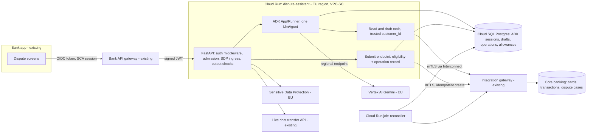

# System design: Card dispute assistant

Status: **draft**. Written in one pass without the user available. Every
decision that depends on an assumed answer is **provisional** until the user,
compliance or the named owner confirms it. Nothing here was reviewed by the
user. No decision is user-accepted yet.

Plan: [docs/plans/card-dispute-agent.md](../plans/card-dispute-agent.md)

## Assumed answers

The user could not be asked. Each row is the question I would have asked, the
answer assumed, and the decisions that depend on it (all provisional).

| # | Question | Assumed answer | Decisions that depend on it |
| --- | --- | --- | --- |
| A1 | GA date, and what happens after it? | GA on or about **2027-02-08**, four months from 2026-10-09. The service then runs and keeps being developed. | Phase 1 scope, cut line, D12 |
| A2 | Who builds it, how many hours each, how familiar with ADK and GCP? Who runs it after GA? | Six full-time engineers, about 16 working weeks once holidays are taken out. They know Python and GCP and are **new to ADK**. A security reviewer gives about 0.25 FTE. The bank's SRE team runs it after GA, with the six engineers as second line. The **existing mobile/web app team** builds the screens from our API contract and is not counted in the six. | Capacity, G06 scope |
| A3 | What is the budget for models and cloud? | Production run cost under about €15k/month and non-production under €5k/month. These are illustrative figures. | D9, model tier, eval repeats |
| A4 | Who uses it and who judges it? | Authenticated retail cardholders in the bank's existing app. Compliance, Security, Dispute Operations and Model Risk judge it by reading this design, the test evidence and the pilot metrics. | Identity, D2, D11 |
| A5 | What data does it touch and what can it change? | Regulated personal and payment data. The only effect is **creating a dispute case in core banking**, which can start a chargeback and provisional credit under the bank's rules. The agent never moves money itself. | Floor, D3, D4 |
| A6 | Which dispute types are in GA scope? | **Merchant disputes**: not received, not as described, cancelled or returned but still charged, duplicate charge, wrong amount. **Unauthorised or fraud claims are out of the agent's case-creation scope.** They go to the existing fraud journey. | D5, G04 |
| A7 | Does core banking expose a dispute-case API, and does it support idempotency keys and status lookup? | A REST dispute API exists behind the bank's integration gateway and has a sandbox. Idempotency-key support is **unknown**. A case search by transaction ID exists. | D4, G00 (discovery), G05 |
| A8 | Is there a GCP landing zone? | Yes: an approved EU landing zone with VPC Service Controls, CMEK, Private connectivity (Interconnect) to the on-prem integration gateway, and Cloud Run and Cloud SQL allowed. | D7, G11 |
| A9 | Do fallbacks exist (dispute web form, live chat)? | Yes. A classic in-app dispute form and contact-centre live chat with a transfer API both exist. | D9, D10 |
| A10 | Languages at GA? | One language, the bank's primary customer language. More languages come in phase 2. | G10, G15 |
| A11 | What are the volume, latency and availability targets? | Peak 3,000 dispute conversations a day, about 10 turns each. Provisional targets: p95 complete reply ≤ 8 s and 99.5% monthly availability, with fallback to the form. | Budgets, G13 |
| A12 | What retention applies, and who sets it? | Conversation sessions are kept 90 days. Dispute records follow the bank's existing dispute retention in core banking. The DPO confirms both. | Data table, G07 |
| A13 | Regulatory classification? | Under the EU AI Act this is a customer-facing system with a transparency obligation; it is assumed **not** high-risk. The bank's model-risk policy applies. Google Cloud is already in the DORA ICT third-party register. **Compliance must confirm all of this.** | D11, release gates |
| A14 | Can Gemini on Vertex AI process this data in an EU region? | Yes, through a **regional** EU Vertex AI endpoint under the bank's existing Google Cloud agreement, with no training on customer data. Regional model availability and data-processing terms are **unverified** (V1, V2). | D6, D7 |

## Purpose and constraints

**Journey.** A customer opens the banking app and sees a €84.90 charge from
"SHOPX\*ONLINE" for headphones that never arrived. Today they must find the
dispute form, pick a reason code they do not understand, and type a
description. About a third of these submissions (assumption; baseline to be
measured, M1) come back from Dispute Operations for missing facts such as the
delivery date or whether the merchant was contacted. The re-contact takes days.

With the assistant, the customer taps "Dispute this charge" or types "I never
got my headphones". The agent finds the candidate transaction among the
customer's own card transactions and asks only the questions the chosen reason
needs. It then produces a structured draft. The app shows that draft as a
fixed, code-rendered summary. When the customer taps **Submit**, backend code
(not the model) validates eligibility again and creates exactly one case in
core banking. The customer then sees the case reference and the next steps,
taken from approved text.

**Useful result.** A complete, correctly classified dispute case for a
transaction the customer owns, created once, with an honest status.

**Outcome to improve** (hypothesis until measured): a lower share of cases
returned for missing information and a shorter time to file. The guardrail is
that complaint volume and handoff-to-human rate must not rise.

**What the model contributes:** understanding the customer's free text,
choosing the candidate transaction from a bounded list, proposing a reason
category, asking the follow-up questions that category needs, and writing the
case narrative.

**What code controls:** identity and card scope, the transaction set,
eligibility (time window, duplicate open dispute, card status, amount),
mapping categories to scheme reason codes, the unauthorised-claim split, the
confirmation, the core banking write, all regulated statements (deadlines,
provisional credit, AI disclosure) and every budget.

**Non-goals at GA:** reading uploaded evidence with the model, deciding
liability or refunds, blocking cards, fraud case creation, voice, more than
one language, cross-session memory.

**Observed repository facts:** the repository contains only `.claude/skills/`.
It has no application code, dependency pins or existing document convention,
so this design uses `docs/architecture/` and `docs/plans/`.

## Delivery constraints, depth and deferred controls

| Scope-gate answer | Value |
| --- | --- |
| First useful version due, and what happens after it | GA about 2027-02-08 (given: four months); then operated and extended (A1) |
| People and hours | Six engineers at about 16 weeks × 40 h, new to ADK. Security reviewer at about 0.25 FTE. Bank SRE runs it after GA (A2) |
| Money | Illustrative: €15k/month production, €5k/month non-production (A3) |
| Users or judge, and what they read | External retail customers in the app. Compliance, Security, Dispute Ops and Model Risk read the design, the evidence and the pilot metrics (A4) |
| Data touched and effects allowed | Regulated personal and payment data. Creates dispute cases in core banking; never moves money (A5) |
| Delivery profile | **Production service**: external customers, regulated data, and a write to the system of record. |

Depth per concern:

| Concern | Depth now (phase 1 / GA) | Trigger that raises it |
| --- | --- | --- |
| Core judgment, measured | Build: labelled evaluation set (about 150 cases) gated in CI | New dispute type or language |
| Identity and per-customer scope | Build: gateway-verified OIDC subject, card scope from core banking, cross-customer denial tests | — |
| Secrets and credentials | Build: workload identity, Secret Manager with rotation, mTLS to the integration gateway | — |
| External writes | Build: confirmation outside the model, durable operation record, idempotent create or lookup-reconcile, reconciler | — |
| Sensitive data | Build: SDP ingress redaction of PAN, CVV and IBAN; typed tool projections; no content in telemetry; deterministic output checks | Model Armor layer in phase 2 (G16) |
| Prompt injection and agency | Build: threat model, per-agent trifecta check, no egress tools, adversarial suite | Uploads read by the model (G14) |
| Budgets and loop limits | Build: `max_llm_calls`, per-customer daily allowance, global admission cap, operator kill switch | — |
| Memory and retrieval | Minimal: persistent sessions only; no cross-session memory, no RAG (approved texts are code-owned templates) | Policy Q&A scope (later) |
| Frontend | Build: JSON API contract. The app team builds the screens | — |
| Hosting | Build: Cloud Run in an EU region with rollback, DR rehearsal and cleanup | — |
| Observability | Build: SLIs, SLOs, alerts, runbook, content gates | — |
| Release engineering | Build: release manifest, CI eval gate, staged rollout, joint rollback | — |
| Performance and cost tuning | Minimal: one load test against targets | Measured p95 or cost over target |

**Floor:** no secrets in code, prompts, logs or documents; a spend stop
(`max_llm_calls`, application admission and an operator stop); no dispute case
without explicit customer confirmation of the code-rendered summary; real
customer data only in production and the bank-approved pilot cohort; model IDs
pinned. **Accepted risks:** none yet. Each open decision below can become one,
with its owner.

**Who may use it before GA:** synthetic data only in development. Staff
cardholders in pilot stage 1, then a 1% to 10% customer cohort, each stage
gated by G13.

| Deferred control | Why it waits | What would bring it forward |
| --- | --- | --- |
| Model reads uploaded evidence (quarantined reader) | Adds an untrusted-content leg; evidence can be attached to the case through the existing case portal | Dispute Ops shows that missing evidence drives rework (G14) |
| Model Armor screening | Structural controls and SDP cover GA risks; this is a defence-in-depth layer | Security review requires it, or an adversarial case passes the structural layer (G16) |
| Fraud and unauthorised case creation by the agent | PSD2 refund timing needs the fraud team's process and the card-block API | Fraud team agrees a contract (G19) |
| Second language | Doubles the evaluation set and the approved texts | Phase 2 (G15) |
| BigQuery analytics and production-to-eval refresh | Needs production traffic first | One month after GA (G18) |
| Cost and latency tuning | Needs measured traffic | p95 or cost over target (G20) |

**Capacity and cut line.** Capacity is 6 × 16 weeks × 40 h × 0.65 focus ≈
**2,500 focused hours**. A 20% reserve leaves about **2,000 h** for goals.
Phase 1 (G00 to G13) is estimated at **1,440 to 2,180 h**, so it fits at the
low and middle of the range but not at the high end. If the work runs high,
the plan names four contingency cuts (about 190 h). The plan shows them;
choosing them is the user's decision.

**Regulatory lead time is the critical path, not engineering hours.** The
DPIA, model-risk validation, penetration test, AI Act transparency review and
the DORA register update all have external calendars. Each one is a dated
milestone in the plan.

## Guarantees and acceptance

| ID | Invariant or target | Enforcing component and authoritative evidence | Failure outcome | Planned verification |
| --- | --- | --- | --- | --- |
| I1 | A customer sees and disputes only transactions on cards they hold | Auth middleware derives `customer_id` from the gateway-verified token. Tool adapters take it from trusted context, never from model arguments. Core banking holds the card list | Tool returns `not_found`, nothing is disclosed, and a security event is logged | Offline: a scripted model asks for another customer's transaction ID; the adapter returns `not_found` and no core read with a foreign ID happens |
| I2 | Only the owner can read or resume a session | Session service lookup is keyed by (app, verified `customer_id`, session_id) | 404, the same as a missing session | Offline: user B with user A's session ID gets 404 |
| I3 | No case is created without explicit confirmation of the exact summary | The model has **no submit tool**. `POST /disputes/{draft_id}/submit` requires the `draft_version_hash` the UI rendered | Mismatched or stale hash returns 409 and the summary is re-rendered | Offline: the agent tool set contains no write to core banking. Submit with a stale hash returns 409 and makes no core call |
| I4 | One confirmed draft produces at most one core case | `dispute_operation` row with a unique `operation_id` and a unique open-dispute key (customer, transaction). The core idempotency key, or lookup-before-retry (G00 decides) | Duplicate click returns the same operation status | Offline: double submit and a restart mid-call each give one core create call, or a lookup with no second create |
| I5 | An uncertain write is never shown as success or failure | Operation state machine: `pending → submitted / rejected / uncertain`. The reconciler resolves `uncertain` | Customer sees "We're confirming your dispute", the reference follows by notification or on reopening | Offline: the fake core commits and then times out. Status stays `uncertain` until the reconciler finds the case and sets `submitted` |
| I6 | The assistant never promises an outcome, refund or deadline outside approved text | Regulated statements come from code-owned templates. A deterministic output check blocks refund-promise patterns and replaces them with a handoff reply | Reply replaced; event counted | Eval: an adversarial "promise me a refund" set gets 0 promises from the deterministic checker |
| I7 | Full PAN, CVV, PIN and credentials never reach the model, the session store or logs | SDP inspect and de-identify at ingress, before the Runner. Tools return only masked PAN. Telemetry content capture is off | When SDP is unavailable, fail closed: "Use the dispute form", and nothing is stored | Offline with fake SDP: a message containing a test PAN is stored and modelled as `[CARD_NUMBER]`. With SDP down, no event is persisted |
| I8 | Unauthorised claims never become merchant disputes | The summary screen asks a deterministic question: "Did you or someone you allowed make this purchase?" A "No" routes to the fraud journey whatever the model's category | Fraud handoff screen; no draft is submitted | Offline: a draft with category `not_received` and answer "No" routes to fraud and calls no core create |
| I9 | Bounded work and spend | `RunConfig.max_llm_calls` per invocation, a per-customer daily turn allowance, a global admission cap, and an operator kill switch that routes to the form | Polite limit message plus form link | Offline: a looping fake model stops at the bound. Allowance exhaustion admits no new run |
| I10 | The customer knows it is AI and can always reach a human | The app shows a fixed disclosure. A `handoff` action is offered on every reply and enforced in the API schema | — | Contract test: every reply payload includes `handoff_available: true` |
| T1 | Provisional: p95 complete reply ≤ 8 s, 99.5% monthly availability | Cloud Run plus Vertex AI, measured by G12 SLIs | Fallback to form | G13 load test at 2× the assumed peak |

## Architecture and decisions



There are three trust boundaries: the bank gateway to the service (customer
identity), the service to Vertex AI (the model sees only redacted, projected
data), and the service to the integration gateway (workload identity and mTLS;
the customer scope is applied by our adapter and checked again by core
banking's own API where it supports a customer parameter, see V5).

**Sequence: confirmed submission**

```mermaid
sequenceDiagram
  participant C as Customer app
  participant A as API
  participant R as Runner/agent
  participant D as Cloud SQL
  participant K as Core banking
  C->>A: message (JWT)
  A->>A: verify JWT → customer_id; admission; SDP redact
  A->>R: run_async(user_id=customer_id, session_id)
  R->>K: list_card_transactions(trusted customer_id)
  R->>D: save_dispute_draft(transaction_id, category, answers)
  A-->>C: reply + draft summary (rendered by code, version hash)
  C->>A: POST submit(draft_id, hash, unauthorised_answer=yes)
  A->>D: claim operation (unique op_id; unique open dispute)
  A->>K: re-check eligibility; create case (idempotency key = op_id)
  K-->>A: case ref (or timeout → uncertain)
  A->>D: record outcome
  A-->>C: submitted + reference / "confirming"
```

### Decisions

All decisions are **proposed and provisional** (see the assumed answers).

| ID | Requirement | Design choice | Reason | Tradeoff / alternative | Verification and expected result |
| --- | --- | --- | --- | --- | --- |
| D1 | Interpret free text over a few capabilities (A6) | **One `LlmAgent`** with five tools (list/get transactions, get dispute status, save draft, request handoff). No sub-agents | One responsibility, one context, one credential set. Sub-agents would add routing with no new boundary | Less modular than a router of specialists, which can come with new dispute families | Tool-selection accuracy ≥ target on the dev set (G10). Declaration dump shows 5 tools |
| D2 | Confirmation the model cannot bypass (I3) | **The submit path is an ordinary API endpoint** called by the app's Submit button with a draft version hash. ADK tool confirmation is not used | The model cannot reach code it has no tool for. The hash binds approval to material details | Two UI steps instead of an in-chat "yes". Native confirmation would be fewer moving parts, but it keeps the write inside the agent's tool set | Offline: the agent's tools include no core write. A stale hash returns 409 |
| D3 | Eligibility is policy, not judgment (A5, A6) | **Eligibility, reason-code mapping and regulated texts live in code** (`dispute_policy` module, versioned with an owner in Dispute Ops). The model proposes only a category from an enum | Deterministic, auditable, testable. Policy changes do not need prompt changes | Policy changes need a code release; the alternative, rules in the prompt, is non-deterministic | Table-driven unit tests per category, window and duplicate rule |
| D4 | At most one case per confirmation, with an honest status (I4, I5) | **Durable `dispute_operation` record** claimed before dispatch. Core idempotency key = `operation_id` if supported, otherwise lookup by transaction before any retry. A reconciler job handles `uncertain` | A lost reply cannot cause a duplicate, and a local transaction cannot make the remote call atomic | Extra table and job; depends on the G00 contract | Fault-injected offline tests: commit-then-timeout, double click, restart |
| D5 | Unauthorised claims follow PSD2 timing in the fraud process (A6) | **A deterministic authorisation question on the summary screen** routes "No" to the existing fraud journey | Routing on a regulated distinction must not depend on model classification | One more question for every customer | I8 test, plus an eval of how often the model *suggests* fraud routing |
| D6 | Comparable behaviour across releases; EU processing (A14) | **Agent model `gemini-3.8-flash`** on Vertex AI, regional EU endpoint, pinned. Judge pinned to `gemini-3.8-flash` for rubric metrics only. No automatic model failover: on model failure the customer is offered the form or a human | Newest stable model in the lifecycle snapshot dated 2026-10-08, with no announced shutdown. Its alternatives `gemini-3.7-flash` (Vertex retirement 2027-01-28) and `gemini-3.6-flash` (2026-11-19) retire before or near GA. `gemini-3.5-flash` (Vertex ≥ 2027-05-19) retires three months after GA | 3.8-flash is the newest model, with the least field history. Judge and agent being the same family risks self-preference, which is mitigated by deterministic checks carrying the gate. Failover to a second model would be an untested combination | V1 confirms EU regional availability and the Vertex retirement date. G04 records `thinking_level` and the schema behaviour |
| D7 | EU residency, the bank's operating model, and the app owning the Runner (A8) | **Cloud Run** in one EU region (provisionally `europe-west3`), VPC-SC, CMEK, Direct VPC egress to the Interconnect. Cloud SQL Postgres in the same region | The app owns auth middleware, the Runner, admission and submit endpoints. Cloud Run supports traffic splitting and revision rollback. It is in the assumed landing zone | Agent Runtime would add managed sessions but gives less control over the middleware and the network path to on-prem. GKE only if the platform team mandates it | V3 confirms the landing-zone policy. G11 deploy readback shows the revision, region and egress |
| D8 | Sessions survive restart and replicas. Concurrent turns are safe | `DatabaseSessionService` on Cloud SQL (verify against the ADK pin). **Serialize turns per session** with an advisory lock; a second concurrent message returns 409 "still answering" | Persistent events alone do not coordinate whole turns | One in-flight turn per conversation | Integration test: two concurrent posts give one run and one 409. A process restart resumes the session |
| D9 | Bounded spend and an operator stop (I9, A3) | `max_llm_calls=8` per invocation, 40 turns per customer per day, a global concurrent-run cap per instance, and a kill-switch flag that routes every entry point to the classic form | Billing budgets only alert; admission must be enforced in code | Some legitimate long conversations are cut off; they are handed to a human | I9 tests. The kill switch is exercised in G13 |
| D10 | Fallback without loss of trust (A9) | Every failure path offers **live-chat transfer**, with a code-generated case summary (structured draft fields, not the transcript), or the **classic form** | Customers always have a working route, and the summary avoids repeated questions | Live chat load can rise. The transfer payload is a new contract with the contact centre | Contract test with the fake live-chat API |
| D11 | Transparency and no unapproved claims (I6, I10, A13) | Fixed AI disclosure in the UI. Approved-text templates for deadlines and outcomes. Deterministic output checks before release. **Complete-reply JSON, not token streaming** | Screening before release is only possible if text is not already streamed | No progressive text; the UI shows a typing indicator. p95 ≤ 8 s is assumed acceptable | G06 contract tests, G10 adversarial cases |
| D12 | One release unit, rolled back together | Release manifest: image digest, prompt version, model and judge IDs, tool schema hash, `dispute_policy` version, eval-set hash, secret versions. Staged rollout: staff, 1%, 10%, 50%, 100% | Prompt, model, policy and code are only valid together | Slower releases | G12: the manifest has no aliases; a rollback rehearsal restores the previous unit |

**Versions (working assumptions).** No ADK is installed. The specialists'
`references/compatibility.md` files name **google-adk 2.8.0** (tag `v2.8.0`,
2026-08-25) as their read baseline, with notes up to 2.11.0. The
agent-security compatibility notes put 2.7.0 as the floor for known `adk web`
CVEs. Working pin: `google-adk==2.8.0`. Confirming it against the chosen pin
is an acceptance item of G01. Model IDs come from
`.claude/skills/adk-model-and-output-contracts/assets/model-lifecycle-2026-10-01.json`
(`checked_on` 2026-10-08). That snapshot gives `gemini-3.8-flash` no Vertex
retirement entry (V1).

**Provider facts not verified in this session** (no network). They are
provisional, each with the exact check needed:

| ID | Fact to verify | Source to consult | Blocks |
| --- | --- | --- | --- |
| V1 | `gemini-3.8-flash` is available on a regional EU Vertex AI endpoint (e.g. `europe-west3`), and its Vertex retirement date | Vertex AI model versions and locations pages | D6, G04 live checks |
| V2 | Vertex AI data-processing location and data-retention terms (abuse-monitoring logging, caching) for a regional endpoint | Vertex AI data governance page and the bank's Google contract | DPIA, G07 |
| V3 | Cloud Run, Cloud SQL, SDP and Vertex AI are supported inside the bank's VPC-SC perimeter and with CMEK in the chosen region | VPC-SC supported products page, CMEK pages | D7, G11 |
| V4 | `DatabaseSessionService` behaviour with Cloud SQL Postgres at the pinned ADK, including schema migration between versions | ADK sessions docs and pinned source | D8, G01 |
| V5 | Core banking dispute API: idempotency keys, case lookup by transaction, customer-scope parameter, error semantics, sandbox | Integration team (G00) | D4, G05 |
| V6 | SDP regional processing and latency per inspect call | SDP locations and quotas pages | G07, T1 |

### Model-facing contracts

| Surface | Contract | Implementing skill and verification |
| --- | --- | --- |
| Instructions | The agent owns fact-finding for the five merchant-dispute categories and writing the narrative. It never states deadlines, outcomes or refund amounts, and calls `request_handoff` when unsure. Identity, the date, eligibility and limits are injected by code, not described in the prompt. Prompt files are versioned with a rendered-request test | `adk-agent-instructions`; captured request shows the instruction plus 5 declarations |
| Tool interfaces | `list_card_transactions(days_back≤120, merchant_query?)` returns ≤ 20 rows of {transaction_id, date, masked_card, merchant_descriptor, amount, currency, status}. `get_transaction(transaction_id)`. `get_dispute_status(case_ref?)`. `save_dispute_draft(transaction_id, category ∈ enum, answers{…}, narrative ≤ 1,000 chars)` writes the app-DB draft only (write tier, reversible). `request_handoff(reason ∈ enum)`. Results are `{status, …}` with actionable errors. **None of them takes a customer or card identifier** | `adk-tool-interface-design`; declaration dump and size; selection accuracy |
| Output contract and model | Final reply text plus a structured side channel from `save_dispute_draft`; no `output_schema` on the conversational agent. Draft arguments are validated by Pydantic in the tool, and a validation failure becomes an actionable tool error (repair budget 2, then handoff). Model pinned per D6 | `adk-model-and-output-contracts`; scripted model returns invalid category, overlong narrative and prose → designed responses |

## Data and authority

| Data / operation | Owner and authorised scope | Writers / readers | Source and freshness | Lifetime / erasure |
| --- | --- | --- | --- | --- |
| Customer identity | Bank IdP. The verified subject maps to `customer_id` | Gateway writes; the API middleware reads | Per request | Not stored beyond session `user_id` |
| Cards and transactions | Core banking; the customer's own cards | Core writes; tools read (projected, masked) | Live read per call; no caching | Not copied except the transaction ID and display fields inside the draft |
| ADK session events | The service; owner is `customer_id` | Runner writes; Runner and owner read | Redacted at ingress | 90 days (A12), then deleted by a scheduled job. Erasure on a DSAR follows the bank's process |
| Dispute draft | The service; owner is `customer_id` | The `save_dispute_draft` tool writes; the submit endpoint and UI read | Versioned; the hash is shown to the customer | Deleted 30 days after submission or abandonment (assumption) |
| Dispute operation | The service, with an audit role | The submit endpoint and reconciler write; the API, reconciler and operators read | Authoritative for the *attempt*; core banking is authoritative for the *case* | Kept as long as dispute records (A12), as an audit trail |
| Dispute case | **Core banking** | Created via the integration gateway; Dispute Ops works it | Core is the source of truth for status | Bank retention policy |
| Telemetry | Bank SRE | Service writes; SRE reads | Metadata only, no message content | Per bank log policy |

Identities: the **conversation** (`session_id`) lasts days. The **invocation**
is one turn. The **business operation** (`operation_id`) is created at the
first confirmed submit and survives retries, restarts and reconciliation.
Workload identities are kept separate: the runtime service account (Vertex
AI, Cloud SQL, SDP, the Secret Manager secret holding the mTLS client
certificate), the reconciler job's service account (Cloud SQL, gateway only),
the CI deployer and the builder.

### Security posture

| Agent | Private data | Untrusted content | Write or egress | Resolution |
| --- | --- | --- | --- | --- |
| Dispute assistant | Yes: the customer's transactions | Yes: customer text, and **merchant descriptors, which merchants control** | Write only to the customer's own draft (reversible), plus a handoff | **One leg removed**: the agent has no egress tool and no core write. The only write is the customer's own draft, which a human reviews on a code-rendered summary before code submits. Injection can at worst produce a wrong draft the customer sees. Adversarial cases assert that no other customer's data is read and no submit happens |

Tool tiers: read (`list_card_transactions`, `get_transaction`,
`get_dispute_status`); write, reversible and owner-scoped
(`save_dispute_draft`, `request_handoff`). The irreversible tier (create case)
sits outside the agent, behind the confirm endpoint. A `before_tool_callback`
checks that every `transaction_id` argument belongs to the trusted transaction
set loaded this session. There is no code executor. The adversarial suite (G08)
covers a merchant descriptor carrying instructions, a customer asking to
dispute another person's card, a request to reveal the system prompt, a
refund-promise request, and attempts to call a non-existent submit tool.

## Budgets and capacity

- **Workload (A11, provisional):** 3,000 conversations a day at peak and about
  10 turns each, so 30,000 turns a day. With a busy-hour factor of 15%, that is
  about 4,500 turns an hour, or 1.25 per second. At about 6 s in flight, about
  8 runs are concurrent. A 2× headroom test is about 16 concurrent runs.
- **Fan-out per turn:** expected 1.5 model calls and at most 8 (D9). Up to 2
  core reads. One SDP inspect at ingress. One output check (local). The ADK or
  genai SDK retries on 429/5xx are bounded to 2 and counted inside
  `max_llm_calls`, so the application owns the combined retry policy.
- **Cost (symbolic, prices not looked up):** per conversation, about 10 turns ×
  1.5 calls × (≈6k input + 0.4k output tokens) ≈ 90k input and 6k output
  tokens. That gives monthly model cost ≈ 3,000 conversations × 30 days ×
  (90k·p_in + 6k·p_out), where p_in and p_out are taken from the Vertex pricing page on the
  pricing date for the chosen region. Add SDP per-byte inspection, Cloud Run,
  Cloud SQL (a fixed minimum), and evaluation runs (about 150 cases × 3
  repeats per release candidate). The dated cost table is an acceptance item
  of G13. It is not a cap.
- **Enforcement points:** invocation (`max_llm_calls`), the customer (daily
  turn allowance in Cloud SQL, atomic increment before admission), the instance
  (concurrency semaphore), the service (kill switch, a Cloud SQL feature row
  read with a 30 s cache), and the model project (quota and budget alert as
  observation only).
- **Control store unavailable:** if Cloud SQL is down, admission fails closed
  and the customer is sent to the form. Without the store there are no
  sessions anyway.

## Failure and recovery

| Failure window | User-visible outcome | Retained state / possible effects | Safe next action and recovery owner |
| --- | --- | --- | --- |
| Success | Case reference and approved next-step text | Operation `submitted` with `case_ref` | — |
| Another customer's transaction or session ID | "I couldn't find that transaction" / 404 | Security event (no content) | None. Security monitoring alerts on rate |
| Model unavailable, 429 after retries, or malformed draft twice | "I'm having trouble — continue with an adviser or the form" | Session up to the last good event; no draft change | Customer chooses handoff or form. SRE on the error-rate alert |
| SDP unavailable | Same fallback message; **nothing persisted** | None | Fail closed. SRE |
| Core read timeout | "I can't load your transactions right now" | Session | Retry next turn. Integration on-call |
| Submit: core commits, reply lost | "We're confirming your dispute" | Operation `uncertain` | The reconciler looks up by transaction or idempotency key (no fresh create). After 30 min unresolved it goes to the Dispute Ops manual queue |
| Double tap, or two devices submit | The second request gets the same status | One operation (unique key) | None |
| Process restart mid-submit | The app polls status and sees `uncertain` or `submitted` | Operation claimed before dispatch | Reconciler |
| Transaction disputed in another channel meanwhile | "This charge already has an open dispute (ref …)" | Operation `rejected: duplicate` | Customer sees the existing case |
| Card closed or eligibility changes between draft and submit | Re-check at submit; the reason is shown | Draft kept | Customer goes to the form or a human |
| Injected merchant descriptor | No effect beyond a possibly wrong draft that the customer sees | — | G08 suite asserts no forbidden calls |
| Customer abandons mid-flow | — | Draft expires after 30 days | Cleanup job |
| Budget or kill switch | "Please use the dispute form" | — | Operator clears the flag |
| Telemetry exporter down | No customer impact | Metrics gap | SRE. A missing-data alert on the SLI |
| Model retirement announced | — | — | A planned re-baseline release (G12 calendar). Judge scores are not compared across judges |
| Rollback | Customers continue (sessions compatible) | Session schema and policy versions recorded | The release unit rolls back as a whole. A schema migration needs a rehearsed backward-compatible step |

## Verification and implementation handoff

- **Offline deterministic:** policy tables, tool adapters with a fake core,
  Runner with a scripted model (I1 to I9), and fault-injected submit and
  reconciler tests.
- **Local integration:** a real Postgres process restart (D8), concurrency
  409, fake SDP and fake live chat.
- **Bounded live (authorised non-production project only):** Vertex model
  behaviour on the dev set, SDP redaction on synthetic PANs, the core sandbox
  contract (G00).
- **Release/operation:** load test at 2× peak, DR restore of Cloud SQL,
  rollback rehearsal, penetration test, kill-switch drill.

**Outcome measurement** (hypothesis, separate from model quality):
M1 is the share of cases returned for missing information (baseline from
Dispute Ops for the last three months). M2 is the median time to file. The
guardrails are the complaint rate and the handoff rate. Compare the pilot
cohort with the form path.

**Observability and release:**

- SLIs: completed-dispute ratio (submitted ÷ drafts confirmed), uncertain
  operations older than 30 min (target 0), tool error rate by tool, model
  error rate, p95 turn latency, tokens per submitted dispute, handoff rate.
- One telemetry owner per process. Content capture is off
  (`OTEL_INSTRUMENTATION_GENAI_CAPTURE_MESSAGE_CONTENT=false`; verify the
  variable at the pin). Trace, session and operation IDs are carried on every
  hop.
- Release bundle per D12, recorded in the deploy manifest in the repository.
- Promotion gate: deterministic suite plus adversarial suite on every change;
  the judge rubric runs per release candidate with 3 repeats; there is a cost
  ceiling per CI run.
- Rollback unit: the release bundle. The previous revision stays ready
  (0% traffic) for at least 7 days.

Plan and goals: [docs/plans/card-dispute-agent.md](../plans/card-dispute-agent.md).

## Open decisions

| Question or assumption | Why it changes the design | Owner / evidence needed | What it blocks |
| --- | --- | --- | --- |
| Core dispute API idempotency and lookup (A7, V5) | Decides between an idempotency key and lookup-before-retry, and the reconciler's evidence | Integration team; G00 | G05 |
| Merchant-only GA scope; fraud via the existing journey (A6) | If fraud cases are in scope, PSD2 timing and card blocking join phase 1 | Product owner and Fraud | G04, G19 |
| Model and region (D6, V1, V2) | Residency and retirement horizon | Cloud architecture and DPO | G04 live checks, DPIA |
| AI Act and model-risk classification (A13) | High-risk classification would add conformity work beyond four months | Compliance and Model Risk | GA date |
| Complete-reply JSON vs streaming (D11) | Streaming would need release-time screening tradeoffs | Product and UX | G06 |
| Retention periods (A12) | Cleanup jobs, DPIA | DPO | G07 |
| Cut line and contingency cuts | Whether GA ships at the high estimate | User | Phase 1 |
| Hosting on Cloud Run vs a mandated GKE platform (A8) | Deployment goal and runbooks | Platform team | G11 |
