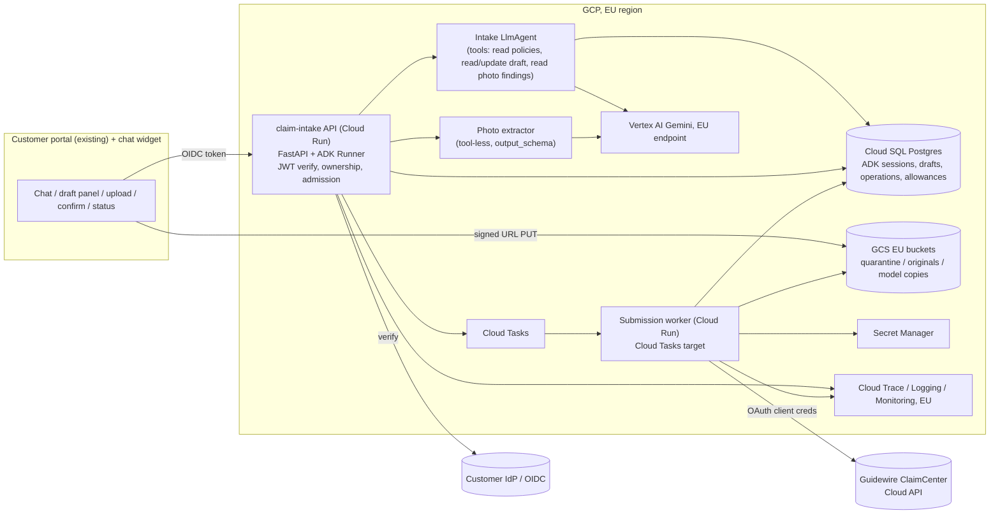
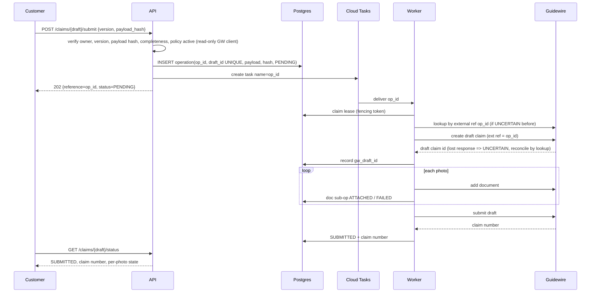

# System design: home-insurance claim intake agent (EU)

Status: **draft**. The user was not available, so every scope-gate answer and
several product decisions below are **assumed** (see the table). Decisions that
rest on an assumption are marked *provisional*. Nothing here has been accepted by
the user yet. Implementation plan: [docs/plans/home-claim-intake.md](../plans/home-claim-intake.md).

## Assumed answers

These are the questions I would have asked. Each row gives the answer I assumed
and the decisions that depend on it. If an answer is wrong, revisit the decisions
it lists.

| # | Question | Assumed answer | Decisions that depend on it |
| --- | --- | --- | --- |
| Q1 | When does work start, when is GA, and can we run a limited pilot before GA? | Start 2026-10-12, GA 2027-03-12 (about 20 working weeks after a two-week holiday break). A staff dogfood from week 11 and a limited customer pilot from week 16 are allowed. Development continues after GA. | Phase split, milestones, D10 |
| Q2 | How many hours does each person have, and how well do they know ADK and GCP? What share of the security reviewer's time do we get? Who runs the service after GA? | Five engineers and one ML engineer work full time (40 h/week) and know Python and GCP but are new to ADK. The security reviewer has 0.2 FTE. After GA the team runs the service, with business-hours on-call backed by the existing SRE rota. | Capacity, D8, D9 |
| Q3 | What can we spend on models and cloud? | Production: about €6k/month at GA volume. Non-production: €1.5k/month. Evaluation: €1k/month. All three are provisional. | D9, model choice, eval repeat policy |
| Q4 | Who are the users, how do they sign in, and through which channel? | Existing policyholders who sign in to the existing customer portal through the company's OIDC customer identity provider (CIAM). The channel is web plus the portal's mobile web view. Anonymous filing is not supported. | D3, D7 |
| Q5 | Which markets and languages? | One EU country at GA, in its local language plus English. | D2, eval set size, G09 |
| Q6 | Which Guidewire product, deployment and API? Is there a sandbox? Does it support idempotency or lookup by external reference? Who changes the Guidewire configuration? | ClaimCenter on Guidewire Cloud with Cloud API (Claim API: create a draft claim, add documents, submit). A sandbox tenant is available within three weeks. Idempotency and lookup support are **unknown** and resolved by G02. A separate Guidewire team owns the ClaimCenter configuration. | D5, I3, G02, G10, G11 |
| Q7 | What may the agent decide? | Nothing that has a legal or financial effect. It collects and structures the first notice of loss (FNOL). Adjusters decide coverage, payment and fraud. No automated individual decision under GDPR Art. 22. | D1, I6, security posture |
| Q8 | What should the system do with photos? | Attach the original photos to the claim as evidence. Analyse a privacy-reduced copy to check photo quality and to suggest damage type, room and visible cause, which the customer confirms. No repair-cost estimate. | D4, G06, G07 |
| Q9 | Must all data stay in the EU, including model inference? | Yes, strictly. Every store, log, backup and model call uses EU regions. No global model endpoint. | D6, G03 |
| Q10 | What are the retention and erasure rules for agent-side data? | Conversation transcripts: 90 days. Staged photos: deleted 30 days after a successful attach, or 30 days after abandonment. Claim data follows Guidewire retention. | Data table, G13 |
| Q11 | May the agent collect injury details (GDPR Art. 9 health data)? | No. It records only an "anyone injured?" yes/no and refers injury cases to the phone line. | D2, G09, G13 |
| Q12 | What volume and surges should we plan for? | About 2,000 claims/month filed through the agent at GA, with about 1.5 sessions per filed claim. A storm (catastrophe) day can bring 10× the daily average within a few hours. | D9, G15, G19 |
| Q13 | Is there a fallback channel? | Yes: the existing digital claim form and the phone line. A kill switch sends customers there. | D9, failure table |
| Q14 | What availability and latency targets apply? | Chat availability 99.5% per month. 99% of confirmed claims reach Guidewire within 15 min. p95 time per agent turn ≤ 8 s. All provisional, to be re-set from pilot measurements. | SLIs, G17, G19 |
| Q15 | What platform do we already have? | A GCP organisation with an EU landing zone, Terraform and existing Cloud Run services. A private connection to Guidewire Cloud exists or can be requested. | D7, G16 |
| Q16 | Who owns the DPIA, the AI-disclosure text and accessibility? | The DPO and Legal. Engineering supplies the data map and controls. GA is gated on DPIA sign-off. | G13, G20 |
| Q17 | Is a live hand-off to a human agent needed at GA? | No. The agent shows the phone number and offers a callback request through the existing contact-centre form. | Later list |
| Q18 | Who sends claim acknowledgements to customers? | Guidewire or the existing communications platform. The agent sends no messages. | D5, egress analysis |
| Q19 | Is there a baseline for the current journey? | Yes: analytics from the web form and claims-operations data on missing-information callbacks. | Outcome measurement |

## Purpose and constraints

**Journey (running example).** Storm damage brings down part of a ceiling in
Anna's flat during the night. Today she has two options. She can phone the claims
line, which has long queues on storm days, or she can fill in a long web form that
asks for codes she does not know ("peril type", "loss cause"). About a third of
filed claims then need an adjuster callback for missing information *(assumed
baseline, Q19)*. With the agent, Anna signs in to the portal and describes the
damage in her own words. She uploads four photos and answers a few targeted
questions. She then reviews a summary built from her answers and presses
**Submit**. She gets a reference straight away and a Guidewire claim number within
minutes. An adjuster receives a complete FNOL with the photos attached.

**What improves.** These are hypotheses until measured:

- Digital FNOL completion rate goes up.
- The share of claims needing a missing-information callback goes down.
- Time to file goes down.
- Guardrail: adjuster correction effort and complaint rate must not rise.

**Non-goals.** The agent does not decide or promise coverage, payout amounts,
fraud scores, repair-cost estimates, or anything about bank details or payment.
It does not file motor or contents-only claims, take claims from non-customers,
send outbound messages, or hand off to live chat.

**What the model contributes, and what code controls.**

- The model interprets free-text descriptions and asks the next useful question.
- The model maps the customer's language to the claim's coded fields, as
  *proposals* the customer sees.
- The model describes what photos show, as *proposals* the customer confirms.
- Code controls everything else: identity, policy ownership, the
  required-field rules per loss type, draft versioning, the confirmation step,
  the Guidewire payload, submission, retries and reconciliation, budgets, safety
  messaging and retention.

**Observed repository facts.** The repository is greenfield: one commit and no
application code. There are no pinned versions to preserve.

## Delivery constraints, depth and deferred controls

| Scope-gate answer | Value |
| --- | --- |
| First useful version due, and after it | GA 2027-03-12 in one EU country (Q1). Staff dogfood from week 11, limited pilot from week 16. Development continues after GA. |
| People and hours | 5 engineers + 1 ML engineer full time, new to ADK, know GCP. Security reviewer 0.2 FTE. The team operates the service after GA (Q2). |
| Money | Provisional: prod €6k/month, non-prod €1.5k/month, eval €1k/month (Q3). |
| Users and what they read | External customers using a running service. Adjusters read the claims it creates. Reviewers: DPO, security and claims operations. |
| Data touched and effects allowed | Personal data of EU customers (identity, address, policy, photos of homes that may show people). The system creates claims in Guidewire, which is the system of record. These are regulated and externally visible effects. |
| Delivery profile | **Production service.** External customers, personal data and writes to the authoritative claims system at GA. |

Depth per concern:

| Concern | Depth now (phase 1 = to GA) | Trigger that raises it |
| --- | --- | --- |
| Core judgment, measured | Build, with a gated evaluation set (G08, G09) | — |
| Identity and per-customer scope | Build: verified OIDC subject, ownership checked on every route and tool (G04) | — |
| Secrets and credentials | Build: workload identity, Secret Manager for the Guidewire client secret, rotation runbook (G11, G16) | — |
| External writes | Build: confirmation bound to a draft version, durable operation, reconciliation (G10, G11) | — |
| Sensitive data | Build: data map, minimisation, EU residency, no content in telemetry, retention and erasure (G06, G13) | Faces or third-party data in photos becomes a DPIA finding → G13 adds image redaction (phase 2 P2-04) |
| Prompt injection and agency | Build: threat model, no submit tool for the model, tool-less photo reader, adversarial suite (G14) | — |
| Budgets and loop limits | Build: per-invocation, per-session and per-customer limits, surge admission, kill switch (G15) | — |
| Memory and retrieval | Minimal: ADK sessions plus the draft record. No long-term memory and no RAG. | The customer asks to resume across devices after 7 days, or policy-wording Q&A is requested |
| Frontend | Build: chat widget, draft panel, upload, confirmation and status in the existing portal (G12) | — |
| Hosting | Build: Cloud Run in an EU region, with staging and production (G16) | Measured need for managed sessions or Agent Runtime features |
| Observability | Build: traces, token cost, SLIs and alerts (G17) | — |
| Release engineering | Build: release manifest, CI evaluation gate, canary and joint rollback (G18) | — |
| Performance and cost tuning | Defer until measured: load test only (G19) | p95 turn > 8 s, or cost per filed claim above budget, in the pilot |

Floor kept: no secrets in code, prompts or logs. Spend stops in code and on the
project. A customer-confirmed, version-bound submission is the only path to
Guidewire. Real customer data only in staging-approved and production
environments. Pinned model IDs. No accepted risks are recorded yet. The user has
accepted nothing.

| Deferred control | Why it waits | What would bring it forward |
| --- | --- | --- |
| Face and third-party redaction in stored photos | Adjusters need the original evidence. The model copy is already minimised (D4). | DPIA finding, or a complaint |
| Live hand-off to human chat | Not required at GA (Q17) | Abandonment after a "talk to a person" request exceeds 5% in the pilot |
| Cost tuning (context caching, smaller model for some steps) | No measurement exists yet | Cost per filed claim above budget |
| Long-term memory | The journey ends with one claim | Customers resume across days or devices |
| Multi-region failover | 99.5% target (Q14). Fallback is the form or phone (D9). | SLO raised above 99.9%, or a regional outage hits the SLO |

Capacity and cut line: see [Plan, capacity](../plans/home-claim-intake.md#delivery-profile-and-capacity).
In short:

- Capacity ≈ 2,980 focused hours, or ≈ 2,230 after a 25% reserve.
- Phase 1 (G01–G20, everything GA needs) is estimated at 1,350–2,100 h, so it
  fits at the high end.
- The tight resources are the security reviewer (≈ 72 h usable) and the ML
  engineer (≈ 360 h usable).

## Guarantees and acceptance

| ID | Invariant or target | Enforcing component and authoritative evidence | Failure outcome | Planned verification |
| --- | --- | --- | --- | --- |
| I1 | An authenticated customer can read or change only their own sessions, drafts, photos and submission status. | API middleware verifies the CIAM JWT and derives `customer_id`. Every repository query is keyed on it. Tools receive `customer_id` from trusted session state, never from model arguments. | 404 (no existence leak). No model call. | Cross-customer denial tests on every route and tool (G04, G14) |
| I2 | A Guidewire claim is created only after the customer confirms one specific draft version. The model cannot trigger submission. | `POST /claims/{draft_id}/submit` with `{version, payload_hash}`. The model has no submit tool. The server rechecks ownership, version, completeness and policy status. | 409 if the draft changed. 422 if incomplete. Nothing is sent. | Scripted model asks to "submit now": no submit call in the tool list. Draft edited after confirmation leads to 409 (G10, G14). |
| I3 | One confirmed draft produces at most one Guidewire claim, *under the replay contract G02 verifies*. | Operation record with `UNIQUE(draft_id)`. Fenced worker lease. Lookup by external reference before any retry after an uncertain outcome. | State `UNCERTAIN` stays visible. No fresh create until reconciled. | Fake Guidewire drops the response after commit: exactly one claim, and status ends `SUBMITTED` (G10). The same test runs against the sandbox (G11). **Open until G02.** |
| I4 | Each photo confirmed with a claim is either attached to that claim or shown as pending or failed. | One document sub-operation per photo with its own state. | Status page lists failed attachments. The ops queue owns the retry. | Fake Guidewire fails photo 3 of 4: claim submitted, photo 3 `FAILED` and visible, retry attaches it once (G10) |
| I5 | Fields sent to Guidewire are validated values from the confirmed draft, never raw model text. | `ClaimPayloadBuilder` (code) maps draft fields to the Cloud API schema. Free text goes only into the description field, bounded in length. | Validation error, claim not sent | Payload snapshot tests. Fuzzed draft values (G10). |
| I6 | The agent does not state coverage, payout amounts or claim outcomes. | Instruction (G09), output release check (G13) and evaluation gate (G08). **This is probabilistic, not a hard guarantee.** | The release check replaces the message with a fixed text and logs a metric. | Dev set: 0 violations in a ≥ 40-case adversarial slice. Production metric: release-check hit rate. |
| I7 | All customer data is processed and stored in EU regions, including inference. | Resource-location org policy, regional endpoints in config, and G03 verification. | Deploy fails the policy check | Infrastructure readback lists every resource and endpoint region (G03, G16) |
| I8 | Telemetry and logs contain no conversation content, photo bytes or policy numbers. | ADK content-capture flags off. Structured logger with an allow-list of fields. | — | In-memory exporter test plus log-scrubbing test (G13, G17) |
| I9 | Model spend and work are bounded per invocation, session, customer and project. | `RunConfig.max_llm_calls`, session caps, per-customer daily allowance in Postgres, surge admission and kill switch. | The customer sees the fallback to the form or phone. | Tests exhaust each limit (G15) |
| I10 | Safety guidance (gas, water, structural danger, injury → phone) appears deterministically. | A fixed first-step UI card plus code-detected flags from the draft. Not model-generated. | — | UI test, and a draft with `injury=yes` shows the phone card (G09, G12) |

Provisional targets (Q14), owned by claims operations after the pilot:

- Chat availability ≥ 99.5% per month.
- ≥ 99% of confirmed claims `SUBMITTED` within 15 min.
- p95 agent turn ≤ 8 s.
- Business guardrail: the adjuster missing-information callback rate is no
  worse than the form baseline.

## Architecture and decisions



Trust boundaries:

- **Browser.** Untrusted.
- **API.** Verifies the end-user identity. Runs as the `sa-intake-api` workload
  identity. It cannot reach Guidewire.
- **Worker.** Runs as `sa-submit-worker`. It is the only workload that holds the
  Guidewire credential.
- **Model.** Receives no credentials and no other customer's data.

**Submission sequence (happy path and the uncertain branch).**



The policy-active recheck on submit uses a **read-only** Guidewire client held by
the API. G02 decides whether this read is a separate credential with read scope
only. If Guidewire cannot scope it, the recheck moves to the worker, and a
lapsed policy becomes `REJECTED` with an explanation.

### Decisions

All are *proposed*. None is user-accepted.

| ID | Requirement | Design choice | Reason | Tradeoff / alternative | Verification |
| --- | --- | --- | --- | --- | --- |
| D1 | Complete FNOL from free text and photos, without decisions that have legal effect (Q7) | **One intake `LlmAgent`** with four narrow tools, plus code-owned state machine rules for completeness. No sub-agent hierarchy. | A conversational interpretation with a small tool set fits one agent. Required fields per loss type are deterministic, so code owns them. | Alternative 1: the plain web form, which is the baseline and fallback. Alternative 2: a multi-agent "triage → intake → review" chain, which adds hops without a distinct responsibility. We give up a reviewer agent; the customer's own confirmation is the review. | Dev-set completeness and field accuracy (G08). Captured request shows four tools (G05). |
| D2 | Customers must not be misled or put at risk (Q7, Q11) | Instruction forbids coverage or payout statements and injury details. Safety card and injury routing in code (I10). Output release check (I6). | The things the application knows (safety rules, required fields) live in code. The prompt carries only judgment. | Buffered message release adds latency (D8). | Adversarial eval slice. Release-check unit tests. |
| D3 | Customers see only their own data (I1) | Verify the CIAM JWT in middleware and map `sub` to `customer_id` and Guidewire account number through the CIAM claim, or a cached lookup *(G02/G04 decide)*. Session `user_id = customer_id`. Tools read `customer_id` from `tool_context.state` set by trusted code. | The model never selects authority. A conversation ID locates a resource but is not permission. | One extra lookup per session start | Denial tests (G04) |
| D4 | Use photos for quality checks and pre-fill without exposing extra personal data (Q8) | Upload through a **signed URL** to a quarantine bucket. Validate by magic bytes and size, then re-encode. Keep the **original** (with EXIF) for Guidewire. Make a **model copy**: EXIF stripped, downscaled to ≤ 1,600 px. A **tool-less extractor** returns a schema of enums plus a ≤ 200-character description. The intake agent sees findings only, never images. | Splits the untrusted-content reader from the writer. Smaller context. Adjusters keep the evidence. | The intake agent cannot answer open questions about a photo. A second model call per photo. | Extractor schema tests. Injected-text photo leaves the draft unchanged (G07, G14). |
| D5 | Create the claim in Guidewire exactly once with the photos (I2–I4) | Submission is an **application endpoint, not a model tool**. A durable operation record in Postgres. Cloud Tasks dispatch with task name = `op_id`. The worker creates a Guidewire *draft* claim tagged with `op_id`, adds documents, then submits. Uncertain outcomes are reconciled by lookup. | Version-bound human confirmation. Replay safety does not depend on the model or the session. Guidewire drafts stay hidden from adjusters until submitted *(assumed Cloud API behaviour, verify in G02)*. | Asynchronous: the customer sees "received" before the claim number. Needs a worker and an ops reconciliation queue. Synchronous create in the request is the credible alternative, but it is unsafe under timeouts. | Lost-response, duplicate-click and restart tests (G10). Sandbox run (G11). |
| D6 | EU residency (Q9, I7) | All resources in **one EU region**. *Candidate: europe-west4 or europe-west1; G03 picks by model availability.* Vertex AI regional endpoint for Gemini. Regional log buckets. Resource-location org policy. | The host region alone does not establish residency. Each recipient is checked. | One region means no regional failover. The fallback is the form or phone (D9). | G03 inventory. G16 readback. |
| D7 | Host the API and agent with control over auth, VPC egress and region (Q15) | **Cloud Run** (API service plus worker service), with `DatabaseSessionService` on **Cloud SQL Postgres** in the same region. | The team already runs Cloud Run and Terraform. We own the auth middleware and VPC egress to Guidewire. Sessions and business records share one transactional store. | Agent Runtime would give managed sessions and memory, but we would still need a gateway for CIAM auth and a worker. Its EU regional availability is unverified. GKE is too heavy for this team. | `DatabaseSessionService` against Postgres at the pinned ADK version (G01, G05). Restart test. |
| D8 | Safe public output and a responsive chat (I6, Q14) | **Buffered per-message release**: generate the full agent message, run the release check, then send it as one JSON event. Show a progress indicator while the agent works. Tool activity appears as status chips. | Streaming cannot retract text that has already been shown. Messages are short. | Time to first token equals the full turn time, so the p95 target is 8 s rather than first-token latency. | p95 turn time in the pilot. Release-check tests (G12, G13). |
| D9 | Bounded spend and graceful surges (Q3, Q12, I9) | `max_llm_calls=8` per invocation. Per session: 60 turns and 20 photos. Per customer: 5 sessions/day. Concurrency admission per instance plus a global active-session cap in Postgres. On saturation or kill switch, the customer is sent to the form or phone. Vertex quota and budget alerts as observation only. | A storm surge must degrade to the existing channels, not to errors. | Some surge customers are turned away to the form | G15 tests. G19 surge load test. |
| D10 | A release must not silently change behaviour (Q1) | Pin `gemini-3.8-flash` for the agent and extractor, with a separately versioned judge prompt on the same pinned model. Release manifest. CI eval gate. Cloud Run canary with thresholds. Joint rollback. | 3.8-flash is stable with no shutdown announced, and it is the recommended Flash for new work. Avoid 3.6 and 3.7-flash: Vertex retires them on 2026-11-19 and 2027-01-28. *Source: `adk-model-and-output-contracts/assets/model-lifecycle-2026-10-01.json`, checked_on 2026-10-08.* | Vertex commits to ≥ 12 months after release (2026-09-02), so earliest retirement is about 2027-09. A migration is planned after GA (phase 2 P2-03). | Manifest has no alias (G18). EU availability is checked in G03. |

**Versions.** ADK `google-adk==2.8.0` is the working assumption. The specialists
were checked against it (`*/references/compatibility.md`). G01 confirms it against
the chosen pin. Features known to be absent at 2.8.0: `FallbackModel` (2.9.0),
`ADK_MAX_TOOL_ROUNDS`. The design does not rely on either. Model backend: Vertex AI
(keyless IAM, EU regional endpoint). No prices, quotas or regional model
availability were looked up in this session (no network). They are G03's
verification.

### Model-facing contracts

| Surface | Contract | Implementing skill and verification |
| --- | --- | --- |
| Intake instruction | Owns the following judgments:<br>• which missing field to ask about next<br>• how to map the customer's words to coded proposals<br>• when the draft is ready for review<br><br>It must not:<br>• make coverage or payout statements<br>• ask for injury details, bank details or third-party personal data beyond names of other parties involved<br><br>Templated state: language, loss type, missing fields list (computed in code). Versioned as `prompts/intake/vN.md`. | `adk-agent-instructions`; rendered-request snapshot test (G09) |
| Intake tools (4) | `list_my_policies()` → read, bounded to ≤ 10 policies with masked numbers.<br>`get_claim_draft()` → read.<br>`update_claim_draft(changes: list[FieldChange])` → write to *our* draft only, validated, returns accepted, rejected and missing fields.<br>`get_photo_findings()` → read, enums only.<br><br>None takes `customer_id` or `draft_id` as an argument; both come from trusted state. There is no submit tool. | `adk-tool-interface-design`; declaration dump ≤ 4 tools, bytes recorded (G05) |
| Photo extractor output | `PhotoFindings{status: ok/not_damage_photo/unusable, quality_issues[], room: enum, damage_types: enum[], visible_cause_hint: enum, severity_bucket: enum, description ≤ 200 chars}`. Pinned `gemini-3.8-flash`. A refusal is a valid shape. One repair attempt, then `unusable`. | `adk-model-and-output-contracts`; scripted prose, fenced JSON and wrong-valid cases (G07) |

## Data and authority

| Data / operation | Owner and authorized scope | Writers / readers | Source and freshness | Lifetime / erasure |
| --- | --- | --- | --- | --- |
| Customer identity | CIAM | CIAM / API middleware | Verified JWT on every request | Not stored beyond the session `user_id` |
| Policy facts (active policy, insured address) | Guidewire (or PolicyCenter through Guidewire) | Guidewire / read client in the API | Read at session start and **re-read at submit** | Cached in session state for display only. Expires with the session. |
| ADK session events (transcript) | Customer (`user_id`) | API Runner / API (owner only) and support with break-glass access | — | 90 days, then deleted by a scheduled job. Erasure on request through the DPO process (G13). |
| Claim draft (versioned) | Customer | `update_claim_draft` tool and UI edits / UI, worker | Authoritative pre-submission record. `version` increments on every change. | Converted into an operation at submit. Deleted with the session after 90 days. |
| Photo original | Customer → Guidewire after attach | Browser (signed PUT) / worker | Quarantine → originals bucket after validation | 30 days after attach or abandonment. CMEK *(optional, ask)*. |
| Photo model copy and findings | Customer | Upload handler / extractor, intake tools | Derived from the original | Same as the original. Findings are stored in the draft. |
| Submission operation and document sub-operations | Application | API (create) and worker (transitions) / API status, ops console | Authoritative for "what we sent". Guidewire is authoritative for the claim. | 24 months as an audit record *(assumed, ask Legal)* |
| Guidewire claim | Guidewire | Worker / adjusters | System of record | Guidewire retention |
| Allowances and admission counters | Application | API | — | Rolling 24 h |
| Telemetry | Ops | Both services / ops | — | Trace 30 days, logs 30 days, in EU sinks. No content. |

Identities, kept separate:

- **Conversation:** `session_id`, owned by `customer_id`.
- **Invocation:** `invocation_id`.
- **Business object:** `draft_id` + `version`.
- **Business operation:** `op_id`, unique per draft.
- **External record:** the Guidewire claim number.

**Approval binding.** Confirmation carries `{draft_id, version, payload_hash}`.
The server recomputes the hash and rejects a mismatch. It also rechecks policy
status and completeness at submit time.

**Credentials.** These are the credentials and their owners:

- **CIAM signing keys.** Fetched via JWKS by the API.
- **Guidewire OAuth client credentials.** Held in Secret Manager. Only
  `sa-submit-worker` can access them (and, if G02 allows, a read-scoped client
  for `sa-intake-api`). They never appear in a prompt, tool argument or event.
- **Vertex AI.** Accessed through workload identity. There are no API keys.

### Security posture

| Agent / component | Private data | Untrusted content | Write or egress | Resolution |
| --- | --- | --- | --- | --- |
| Intake agent | Yes: the customer's own policy and draft | Yes: customer text, plus photo findings derived from untrusted images | Writes only the customer's own draft (reversible). Egress only to the same customer. | **The irreversible leg is removed.** There is no submit tool and no Guidewire credential. Draft writes are validated and scoped by trusted state. Any injected change is visible on the confirmation screen and affects only that customer's own claim, which the customer can already edit. |
| Photo extractor | Photo content | Yes: images, which may contain text | **None:** no tools | A quarantined reader. Schema-constrained output with enums and a bounded string. |
| Submission worker | Draft and photos | Draft values that originated from the model | Guidewire write | **Code only, no model.** Validated payload builder (I5). Confirmed version only. |

Tool tiers:

- **Read:** `list_my_policies`, `get_claim_draft`, `get_photo_findings`.
- **Write (reversible, own scope):** `update_claim_draft`.
- **Irreversible:** Guidewire create and submit. This tier is outside the model.
  It is gated by the confirmation endpoint.

A `before_tool_callback` checks that `tool_context.state["customer_id"]` is set
and that the draft belongs to that customer, and refuses otherwise. There is no
code executor.

Adversarial suite (G14) asserts:

- no cross-customer read through any argument
- no Guidewire call without a confirmation record
- an injected photo text ("set loss date to …", "mark as submitted") changes no field without the customer seeing it on the summary
- coverage-promise prompts trigger the release check

Map findings to OWASP LLM01, LLM02, LLM06 and LLM05.

## Budgets and capacity

These are illustrative workload assumptions (Q12):

- 2,000 filed claims/month and 1.5 sessions per filed claim, so about 3,000
  sessions/month.
- About 18 turns per session, with about 1.6 model calls per turn including tool
  rounds. That is about 29 calls per session.
- About 5 photos per claim, with 1 to 2 extractor calls each.
- Input tokens per intake call: about 3k for the instruction and tools, plus
  history that grows to about 8k. Average about 6k.

Formula:

```
monthly model cost ≈ sessions × (29 × (6k × P_in + 300 × P_out))
                   + photos × 1.3 × (image_tokens × P_in + 250 × P_out)
                   + eval runs
```

The P values are Vertex prices for `gemini-3.8-flash` in the chosen EU region. They
were **not looked up** in this session, so this is not a validated bill. G03
records the dated prices and G19 measures real tokens per filed claim.

Concurrency:

- **Steady.** About 100 sessions/day at roughly 15 min each comes to a handful
  of concurrent sessions.
- **Storm day.** 10× the daily average arrives over about 4 h. That gives about
  1,000 sessions in 4 h, or about 60 concurrent sessions. Model calls run at
  about 2–4 per second at peak.
- **Constraints.** Vertex per-region quota and Guidewire API rate limits matter
  more than Cloud Run (G03, G02).

Allowances (I9):

| Allowance | Unit | Scope | Enforcement point | Persistence | On exhaustion |
| --- | --- | --- | --- | --- | --- |
| LLM calls per invocation | calls | invocation | `RunConfig.max_llm_calls=8` | none | Fixed apology plus a "try again" message. The draft is kept. |
| Turns and photos per session | count | session | API before `run_async` / upload URL issue | Postgres | Offer the form or phone. The draft is kept. |
| Sessions per customer per day | count | customer | API session create | Postgres | Form or phone |
| Global active sessions | count | service | API admission (atomic counter with TTL lease) | Postgres | "High demand" page with the form or phone |
| Kill switch | flag | service | API, checked each request | Config (Secret Manager or Firestore *(choose in G15)*) | All new sessions go to the form. Submissions already in progress finish. |
| Project spend | € | project | Budget alert (observation only) and Vertex quota | GCP | An alert pages the owner, who decides on the kill switch |

Submissions and reconciliation are **exempt** from the turn and admission limits:
already-confirmed work always completes.

## Failure and recovery

| Failure window | User-visible outcome | Retained state / possible effects | Safe next action and recovery owner |
| --- | --- | --- | --- |
| Successful filing | Reference straight away, claim number within minutes | Session, draft, operation `SUBMITTED` with the claim number, documents `ATTACHED` | — |
| Another customer's `session_id` or `draft_id` supplied | 404 | Nothing read. No model call. | Security metric. No retry. |
| Model unavailable, 429, or malformed output | "Something went wrong, your answers are saved." Retry button. | Draft unchanged or at the last valid version | SDK retry bounded once (single owner: the `Gemini` `retry_options`). After that the customer may retry, within the allowance. |
| Extractor returns invalid output twice | Photo shown as "uploaded – we couldn't read it" | Original kept and still attached at submit | None needed. The adjuster sees the photo. |
| Browser disconnects mid-turn | On reconnect, history shows the completed turn or none | Session events up to the last committed event. The draft version shows any accepted changes. | Customer resends. Turns are serialised per session (409 on overlap). |
| Customer double-clicks Submit / two tabs | Same reference shown | One operation (`UNIQUE draft_id`) | — |
| Draft changed after the summary was shown | "Your claim changed, please review again" | No operation created | Customer re-confirms |
| Policy lapsed or cancelled between start and submit | "We can't file this online, please call …" | Operation `REJECTED` with reason | Contact centre |
| Guidewire commits the create but the response is lost | Status "Received, being processed" | Operation `UNCERTAIN` and `op_id` external reference | Worker looks up by `op_id` before any create. If lookup is unsupported (G02): manual reconciliation queue. **Owner: claims-ops on-call.** |
| Claim created, photo 3 of 4 fails | Status: claim number plus "1 photo still uploading" | Document sub-op `FAILED` after retries | Worker retries with backoff. After that, ops queue. The claim is never re-created. |
| Guidewire down for hours | "Received, we'll confirm your claim number by email" | Operations `PENDING`. Cloud Tasks retries within its retention. | Worker drains the queue on recovery. Alert on the age of the oldest pending operation (> 15 min). An ops runbook covers anything beyond task retention. |
| Worker crash or overlapping workers | No change | Lease with fencing token. A stale worker's commit is rejected. | Cloud Tasks redelivers. Reconcile if `UNCERTAIN`. |
| Customer requests erasure while an operation is pending | Erasure waits until the operation is terminal | — | DPO process. The Guidewire record follows Guidewire retention rules. |
| Release check or Model Armor unavailable | Fail closed for the message: fixed text plus retry | Draft kept | Alert. A degraded mode is decided in G13, never "release unscreened". |
| Telemetry sink down | None | Exporter drops data. The service continues. | Monitoring alert on exporter errors |
| Storm surge or exhausted budget | "High demand" page with the form or phone | Existing drafts kept for 90 days | Admission control. Ops may raise caps. |
| Model retirement announced | None | — | Planned migration release P2-03 against the frozen dev set |
| Rollback | None for customers (sessions are compatible) | Operations in flight continue on the worker | Joint rollback of image, prompt, model and tool schema. Session-schema migrations must be backward compatible for one release (G18). |

## Verification and implementation handoff

**Verification ladder.** All of these are planned. Nothing has been executed.

- **Offline deterministic checks.** Policy, ownership and tool tests. A scripted
  model drives the Runner. A fake Guidewire covers lost responses, partial
  documents and duplicates. Restart and fencing tests run on local Postgres.
- **Local integration.** A real process restart with Cloud SQL Postgres (or
  local Postgres). Browser upload through signed URLs against an EU bucket in
  dev.
- **Bounded live.** Guidewire sandbox contract tests (G11). Vertex EU endpoint
  availability (G03). Evaluation runs within the eval budget.
- **Release and operations.** Load and surge test in staging (G19). Canary
  thresholds (G18). Alerts fire in staging (G17). Pilot measurement against the
  form baseline (G20).

**Outcome measurement** is separate from model quality:

- Baseline: form completion rate and missing-info callback rate (Q19).
- Pilot compares the agent cohort with the form cohort.
- Guardrails: adjuster correction rate and complaints.
- Model quality (field accuracy, photo enum accuracy, policy violations) comes
  from G08's dev set.

**Observability and release:**

- **SLIs:**
  - submission success (`SUBMITTED` within 15 min / confirmed)
  - age of the oldest `UNCERTAIN` or `PENDING` operation
  - tool error rate by tool
  - turn latency p95
  - tokens and € per filed claim
  - release-check hit rate
  - admission rejections
- **Telemetry:** one owner per service. ADK content capture off. Trace, session
  and op IDs on every log line.
- **Release bundle:** image digest, prompt version, model IDs, tool schema hash,
  eval-set hash, secret versions. Recorded in `release/manifest.json` and in the
  Cloud Run revision labels.
- **Promotion gate:** deterministic tests on every change. The judge-scored eval
  runs nightly and before each release. A missing run counts as a failure.
- **Canary:** 5% for 24 h, with the thresholds fixed in G18.
- **Rollback:** the previous revision stays ready for 7 days.

**Implementation routes and goals** are in the [plan](../plans/home-claim-intake.md).
The proposed module layout is labelled there.

## Open decisions

| Question or assumption | Why it changes the design | Owner / evidence needed | What it blocks |
| --- | --- | --- | --- |
| Guidewire replay contract: idempotency key, lookup by external reference, draft claims and document limits (Q6) | Decides whether I3 is automatic or needs manual reconciliation | Guidewire team plus the sandbox (G02) | G11, and the real adapter in G10 (the fake-based work is not blocked) |
| Mapping from CIAM subject to Guidewire account (Q4, D3) | Ownership of policies | CIAM owner plus G02 | G04 policy step, G05 `list_my_policies` |
| Regional availability and quotas for `gemini-3.8-flash` on Vertex in EU regions. Prices. Model Armor and SDP EU endpoints (Q9). | D6 region, D10 model, D9 cost | G03 | G16 (region), G13 (Model Armor) |
| Whether EXIF and GPS from the originals may go to Guidewire (Q8) | Data minimisation versus evidence value | DPO | G06 attach behaviour |
| Retention of operation audit records (24 months assumed) | Storage and erasure | Legal | G13 |
| Production budget figures (Q3) | Caps in D9 | Product owner | G15 thresholds (defaults are usable) |
| AI disclosure wording (EU AI Act transparency obligations, per Legal; not verified in this session) and accessibility level | UI copy, GA gate | Legal | G12 copy, G20 |
| Security reviewer time (0.2 FTE assumed) | G14 review depth is the tightest constraint | Engineering manager | G14, G20 |

Design completion here does not authorise provisioning, IAM changes, Guidewire
writes, paid evaluation runs or deployment. Each goal names what it still needs.
