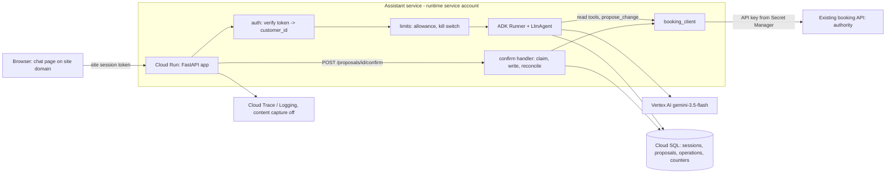

# System design: salon booking assistant (MVP)

Status: **draft**. Every decision is provisional because it rests on the assumed answers
below. The user was unavailable, so no decision here is user-accepted except the three facts
in their request: three developers, an MVP in two weeks then continued, and book, move
and cancel through the existing booking API.

Plan: [../plans/salon-booking-assistant.md](../plans/salon-booking-assistant.md).
Tickets: [../tickets/salon-booking-assistant/](../tickets/salon-booking-assistant/).

## Assumed answers

These are the scope-gate questions and the others the request did not answer. Each row lists
the decisions that change if the answer is wrong.

| # | Question I would have asked | Assumed answer | Decisions that depend on it |
| --- | --- | --- | --- |
| A1 | When exactly is "two weeks", and what happens after? | 10 working days from kickoff to customers using it; continued and improved afterwards, so phase 1 code is kept | Cut line; kept rather than throwaway code |
| A2 | How many hours can each developer give, and how familiar are they with ADK and GCP? | About 6 focused hours a day each for the two weeks. Comfortable with Python and web work, new to ADK (estimates ×1.5) | Capacity of 135 h after reserve; all estimates |
| A3 | Is there a GCP project, and where does the booking API run? | The booking API already runs on GCP, and the team can create resources in that organisation | D5, D10; no GCP setup day added |
| A4 | What can the MVP spend on models and cloud? | About US$300 a month for staging and production together, with a budget alert | D7, D8; model tier; G07 budget |
| A5 | Who uses it and who judges the MVP? | Customers of the salons use it, on the public website. The salon owners judge the pilot. Staff see results in the existing booking system | MVP profile; D4, D6 |
| A6 | Do customers have website accounts the server can verify? | Yes. The site issues a session token the server can verify, whose subject maps to the booking API's `customer_id`, and the site's reverse proxy can route `/assistant` to a new service | D4, D6; G04 scope |
| A7 | What data does it touch and what can it change? | Real personal data (name, contact details, appointment history). Reversible writes: book, move, cancel. **No payments or deposits** | Floor; D3; sensitive-data depth |
| A8 | Does the booking API have staging, and where are business rules enforced? | It has a staging environment with test customers. The API enforces opening hours, stylist capacity and the cancellation window | G01 scope; D3 |
| A9 | Who tells customers and the salon about a change? | The booking system already sends its usual confirmation for any change made through the API | No notification component in phase 1 |
| A10 | Where are the salons, and are there data-residency rules? | One country, one GCP region near the salons. No residency rule beyond normal privacy law. Each salon has one local time zone | Region for D5, D8, D10 (provisional) |
| A11 | Which languages? | English only | D1 instruction; Later list |
| A12 | Who runs it after launch? | The three developers, during business hours; no 24/7 on-call | Recovery owner; G16 in phase 2 |
| A13 | How much traffic? | Low: at most about 300 conversations a day across five salons at peak. One warm instance in production | D10; cost; no load testing in phase 1 |

## Purpose and constraints

**Journey (running example).** Priya is a signed-in customer of the Northgate salon. On Sunday evening she
wants to move Friday's 10:00 cut to Saturday afternoon. Today she phones during opening
hours, often waits, and the receptionist searches stylist calendars while the customer is on the line.
With the assistant she types "can I move my Friday cut to Saturday afternoon with Sam?" and
sees two free Saturday slots. She picks 14:30 and sees a card saying "Move: Cut with Sam at
Northgate, Fri 10:00 → Sat 14:30". She presses Confirm and gets a receipt. The booking system
sends its usual confirmation.

**Friction to remove:** phone-only changes, limited to opening hours. **Outcome to improve
(hypothesis):** more booking changes completed without staff time. The guardrail is no rise in
wrong or duplicate appointments. There is no baseline yet (O8); G18 measures one.

**Fixed constraints:** the existing booking API is the only authority for salons, services,
stylists, slots and appointments. The deadline is two weeks with three developers.

**What the model contributes and what code controls.** The model:
- interprets requests ("Saturday afternoon", "with Sam", "my Friday one");
- asks clarifying questions;
- chooses which read tool to call;
- proposes a specific change from slots the API returned.

Code:
- resolves identity and dates against salon time zones;
- re-checks ownership and availability;
- stores the proposal;
- renders the Confirm card;
- executes the write with an idempotency key, records its outcome and reconciles uncertainty;
- enforces limits.

The model never holds a tool that writes.

Observed facts: this repository holds only the skills, with no application code or pins.
Everything else in this document is proposal or assumption.

## Delivery constraints, depth and deferred controls

| Scope-gate answer | Value |
| --- | --- |
| First useful version due, and after | 10 working days (A1); continued |
| People and hours | 3 developers × about 6 focused h a day, new to ADK (A2); they run it afterwards in business hours (A12) |
| Money | About US$300 a month (A4), assumed |
| Users or judge, and what they read | External salon customers on the website. Salon owners judge the pilot (A5) |
| Data touched and effects allowed | Real personal data; reversible writes to real appointments; no money (A7) |
| Delivery profile | **MVP or pilot**: first external users completing a real journey; the team must see failures and cost |

Depth per concern:

| Concern | Depth now | Trigger that raises it |
| --- | --- | --- |
| Core judgment, measured | Build: 30 labelled cases, run before each release (G06, G10) | CI gate in G13 once G11 is live |
| User identity and per-customer scope | Build: website session, enforced in code (G04) | OTP sign-in if O1 shows many customers lack accounts |
| Secrets and credentials | Build: Secret Manager and a dedicated service account (G07) | Rotation when the team adds a second environment owner |
| External writes | Build: code-side confirmation, idempotent writes, uncertain-outcome reconciliation (G03) | Scheduled reconciliation in G16 |
| Sensitive data | Build at minimal cost: field minimisation in tool results, content capture off, 30-day log and session retention | Screening (Model Armor or SDP) if free text reaches the model |
| Prompt injection and agency | Build structurally: no write tool in the model, free-text API fields excluded (D3, D9) | Adversarial suite in G14 |
| Budgets and loop limits | Build: per-customer allowance, `max_llm_calls`, kill switch, budget alert (G09, G07) | Shared token budget if spend nears the allowance |
| Memory and retrieval | Conversation sessions only; the booking API's history is the memory | "Usual stylist" preference, Later |
| Frontend | Build at minimal cost: a chat page on the site's domain (G05) | Embedded widget or SMS, Later |
| Hosting | Cloud Run with previous-revision rollback (G08) | Canary in G17 |
| Observability | Build: traces, token cost, daily operations review (G08, G11) | SLOs and alerts in G16 |
| Release engineering | Minimal: pinned model, ADK and prompt in a startup manifest; evaluation run by hand | CI gate (G13) and joint rollback (G17) |
| Performance and cost tuning | Defer | Measured p90 above 6 s, or cost per change above target |

Not touched by the journey: RAG, analytical SQL, A2A or MCP peers, and code execution.

**Floor kept:**
- no secrets in code, prompts or logs;
- spend stops through `max_llm_calls`, the per-customer allowance, a kill switch and a budget alert;
- nothing changes an appointment without the customer pressing Confirm in code the model cannot reach;
- real personal data is minimised and kept out of logs and traces;
- the model ID is pinned.

There are no accepted risks.

**Who may use it, and graduation conditions.** In phase 1, signed-in customers of the pilot
salon, on real data. Before all five salons (G12): no unreconciled uncertain operations after
three to five pilot days, and G10 still at the launch bar. Before more channels, payments, or
unmonitored operation outside business hours: G13, G14 and G16.

| Deferred control | Why it waits | What would bring it forward |
| --- | --- | --- |
| Eval gate in CI (G13) | One release a day at most during the pilot; a manual run is enough | A second person editing prompts, or the first regression |
| Adversarial suite (G14) | The structural split already removes the write leg; the inputs are first-party | A free-text field reaching the model, or any new untrusted source |
| SLOs and alerts (G16) | Baselines don't exist yet; a daily review covers one salon | Five salons live (G12) |
| Canary (G17) | Low traffic; a whole-revision rollback is enough | Daily releases or a bad release in production |
| Content screening | Fields are minimised; no free text from third parties | A privacy review, or free-text notes needed |

**Capacity and cut line.** 180 focused hours with a 25 % reserve leaves 135 h. Phase 1 (G01 to
G11) is **60–94 h** and finishes in **6.9–9.9 of 10 working days**, from the schedule
check in the plan. It ships at **one pilot salon**. Widening to all five (G12) and the phase 2
hardening wait. The user should confirm or move this line.

## Guarantees and acceptance

| Invariant | Enforcing component and authoritative evidence | Failure outcome | Planned verification |
| --- | --- | --- | --- |
| I1 A customer reads and changes only their own appointments | `app/auth.py` derives `customer_id` from the verified site token into trusted state. Tools and the confirm handler use only that value. The booking API is the authority | 401 or 404; no data and no write | G04 cross-customer tests; G03 foreign `proposal_id` test |
| I2 No appointment changes without the customer pressing Confirm on a card that shows the exact change | Only `POST /proposals/{id}/confirm` (ordinary code) calls a write method. The model has `propose_change` only | No write; the agent explains it needs confirmation | G03 scripted-model "just book it" test asserts zero writes in the fake's call log |
| I3 One confirmation gives at most one booking API change | Atomic claim on the `proposals` row, plus `idempotency_key = proposal_id`, plus lookup-based reconciliation. This depends on the API contract (O2, O3) | A duplicate click returns the same receipt | G03 double-click, two-tab and lost-response tests |
| I4 The customer is never told "done" unless the API confirmed it | The `operations` status comes only from the API response or a reconciliation lookup. The card renders from that status | "We're checking this booking. Please don't book again." | G03 timeout-after-commit test; G05 uncertain-state UI |
| I5 The proposed change matches what the customer asked for | Model judgment, measured. Code checks the slot exists and belongs to the right salon and service | A clarifying question or a refusal | G10: at least 27 of 30 correct and 0 forbidden writes (O6) |
| I6 Spend is bounded | `max_llm_calls=12` per turn; per-customer and per-IP allowance; kill switch; budget alert | Polite refusal; "please call the salon" | G09 tests; G07 budget |

## Architecture and decisions

Trust boundaries:
- The browser is untrusted.
- The site token is verified in `auth`.
- The model sees an instruction, tool declarations and minimised tool results. It cannot reach `CONF`.
- The booking API trusts the service's API key. End-user authority is enforced by the assistant passing only the verified `customer_id`; G01 checks whether the API also checks ownership.

**Move with confirmation (sequence):**

1. The browser sends `POST /chat` with the token.
2. `auth` sets `customer_id`, and `limits` admits the turn.
3. The Runner runs: the model calls `list_my_appointments`, then `find_slots`.
4. The model calls `propose_change(move, appointment_id, slot_id)`.
5. Code checks the appointment belongs to the customer and the slot is still free, stores a `Proposal` (pending, expires in 10 minutes) and returns the card.
6. The browser renders the card. The customer presses Confirm, and the browser sends `POST /proposals/{id}/confirm`.
7. The handler re-verifies the token and owner, then flips the proposal from `pending` to `executing` with a conditional update.
8. It writes an `operations` row and calls `reschedule(..., key=proposal_id)`.
9. On success it records `succeeded` and the receipt. On timeout it records `uncertain` and runs reconciliation.
10. It appends an event to the session and returns the receipt.

| ID | Requirement | Design choice | Reason | Tradeoff / alternative | Verification |
| --- | --- | --- | --- | --- | --- |
| D1 | Interpret free-form booking requests over a small capability set | One `LlmAgent` with four read tools and one proposal tool | One judgment (what change does the customer want?) over five tools. No distinct context or credential would justify a second agent | A router with book, move and cancel sub-agents adds routing errors and evaluation surface for no new boundary. A form-based UI is cheaper but doesn't remove the phone friction for vague requests | G02 scripted Runner tests; G10 |
| D2 | The booking API is the authority | A typed `booking_client` adapter used by tools and the confirm handler, and a fake with failure modes | Every goal tests offline against the same contract | Writing a fake costs hours, but live staging can't produce lost responses on demand | G01 contract tests run on the fake and on staging |
| D3 | I2, I3, I4 | **Confirmation and writes in application code.** `propose_change` stores a proposal. A separate HTTP endpoint executes it with `idempotency_key = proposal_id` and an `operations` record. Move uses the API's atomic reschedule if present; otherwise it books new, then cancels old, as two operations, and a failed cancel leaves both appointments and is flagged | The model can't reach the write. Confirmation is bound to the stored details. A duplicate confirm or a retry maps to one operation. ADK's native `require_confirmation` is not used: Google's confirmation docs list `DatabaseSessionService` as unsupported, which D5 needs (cited in `safe-api-tool-calls/references/compatibility.md`; recheck on the pin) | Two tables and an extra endpoint, against native confirmation. If the API has no idempotency keys, deduplication relies on the atomic claim and on looking up by customer and slot before any re-dispatch (O2) | G03 test list |
| D4 | I1 | Verify the site's session token in middleware. `customer_id` goes into trusted session state. Tools never take a customer ID argument | Reuses the existing login with no new identity provider | Depends on A6. The alternative is phone OTP (+8–12 h, O1) | G04 tests |
| D5 | Conversations survive restarts and multiple instances; proposals and operations are durable | One Cloud SQL Postgres instance holds the ADK `DatabaseSessionService` and the application tables | One store, one backup, one place for the transactional claim | A fixed monthly instance cost. `VertexAiSessionService` or Firestore would need a second store for the transactional claim | G08 redeploy-and-resume test |
| D6 | Customers chat on the site and press Confirm | Custom JSON API with complete turns, not streaming; a chat page served by the app under the site's domain | The fewest moving parts. The card is a typed field, not parsed text | No progressive text; a link rather than an embedded widget. Streaming and embedding are Later | G05 browser test |
| D7 | I6 | `RunConfig(max_llm_calls=12)`; a Postgres-backed per-customer allowance (40 turns a day, 3 open proposals) and per-IP limit for anonymous use; kill switch; budget alert | Admission in code, before the model, survives restart. A budget alert only observes | Counters add a write per turn | G09 tests |
| D8 | Stable behaviour through the plan's horizon | Pin `gemini-3.5-flash` on Vertex AI, with thinking at the model default unless G10 shows a need | From the lifecycle table checked 2026-10-08: stable, Vertex retirement "2027-05-19 or later", beyond phase 2. `gemini-3.7-flash` retires on Vertex on 2027-01-28 and `gemini-3.6-flash` on 2026-11-19, inside the horizon. `gemini-3.8-flash` is newer but lists no retirement date yet | Possibly lower quality than 3.8. G10 can compare both on the same set and switch as a release | G10 measures the pinned ID; the manifest shows it |
| D9 | Minimise personal data; see failures and cost | Tool results include salon, service, stylist first name, times and appointment IDs only, with no phone, email or free-text notes. OTel to Cloud Trace with content capture off; token counts per invocation; 30-day retention | The model and the traces see only what the journey needs. Excluding free text also removes the only untrusted-content leg | Debugging can't see prompt text. A redacted sample is needed for G18 | G02 captured-request test; G08 trace check |
| D10 | Host the API near the existing stack | Cloud Run, one service per environment. Production min instances 1; previous revision kept | The team already runs on GCP (A3). The service is stateless | One warm instance costs a little; Agent Runtime would add a gateway for the custom confirm endpoint | G08 rollback test |

**Versions.** `google-adk==2.8.0` is the working assumption: the specialists'
`references/compatibility.md` files name 2.8.0 (released 2026-08-25) as the version read.
G02 confirms the pin and the names it uses. Model lifecycle comes from
`adk-model-and-output-contracts/assets/model-lifecycle-2026-10-01.json` (checked 2026-10-08).
Region, Cloud SQL tier and prices were **not looked up** in this session, which had no network
access. They are provisional, and G07 verifies them.

### Model-facing contracts

| Surface | Contract | Implementing skill and verification |
| --- | --- | --- |
| Instruction | `booking_v1` covers: scope (this chain's salons only); always propose from returned slots; ask when salon, service or day is ambiguous; never claim a change happened; show the salon phone number when stuck. Date, time zones and identity are injected by code, not reasoned about | adk-agent-instructions; G02 rendered-request test |
| Tools | Read tier: `list_salons_and_services`, `find_slots`, `list_my_appointments`, `salon_contact`. Proposal tier: `propose_change(kind, appointment_id?, slot_id?)`. There is no write tier in the model. Results are bounded (10 slots) with `status` and an actionable `error` | adk-tool-interface-design; G02 declaration dump |
| Output | Free text plus the proposal card as a tool result. The application builds the card from the stored proposal, not from model text, so no `output_schema` is needed | adk-model-and-output-contracts; G05 checks the card comes from the proposal row |

## Data and authority

| Data / operation | Owner and authorised scope | Writers / readers | Source and freshness | Lifetime / erasure |
| --- | --- | --- | --- | --- |
| Salons, services, slots, appointments | Booking API; scoped to the verified customer | Booking API writes; the assistant reads through `booking_client` | Authoritative, read live on each tool call; re-checked at proposal and at confirm | Booking system policy |
| Conversation session | Assistant, keyed by `customer_id` and `session_id` | Runner | Not authoritative for appointments | 30 days, then deleted by a scheduled job (G08). Deleted with the customer's account on request |
| Proposal | Assistant, owned by `customer_id` | `propose_change` creates it; the confirm handler claims it | Expires after 10 minutes | 90 days for audit |
| Operation | Assistant; `id = proposal_id` | Confirm handler and reconciliation | Status reflects the API's response or a lookup | 90 days |
| Allowance counters | Assistant | `limits` | Daily | 7 days |

Identities:
- **End user:** the site session gives `customer_id`.
- **Workload:** the Cloud Run service account holds the booking API key, Vertex AI and Cloud SQL access.
- There is no delegated OAuth.
- **Business operation:** `proposal_id`. It differs from the ADK `session_id` and the invocation ID, and survives restarts in Postgres.

### Security posture

| Agent | Private data | Untrusted content | Write or egress | Resolution |
| --- | --- | --- | --- | --- |
| Booking agent | Yes: the customer's own appointments | Low. The customer's own text is the principal, not a third party. API results are first-party, and free-text notes are excluded (D9) | **No** write tool. `propose_change` only stores a pending proposal; the confirm endpoint writes | A leg removed: writes moved out of the model (D3). G14 adds the adversarial suite |

Tool tiers: read; proposal (stores a pending record, no external effect); write (confirm
endpoint only, after the customer presses Confirm). There is no code executor.

## Budgets and capacity

- **Workload (A13):** at most about 300 conversations a day, around 6 turns each. Expected 2–4 model calls per turn, bounded at 12.
- **Cost:** per turn, about (calls × input tokens) + output tokens on `gemini-3.5-flash`. Prices were not looked up in this session. G07 records the price and date, and G11 measures cost per completed change against A4.
- **Fixed costs:** Cloud SQL smallest tier and one warm Cloud Run instance in production.
- **Latency:** no target was given. Provisional target: a complete turn under 6 s at p90, measured in G11. Missing it triggers streaming (Later).
- **Same conversation:** turns are serialised per session by the page, which disables input while a turn runs. The server rejects an overlapping turn for the same session with 409.
- **Exhaustion:** with the allowance used up or the kill switch on, chat says "please call the salon" with the number, and pending proposals can still be confirmed.

## Failure and recovery

The running example is Priya's Friday-to-Saturday move.

| Failure window | User-visible outcome | Retained state / possible effects | Safe next action and recovery owner |
| --- | --- | --- | --- |
| Token invalid, or another customer's session or proposal ID | 401 or 404 | Nothing | Sign in again. No owner needed |
| Model unavailable or malformed tool call | "I'm having trouble, please try again or call Northgate on …" | Session events up to the failure; no proposal | Retry the turn within the allowance. Dev on duty reviews traces daily |
| Slot taken between proposal and confirm | "That slot was just taken. Here are other times" | Proposal marked `failed`; no write | Agent offers new slots. No owner needed |
| Timeout after the API committed (lost response) | "We're checking this booking. Please don't book again" | Operation `uncertain`; the appointment may exist | Reconciliation by key or lookup, never a new key. If unresolved, the dev on duty checks it in the daily review (G11). Scheduled reconciliation arrives in G16 |
| Double click or two tabs | Same receipt twice | One operation | Atomic claim. No owner needed |
| Move as book-then-cancel: the cancel fails | "Your Saturday 14:30 is booked. We couldn't cancel Friday 10:00, so please call the salon or try cancelling again" | New appointment exists; old one still active; operation flagged | Customer can retry the cancel as a new proposal. Staff see the flag in the daily review |
| Process restart mid-turn | The turn errors; the conversation resumes from Cloud SQL | Events persisted so far; a `pending` proposal stays confirmable until it expires | Customer resends. No owner needed |
| Proposal expired before confirm | "That offer expired. Let me check the time is still free" | Nothing written | Agent re-proposes |
| Allowance exhausted or kill switch on | "Please call the salon" | Counters | Resets the next day; operator flips the switch |
| Release breaks behaviour | Wrong proposals | Sessions and operations unaffected | Roll back to the previous revision (G08). G10 runs before each release |
| Telemetry exporter fails | None | Requests continue; traces are lost | Telemetry is best effort. The `operations` table remains the authority for the review |

Not applicable: memory erasure races (no long-term memory), A2A peers, retrieval, and code execution.

## Verification and implementation handoff

- **Offline (G01–G06, G09):** fake booking API with scripted failures; Runner tests with a scripted model; auth, limits and write tests asserting the fake's call log.
- **Local integration (G05):** a real browser against a local server and the fake.
- **Bounded live:**
  - G02: a manual session in the dev project.
  - G10: 30 cases × 3 repeats in the dev project.
  - G01 and G03: one recorded run each against booking-API staging with test customers.
- **Hosted (G07, G08, G11):** staging, then production. Each needs the team's go-ahead. This design authorises none of it.
- **Outcome (G18):** share of signed-in chats ending in a completed change, and salon phone volume against a baseline the salons provide (O8). Until then the benefit is a hypothesis.

Observability and release at MVP depth:
- **Telemetry:** owned by the FastAPI process; content capture off; 30-day retention.
- **Release manifest:** image digest, `google-adk` version, model ID and prompt version, logged at startup.
- **Release gate:** G10 run by hand.
- **Rollback unit:** the previous Cloud Run revision, kept until the next release.
- **Later:** SLIs and alerts (G16), the CI gate (G13) and the canary (G17).

Goals, owners and estimates are in the [plan](../plans/salon-booking-assistant.md).

## Open decisions

| Question or assumption | Why it changes the design | Owner / evidence needed | What it blocks |
| --- | --- | --- | --- |
| O1 Does the site have server-verifiable customer sign-in (A6)? | If not, phone OTP adds 8–12 h and moves G09 into phase 2, or the launch slips | The team (Dev C) | G04, then G05 and G09 |
| O2 Does the booking API accept idempotency keys, and for how long? | Decides whether I3 rests on the provider or only on the claim plus lookup | G01 | G03 detail |
| O3 Is there an atomic reschedule endpoint? | Without one, a move is two operations with a partial-failure state | G01 | G03 detail |
| O4 Can an appointment be looked up by customer and slot? | Needed for reconciliation when keys are unsupported | G01 | G03 |
| O5 Does the API enforce the cancellation window and ownership itself? | If not, the assistant must enforce them, as a second line in code | G01 | G03 |
| O6 Launch quality bar | Decides when G11 may start | Salon owner and team | G10, G11 |
| O7 Spend allowance (A4) and region (A10) | Model tier, Cloud SQL tier, region | User | G07 |
| O8 Baseline phone and booking-change volume per salon | Without it, the benefit can't be measured | Salon owners | G18 |
| Cut line: one pilot salon in phase 1, five in G12 | The user asked for an MVP for the chain | User confirms or moves it | G11, G12 |
