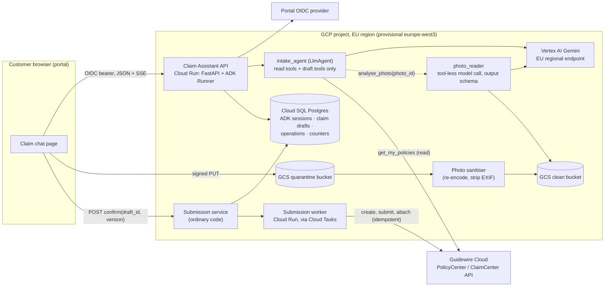

# System design: home-insurance claim intake assistant (ADK, EU)

Status: **draft**. Written in one pass without the user available; every
decision that rests on an assumed answer below is **provisional** until the
user confirms it. No decision in this document has been accepted by the user
yet; all are recommendations.

Plan: [docs/plans/home-claim-intake.md](../plans/home-claim-intake.md) ·
Tickets: [docs/tickets/home-claim-intake/](../tickets/home-claim-intake/)

## Assumed answers

The user was not available. Each row is a question that would have been asked,
the answer assumed, and the decisions that depend on it.

| # | Question | Assumed answer | Decisions that depend on it |
| --- | --- | --- | --- |
| A1 | Which EU market(s) and languages at GA? | One market (Germany assumed), German and English | D16, G08, G09, G26, G27; region choice in D7 |
| A2 | Are all six people full time on this for the five months, and how familiar with ADK and GCP? | Full time; strong Python and GCP, new to ADK (×1.5 on every estimate); security reviewer about one day a week | Plan capacity, every estimate |
| A3 | Which Guidewire product and API: Guidewire Cloud (ClaimCenter/PolicyCenter Cloud API) or self-managed with custom integration? | Guidewire Cloud, ClaimCenter and PolicyCenter Cloud API (REST), with a sandbox and a pre-production tenant owned by an internal Guidewire platform team | D4, G02, G25, G10, G11 |
| A4 | Does the customer portal already have login, and can we embed a chat in it? | Yes: existing web portal with OIDC login and a customer-to-policy-account mapping; the team can add a page | D5, D13, G05, G12, G27 |
| A5 | What may the assistant change? | It creates a first notice of loss (FNOL) claim and attaches photos in ClaimCenter after explicit customer confirmation. It never decides cover, reserves or payments | D3, D11, D12 |
| A6 | Which claims are in scope at GA? | Property damage to the insured home and contents (water, storm, fire after the event, theft, glass). Injury, liability to third parties, ongoing emergencies and commercial property go to the phone hotline | D11 |
| A7 | Expected volume? | ~250k home policies, ~10k home claims a year, 40 % filed digitally at GA (≈11 a day), storm peaks of 30× (≈330 a day, ≈50 concurrent sessions) | Budgets and capacity, G19 |
| A8 | Model and cloud budget? | No fixed cap given; assume a monthly model and cloud allowance the business sets in G04, enforced as a project budget alert plus application admission | D14 |
| A9 | Regulatory constraints the company already applies? | GDPR with a DPO who signs a DPIA; EU AI Act transparency (users told they talk to an AI); DORA ICT third-party register for the insurer; legal to confirm the system is not an AI Act high-risk use | D10, G03 |
| A10 | Must data stay in the EU, including model inference? | Yes: all processing and storage in EU regions; no global endpoints | D7, D9, D10 |
| A11 | How long are transcripts and photos kept? | Photos: until attached to the claim plus 30 days in our bucket (Guidewire holds the claim copy). Transcripts: 90 days after submission or abandonment, then deleted; DPIA (G03) may change both | D10, G14 |
| A12 | Who operates it after GA? | The same team, business-hours on-call, with the claims operations team handling uncertain submissions | Failure and recovery, G16, G24 |
| A13 | Is a controlled pilot before GA acceptable? | Yes, a 2–3 week pilot with a small share of portal users before GA | G23, G24 |

## Purpose and constraints

**Running example.** Anna, a homeowner in Germany, finds water coming through
her kitchen ceiling from a burst pipe on Saturday. Today she phones the claims
line (queues at weekends), or fills a long web form that does not accept
photos, then emails photos that a claims handler matches by hand and re-keys
into Guidewire ClaimCenter. The intended outcome: in the portal, already
signed in, she describes what happened in her own words, uploads photos from
her phone, the assistant asks only for what is missing, shows her a summary
of the claim, she confirms it, and within a minute she sees a ClaimCenter
claim number with her photos attached. A handler then works a complete FNOL
instead of re-keying one.

**Outcome to improve** (hypotheses until measured): share of home claims filed
digitally; FNOL completeness at first contact (fields a handler must chase);
time from first contact to claim number. Guardrails: handler correction rate
on assistant-created claims and complaint rate must not exceed the web-form
baseline. Baselines come from the current web form and phone data (open
decision O7).

**What the model contributes:** turning a free-text account into structured
loss facts, asking for the missing ones in the customer's language, describing
visible damage in photos as observations, and writing a neutral loss summary.
**What ordinary code controls:** who the customer is, which policies they hold,
whether a policy was in force, the claim draft's authoritative values, the
confirmation, the Guidewire write and its replay, the photo pipeline,
emergency routing, budgets and every stored record.

**Non-goals at GA:** cover decisions, reserves, payment or settlement offers,
repairer booking, claim status questions for existing claims, other lines of
business, voice. Existing systems: customer portal and its login (A4),
Guidewire Cloud ClaimCenter and PolicyCenter (A3).

Observed repository facts: the repository is empty apart from the skill
packages under `.claude/skills/`; there is no application code, pin or
convention to preserve. Everything below is proposed.

## Delivery constraints, depth and deferred controls

| Scope-gate answer | Value |
| --- | --- |
| First useful version due, and what happens after it | General availability in one EU market in five months (target 2027-03-09, assumed from 2026-10-12 start); continued and operated afterwards |
| People and hours | Five engineers, one ML engineer, full time (assumed, A2); one security reviewer about one day a week; new to ADK, experienced with GCP and Python |
| Money | Not stated; business-set monthly allowance assumed (A8), enforced by application admission plus a budget alert |
| Users or judge, and what they read | External retail customers using a running service; claims handlers read the created claims; DPO, security and the release board read the design, DPIA and evidence |
| Data touched and effects allowed | Personal data (identity, address, policy, photos of homes and possibly people); writes to the system of record (claim creation, document attachment) |
| Delivery profile | **Production service**: external customers, personal data and writes to the claim system of record at GA |

Depth per concern the journey touches:

| Concern | Depth now (phase 1, to GA) | Trigger that raises it |
| --- | --- | --- |
| Core judgment, measured | Build: labelled evaluation set, CI gate (G09, G26, G17) | Pilot failures feed new cases (G23) |
| Identity and per-customer scope | Build: verified portal OIDC, owner checks on every route and tool (G05) | — |
| Secrets and credentials | Build: workload identity, Secret Manager, Guidewire client credentials rotated (G04, G10) | — |
| External writes | Build: confirmation bound to draft version, durable operation record, provider idempotency, reconciliation (G28, G10, G11) | — |
| Sensitive data | Build: EU residency, no content in telemetry, retention and erasure, DPIA (G03, G14) | — |
| Prompt injection and agency | Build: structural split (no write tool in the agent, quarantined photo reader), adversarial suite, reviewer sign-off, external test (G07, G15, G20–G22) | — |
| Budgets and loop limits | Build: per-invocation, per-session, per-customer and global admission with operator stop (G13) | Measured storm traffic → shared reservations |
| Memory and retrieval | Minimal: conversation sessions and an app-owned claim draft only; no long-term memory, no RAG | A knowledge need (e.g. policy wording questions) |
| Frontend | Build: portal chat page with upload, summary card and confirm (G12 API, G27 page) | — |
| Hosting | Build: Cloud Run in an EU region with rollback (G04, G18, G17) | — |
| Observability | Build: traces, SLIs, alerts, runbook (G16) | — |
| Release engineering | Build: release manifest, CI evaluation gate, canary and joint rollback (G17, G24) | — |
| Performance and cost tuning | Minimal: storm-burst load test only (G19) | Measured p90 latency or cost per claim above target |

Floor kept: no secrets in code, prompts or logs; spend stop through
`RunConfig.max_llm_calls` and application admission; nothing reaches
Guidewire without the customer confirming the exact draft; personal data
scoped to the customer and kept out of telemetry; pinned model IDs.
Accepted risks: none yet; the user has not been asked.

Who may use it at GA: signed-in retail customers of the chosen market with an
active home policy. Graduation conditions before more markets, lines or
channels: per-market language evaluation, market-specific DPIA addendum,
regional Guidewire configuration, load test at the new volume.

| Deferred control | Why it waits | What would bring it forward |
| --- | --- | --- |
| Long-term memory across claims | The journey is one claim; history lives in ClaimCenter | A repeat-claim journey that needs it |
| Shared token reservations across replicas | Storm volume (A7) fits per-request admission | Load test or a budget breach shows oversubscription |
| Model failover to a second model | Adds an untested combination at GA | Measured availability below SLO, or a retirement notice |
| Claim status and follow-up questions | Separate read journey | Post-GA demand (phase 2, P2-02) |
| Automated damage estimation | Would become a decision about the claim (AI Act and GDPR Art. 22 review) | Business request plus legal review |

Capacity and cut line: see the plan's
[delivery profile and capacity](../plans/home-claim-intake.md#delivery-profile-and-capacity);
figures there are produced by `check_schedule.py`, not restated here.

## Guarantees and acceptance

| Invariant or target | Enforcing component and authoritative evidence | Failure outcome | Planned verification |
| --- | --- | --- | --- |
| I1 A customer reads and continues only their own drafts, sessions and photos, and files only against a policy they hold that was in force on the loss date | API middleware verifies the portal OIDC token; `customer_id` derived from the token, never from the request body or model; PolicyCenter lookup by that ID is authoritative | 404 for another customer's IDs; policy not held or not in force → the assistant explains and offers the hotline; no claim | Cross-customer denial tests on every route and tool (G05); scripted model supplying another policy number (G15) |
| I2 ClaimCenter receives a claim only after the customer confirmed the exact draft version shown, and at most one claim per confirmed draft | Submission service (ordinary code, not a model tool) checks draft version hash, owner and policy, then claims a durable operation record; Guidewire replay header and reference field (D4, verified in G02) | Changed draft → re-confirm; duplicate click or worker retry → same operation | Duplicate submit, worker crash after send, lost response tests against a Guidewire fake (G28, G10) and the sandbox (G11) |
| I3 Every confirmed draft reaches a visible state: claim number, rejected with reason, or "received, being processed" with operations reconciling | Operation record states and a reconciler; status read from the record, never from model text | Uncertain → customer told it is received and they will be contacted; ops alert | Fault-injection tests (G10); alert test (G16) |
| I4 Text in photos or messages cannot trigger a write, change draft values without the customer seeing them, or disclose another customer's data | No write or egress tool in the agent; photo reader has no tools and returns schema-validated observations; draft changes shown in the summary before confirm | Injection attempt yields at most a wrong suggestion the customer sees | Adversarial suite asserting forbidden calls never run (G15); reviewer and pen test (G20–G22) |
| I5 The assistant never states that a loss is covered, nor amounts or timelines for payment | Instruction plus a deterministic response check for cover/payout phrases per language, plus evaluation | Response replaced with the approved neutral wording | Evaluation cases and check unit tests (G08, G09, G26) |
| I6 Personal data is processed and stored only in EU regions; telemetry carries no prompt, response or photo content | Region pins on Vertex AI, Cloud Run, Cloud SQL, GCS, logging buckets; ADK content capture off | Deployment check fails the release | Config readback and exporter test (G04, G14, G16) |
| I7 A mention of injury, an ongoing emergency (gas, fire, flooding now) or a liability claim gets the hotline and emergency message | Deterministic keyword screen per language in code plus the model's `handoff_reason` field; either triggers | Assistant stops intake for that topic and shows the fixed message | Evaluation cases in both languages (G09, G26), unit tests (G08) |
| I8 Model work is bounded per invocation, session, customer and globally, and an operator can stop new sessions | `RunConfig.max_llm_calls`, application counters in Cloud SQL, feature-flag stop (G13) | Polite stop message; drafts preserved; confirmed submissions continue | Guardrail tests (G13); load test (G19) |
| T1 Time to first streamed text p90 ≤ 3 s; confirmation to claim number p95 ≤ 60 s while Guidewire is healthy (**provisional targets**, no user source) | Measured from traces | SLO burn alert | Load test (G19), pilot (G23) |
| T2 Intake completion and FNOL completeness at least as good as the web form (**hypothesis**) | Funnel analytics and handler correction tags | Rollback or redesign of the conversation | Pilot comparison (G23) |

## Architecture and decisions

Trust boundaries: the browser and everything a customer uploads are
untrusted; the model's output is a proposal; only the API middleware, the
submission service and the worker hold authority. Identities: customer (portal
OIDC subject), serving workload (Cloud Run service account
`claim-assistant-api`), worker workload (`claim-submission-worker`, the only
holder of the Guidewire write credential), and Guidewire's integration client.

**Submission sequence (Anna confirms):**

1. Browser posts `confirm(draft_id, draft_version)`; middleware verifies the
   token and that Anna owns the draft.
2. Submission service reloads the draft, checks the version equals the one
   shown, re-checks the policy in PolicyCenter (in force on loss date), and in
   one transaction freezes the canonical payload and inserts
   `operation(id, draft_id, payload_hash, state=accepted)`. A second confirm
   for the same draft version returns the existing operation.
3. It enqueues a Cloud Tasks task named after the operation ID (named tasks
   deduplicate enqueue) and returns `202 {operation_id}`; the page polls status.
4. The worker claims the operation (row lock plus a fencing version), calls
   ClaimCenter create-and-submit FNOL with the operation's replay key and
   reference field, records `claim_number` and `state=submitted`.
5. Per photo, an attach operation uploads the clean image as a claim document
   with its own replay key; each photo's state is recorded.
6. The page shows the claim number and per-photo status from the record.

### Decisions

All decisions are **proposed** (none user-accepted); those marked *(prov.)*
depend on an assumed answer.

| ID | Requirement | Design choice | Reason | Tradeoff / alternative | Verification and expected result |
| --- | --- | --- | --- | --- | --- |
| D1 | GA in five months for external customers (A2, A5) | Production profile; phase 1 is everything GA needs in one market | Personal data and system-of-record writes set the risk, not the label | Fewer features at GA than a pilot-first plan could show | Plan schedule check fits the calendar |
| D2 | Free-text loss account into a structured FNOL | One `LlmAgent` (`intake_agent`) with narrow tools, plus a tool-less `photo_reader` model call; no multi-agent routing | One conversation, one responsibility; the reader exists only to quarantine untrusted images | Against ordinary form code: the agent handles free narratives and missing-field questions; a form fallback remains in the portal | Completion and completeness vs form baseline in pilot (G23) |
| D3 | No claim without customer intent (I2) | Submission is not a model tool. The UI confirm button calls the submission service with the draft version the customer saw | The model cannot reach the write; confirmation binds to material details | The assistant cannot "submit for you" in words; the customer clicks | Scripted model that "decides to submit" produces no Guidewire call (G15) |
| D4 | At most one claim per confirmed draft (I2, I3) | Durable operation record in Cloud SQL; Cloud Tasks named task; Guidewire Cloud API replay header (assumed `GW-DBTransaction-ID`, **unverified**) plus a ClaimCenter extension field holding the operation ID for lookup-based reconciliation *(prov., A3)* | Retries, double clicks and worker restarts share one identity; lookup proves an earlier attempt's effect | Requires a ClaimCenter configuration change by the Guidewire team (calendar wait); retention of the replay key unknown | G02 and G25 record the actual replay contract; G10 tests lost-response replay, G11 repeats it in the sandbox |
| D5 | Customer scope (I1) | Verify the portal OIDC token in middleware; map subject to the PolicyCenter account; place `customer_id` and allowed policy numbers in trusted session state the tools read; tool arguments never carry identity *(prov., A4)* | A session ID or policy number typed by anyone is not authority | Extra PolicyCenter call per session | Cross-customer tests (G05) |
| D6 | Photos are untrusted and personal | Signed upload to a quarantine bucket; sanitiser validates type and size, decodes and re-encodes (drops EXIF/GPS and polyglot payloads) into a clean bucket; app-owned `photo` rows hold owner, draft and attach state; only clean bytes reach the model and Guidewire | Ownership, retention and attach state belong to the application, not the conversation | Not using ADK `GcsArtifactService` for these; the agent gets photo IDs and observations, not raw artifact handling | Upload of a non-image, oversized file, or another customer's photo ID fails (G06) |
| D7 | EU hosting, custom API, worker, Guidewire connectivity (A10) | Cloud Run services (API, worker) in one EU region, provisionally `europe-west3` *(prov., A1)* | Custom routes, upload, worker and VPC egress are first-class; team knows Cloud Run | Against Agent Runtime: managed sessions, but a gateway would still be needed for upload, confirm and worker; against GKE: more operations | Deployment readback shows region, service accounts, revisions (G04, G18) |
| D8 | Draft survives disconnect; sessions per customer | ADK `DatabaseSessionService` on Cloud SQL Postgres for events; the claim draft is a separate versioned app record the agent's draft tools update | The draft is authoritative business state; the conversation refers to it by ID | Two stores to keep consistent; restart tests needed | Restart mid-draft and resume returns the same draft version to its owner only (G01, G05) |
| D9 | Pinned, EU-served model through GA and beyond (A10) | Vertex AI `gemini-3.8-flash` on an EU regional endpoint for agent and photo reader; same pinned ID as scheduled judge; `thinking_level` low for the agent *(prov.: EU regional availability and image input to be confirmed in G01)* | Lifecycle table (`adk-model-and-output-contracts/assets/model-lifecycle-2026-10-01.json`, checked 2026-10-08): stable, released 2026-09-02, Vertex guarantees ≥12 months → not before 2027-09; `gemini-3.7-flash` retires on Vertex 2027-01-28 and `gemini-3.6-flash` 2026-11-19, both before GA; `gemini-3.5-flash` retires 2027-05-19 or later, ten weeks after GA | A model retirement ≈6 months after GA is a designed-in migration (Later list); judge equals agent model, so judge scores carry self-preference risk and gates stay deterministic | Release manifest has no alias; captured request shows the regional endpoint (G01, G17) |
| D10 | Residency, minimisation, retention (I6, A9, A11) | Telemetry content capture off; structured logs carry IDs only; transcripts and photos deleted on schedule by a retention job; Model Armor screening on customer text as a layer behind D3/D6 *(prov.: EU availability unverified)*; DPIA before pilot | Personal data appears in prompts, sessions, photos and logs; each sink needs a policy | Debugging without content needs session lookup by ID under access control | Exporter test shows no content; retention job test (G14); DPIA sign-off (G03) |
| D11 | Out-of-scope and urgent cases (I7, A6) | Deterministic screen plus model `handoff_reason`; fixed messages with hotline and emergency numbers; draft kept for the handler | Safety messages must not depend on model wording | Some false-positive handoffs | Evaluation cases in both languages (G09, G26) |
| D12 | No cover or payout statements (I5) | Instruction states it; deterministic post-check per language replaces offending text before release to the browser | A sentence in the prompt is a hint; the check is enforcement | Buffering per sentence adds small latency | Check unit tests and evaluation (G08) |
| D13 | Browser contract | Custom JSON API with SSE text deltas; summary card from the draft record; submission status from the operation record by polling | Status is authoritative only from records | No AG-UI/CopilotKit; portal team keeps its stack | Socket test of the API (G12); browser test of the page (G27) |
| D14 | Bounded spend (I8, A8) | `max_llm_calls`=15 per invocation; ≤80 turns and ≤20 photos (15 MB each) per draft; ≤5 new drafts per customer per day; global daily model-call admission counter and an operator stop flag | Each limit has a unit, scope and enforcement point | Counters in Cloud SQL rather than a shared reservation system | Guardrail tests; storm load test (G13, G19) |
| D15 | Releases are comparable and reversible | Release manifest (image digest, prompt version, model and judge IDs, tool schema hash, eval-set hash, secret versions); deterministic eval gate in CI; canary 5 % → 25 % → 100 % on Cloud Run traffic split | Joint rollback of prompt, model and code | Slower releases | Gate fails by exit code on a seeded regression (G17) |
| D16 | Languages (A1) | German and English at GA; the agent answers in the customer's portal language; fixed messages translated and reviewed | Bounded evaluation per language | Other languages wait for a market | Per-language evaluation slices (G09, G26) |

Versions: no installed ADK exists. Working assumption is **google-adk 2.8.0**,
the version the specialist skills were checked against (their
`references/compatibility.md`); G01's acceptance includes confirming every
interface used here against the pin the team chooses. Provider facts not
verified in this session (no network): Vertex AI EU availability of
`gemini-3.8-flash` and image input; Model Armor EU regions; Guidewire Cloud
API replay header semantics and retention; Cloud Tasks named-task
deduplication window. Each has a verification step in the plan.

### Model-facing contracts

| Surface | Contract | Implementing skill and verification |
| --- | --- | --- |
| Instructions | `intake_agent`: collect loss facts for one home claim in the customer's language, ask one question at a time, never state cover or payment, hand off on injury/emergency/liability. Identity, policies, dates, limits and confirmation stay in code and trusted state | `adk-agent-instructions`; rendered-request test (G08) |
| Tool interfaces | Read: `get_my_policies()` (no identity arguments), `get_claim_draft()`. Draft (app-internal write, shown to customer): `update_claim_draft(field, value)` with enumerated fields and validation, `analyse_photo(photo_id)` (owner-checked, returns observations). No Guidewire write tool. ≤6 tools; results bounded to 2 kB | `adk-tool-interface-design`; declaration dump and size (G08) |
| Output contracts | `photo_reader`: `output_schema` with `observations[]`, `damage_types[]`, `image_quality`, `refusal` (not a photo of damage / unreadable), `text_seen_in_image` flagged as data. Agent turns are free text plus a structured `handoff_reason` via a tool call | `adk-model-and-output-contracts`; scripted prose, fenced JSON and wrong-but-valid outputs (G07) |

## Data and authority

| Data / operation | Owner and authorized scope | Writers / readers | Source and freshness | Lifetime / erasure |
| --- | --- | --- | --- | --- |
| Customer identity | Portal IdP | Middleware reads token | Token per request | Not stored beyond subject and account ID |
| Policies | PolicyCenter | `get_my_policies` reads by trusted account ID | Live call at session start and again at confirm | Cached in session state for the session only |
| ADK session events | Customer (subject) | API via Runner | Cloud SQL | 90 days after submission/abandonment (A11) |
| Claim draft (versioned) | Customer | Draft tools, UI edits | Cloud SQL, authoritative until confirmed | Same as session; frozen payload kept with the operation |
| Photos | Customer, per draft | Upload, sanitiser; reader and worker read | GCS clean bucket | Attached + 30 days, or with abandoned draft |
| Submission operation | Application | Submission service, worker, reconciler | Cloud SQL; Guidewire is authority for the claim | 13 months (assumed audit need; G03 confirms) |
| ClaimCenter claim and documents | Insurer (Guidewire) | Worker writes; handlers | Guidewire | Insurer's claim retention |
| Telemetry | Platform team | Exporters | Cloud Trace/Logging EU buckets | 30 days; IDs only |

Business-operation identity: `operation_id` (one per confirmed draft version)
lives longer than any invocation; ADK `invocation_id` and `session_id` only
correlate. Photo attach operations are children of the claim operation.

### Security posture

| Agent | Private data | Untrusted content | Write or egress | Resolution |
| --- | --- | --- | --- | --- |
| `intake_agent` | Own policies and draft | Customer text; photo observations (derived from untrusted images) | Draft updates (shown to the customer before confirm); no external write; replies only to the same customer | Write leg removed (D3). Draft changes are visible and confirmed by the customer. Tools read identity only from trusted state |
| `photo_reader` | The one photo | The image itself | None: no tools, schema output only | Quarantined reader; output validated and treated as data |
| Submission worker (code) | Frozen payload | None | Guidewire write | Ordinary code; no model in the path |

Tool tiers: read (`get_my_policies`, `get_claim_draft`), internal write
(`update_claim_draft`, `analyse_photo` records observations), irreversible
external write (claim creation, document attachment) only in the worker behind
customer confirmation. No code executor. Adversarial cases (G15): instructions
written in a photo, a message claiming to be the claims handler, another
policy number, a request to submit, an oversized tool-result attempt.
OWASP mapping and the threat model belong to G15.

## Budgets and capacity

Workload (A7, assumed): ≈11 intakes a day normally, ≈330 a day and ≈50
concurrent sessions in a storm peak. Per completed claim (assumed, to be
measured in G19/G23): ≈20 customer turns, ≈25 agent model calls, ≈5
photo-reader calls, ≈200k input and ≈10k output tokens before caching.
Bounded work: 80 turns × 15 calls = 1,200 calls per draft worst case,
capped further by the global admission counter. Cost per claim is symbolic:
`200k × p_in + 10k × p_out + 5 × p_image + Cloud Run + Cloud SQL share`;
prices were not looked up in this session (no network) and must be filled in
from the pricing page with a date in G04. Fixed costs: Cloud SQL HA instance,
minimum one warm Cloud Run instance for the API.

Latency (provisional, T1): first streamed text p90 ≤ 3 s, confirmation to claim
number p95 ≤ 60 s. Exhaustion outcomes: per-invocation cap → the turn ends
with "let me hand you to our team" and the draft is kept; per-customer cap →
retry tomorrow or hotline; global stop → new sessions get the web form link,
confirmed submissions still complete (the worker is outside model admission).

## Failure and recovery

| Failure window | User-visible outcome | Retained state / possible effects | Safe next action and recovery owner |
| --- | --- | --- | --- |
| Successful request | Claim number and photo statuses | Operation `submitted`, photos `attached` | — |
| Another customer's draft or photo ID | 404 | None | — |
| Model unavailable or malformed photo-reader output | "I could not read that photo, please describe it" / retry later; draft kept | Draft, session | Bounded retries (SDK retry only, no app retry on top); customer continues |
| Browser disconnect mid-stream | Reopen shows the conversation and the draft | Session events, draft | Customer resumes; no effect |
| Confirm double-clicked or retried | Same operation shown | One operation | — |
| Worker sends, response lost, worker dies | "Received, being processed" | Operation `in_flight` with replay key | Reconciler: replay with same key or look up by reference field; ops queue after 15 min (G10, G16) |
| Claim created, photo attach fails | Claim number shown, "2 of 5 photos still uploading" | Claim exists; photo ops pending | Retry attach ops; ops alert after N attempts; never re-create the claim |
| Guidewire rejects (policy lapsed, validation) | Clear reason and hotline | Operation `rejected` with reason | Customer edits and re-confirms (new version, new operation) |
| Policy changes between draft and confirm | Re-check at confirm fails → explanation | No operation | Customer contacts hotline |
| Process restart / overlapping workers | No change visible | Fencing version on the operation row | Stale worker cannot record a result |
| Text in a photo instructs the agent | Nothing unusual; maybe a wrong suggestion visible in the summary | None external | Adversarial suite (G15) |
| Budget exhausted / operator stop | Polite stop, web form link | Drafts | Ops lifts the stop |
| Telemetry or Model Armor unavailable | Telemetry: none. Model Armor: fail closed for new text turns with an apology *(prov.)* | — | Platform on-call |
| Model retirement announced | None | Pinned ID | Planned migration release with re-baseline (Later list) |
| Rollback | Previous revision serves; drafts and operations remain readable | Schema migrations are expand-only during canary | Platform; G17/G24 |
| Erasure request | Transcripts, drafts and photos deleted; claim data stays in Guidewire under its legal basis | Operation audit row minimised | Retention job and DPO process (G14) |

## Verification and implementation handoff

Planned (none executed): offline Runner tests with a scripted model and a
Guidewire fake (G01, G05, G28, G10, G13, G15); local integration with real
Postgres, process restarts and the browser (G01, G06, G12, G27); bounded live checks
against Vertex AI EU and the Guidewire sandbox in the dev project (G25, G07,
G11); release evidence: staging run, storm load test, pen test, pilot, canary (G18–G24).

Observability and release:

- SLIs: completed intakes / started intakes; submissions reaching `submitted`
  within 60 s / confirmed; uncertain operations older than 15 min (target 0,
  alert to claims ops); tool error rate by tool; tokens per completed claim;
  first-text latency. Targets from pilot baselines (G23).
- One telemetry owner per Cloud Run process; ADK content capture off; Cloud
  Trace and Logging in EU buckets with 30-day retention.
- Release bundle per D15, recorded in the deployment's manifest and the
  running revision's labels; previous revision kept ready for 7 days.

Implementation plan and goals: [docs/plans/home-claim-intake.md](../plans/home-claim-intake.md).

## Open decisions

| Question or assumption | Why it changes the design | Owner / evidence needed | What it blocks |
| --- | --- | --- | --- |
| O1 Guidewire replay contract and reference field (A3) | Decides whether duplicate prevention is provider-backed or lookup-only | Guidewire platform team; G02 and G25 findings | G10, G11 |
| O2 Vertex AI EU availability of `gemini-3.8-flash` with image input | Residency (I6) and D9 | G01 check against current docs | G07 live checks; fallback is `gemini-3.5-flash` with its 2027-05-19 retirement planned |
| O3 Market, languages, region (A1) | Region, evaluation slices, translations | Product owner | G08, G09, G27 final copy |
| O4 Retention periods and legal basis (A11) | Retention job values, eval data reuse | DPO via G03 | G14 values, G23 start |
| O5 AI Act classification and transparency text (A9) | High-risk classification would add obligations | Legal via G03 | G23 |
| O6 Model Armor fail-closed vs fail-open | Availability vs screening | Security reviewer | G14 |
| O7 Baselines for completion and completeness | T2 cannot be judged without them | Claims operations data | G23 conclusion |
| O8 Budget figure (A8) | Global admission value | Business owner | G13 value only |
