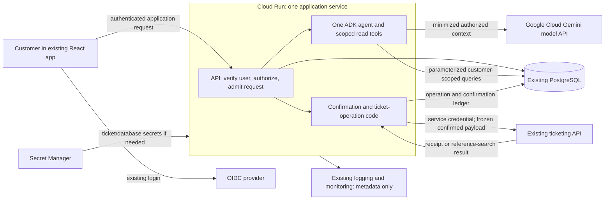

# Customer-support agent: first system design

**Status: draft — recommendations and assumptions await review.**  
**Prepared: 25 September 2026.** Public documentation was checked on this date. No application, cloud resources, credentials, provider contract or workload was inspected or tested.

## Recommendation

Add one Python service on **Cloud Run**, containing the application API, one **Google ADK agent**, and narrow tools for reading cases and preparing escalation drafts. Use **Gemini model inference on Google Cloud** separately from application hosting. Reuse the React app, OIDC login, PostgreSQL database, ticketing API and existing delivery/operations setup.

Ordinary backend code owns authentication, case access, confirmation, ticket submission and recovery. The agent interprets questions and writes explanations or draft escalation text. The model does not receive a tool that can create a ticket directly.

This keeps the pilot small while addressing its main correctness risk: a ticket may be created even when the API response is lost. **Reference search helps reconcile that situation; it does not establish that retrying creation is safe.** Until the provider contract is verified, the application will make at most one create dispatch per logical operation and retain uncertain outcomes for reconciliation. End-to-end “exactly one ticket” remains an unresolved provider guarantee.

## 1. Requirements and assumptions

### Confirmed by the user

- Customers use the agent; internal support staff are outside this interface.
- React, OIDC login and PostgreSQL case ownership/history already exist.
- Customers confirm the exact escalation request before the existing API receives it.
- The API supports creation and search by our request reference. Deduplication is unknown.
- The pilot is expected to have about 20 concurrent customers. The first useful answer should arrive within five seconds; this is unmeasured.
- Cloud costs should stay around $100/month. Two engineers already operate Cloud Run.
- The current request is for a first design with explicit assumptions, without implementation.

### Proposed assumptions, not accepted requirements

- Start with text and case history. Attachments, semantic memory, external web search, policy-document search and autonomous follow-up are outside the first release.
- For the first slice, the customer selects one case using the existing app. Broader questions can use a bounded list of the customer's cases later.
- PostgreSQL has capacity for separate conversation and operation tables, and a supported secure connection from Cloud Run. Its hosting product and region are unknown; no database migration is proposed.
- Only explicitly identified customer-visible history fields may enter model context. Case ownership alone does not make internal notes or another person's details safe to disclose. The existing visibility rule must be established before live data use.
- The cost illustration uses **incremental USD**, excluding the existing app/database baseline. Currency and whether $100 includes those existing costs are open.
- A proposed chat retention period is 30 days. Business-operation evidence needs its own approved lifetime; the retention and privacy owners must decide it before production writes.
- Twenty simultaneous active requests is the initial load-test/admission assumption. Twenty logged-in customers may generate much less work; monthly request volume is unknown.

## 2. Architecture and service choices



The browser and all model output are untrusted inputs to the application. PostgreSQL defines case ownership and approved case history; the ticketing provider defines whether a ticket exists. Neither conversation history nor a model statement overrides these authorities.

| Responsibility | Recommendation and reason | Credible alternative / revisit condition |
| --- | --- | --- |
| Application hosting | One Cloud Run service with a small custom Python API around ADK. It fits the team's existing operation model and permits explicit authentication and confirmation routes. ADK documents Cloud Run and custom application deployment. [ADK deployment](https://adk.dev/deploy/cloud-run/) | Managed Agent Runtime if its operation model later reduces actual team work. GKE adds little for this pilot's stated needs. |
| Language work | One agent using a small, supported Gemini model. Start quality/latency evaluation with a Flash-Lite candidate, compare a Flash candidate only if needed. | Deterministic case cards and a standard escalation form are a useful fallback. Multiple agents add calls without a distinct necessary responsibility here. |
| Case retrieval | Reviewed parameterized queries through bounded tools; reuse authoritative PostgreSQL. | Add governed document retrieval if a separate support knowledge base becomes a requirement. No vector database is needed for current case ownership/history lookup. |
| Conversation persistence | ADK `DatabaseSessionService` backed by separate PostgreSQL tables/schema and a restricted role, subject to compatibility verification. ADK documents PostgreSQL persistence, async drivers and event-append locking. [Sessions](https://adk.dev/sessions/session/#databasesessionservice) | Managed sessions if operating the existing database becomes the limiting factor. In-memory state does not satisfy replica/restart continuity. |
| Ticket-operation persistence | Application-owned PostgreSQL tables for frozen payloads, approvals, dispatch claims and receipts. | A durable queue becomes useful if guaranteed autonomous completion is required; queue delivery alone would still not resolve unsafe provider retries. |
| Identity and secrets | Existing OIDC for customers; a dedicated workload service account with minimal permissions for GCP access. Use managed service identity rather than a downloaded key. Store non-GCP secrets in the existing secret system or Secret Manager. [Service identity](https://docs.cloud.google.com/run/docs/securing/service-identity), [secrets](https://docs.cloud.google.com/run/docs/configuring/services/secrets) | Delegated customer OAuth only if the ticketing system requires it. It is not assumed. |
| Operations and delivery | Reuse existing CI, image registry, Cloud Logging/Monitoring and rollback workflow. Add content-free latency/cost/unknown-operation signals. | No new gateway, agent hosting service, scheduler or analytics store is justified by the known requirements. |

**Version and region gate:** no target ADK/Python/driver version was provided. Pin and verify these together before implementation, including session schema migrations, whole-turn concurrency, cancellation and event filtering. Event-append locking does not serialize an entire conversation turn. Choose Cloud Run near the current database after confirming its region and network path. Choose a model endpoint separately after confirming permitted data locations; application region alone does not determine inference, backup, telemetry or ticket-provider residency. [Model locations](https://docs.cloud.google.com/gemini-enterprise-agent-platform/resources/locations)

## 3. Contracts and authority

| Invariant or target | Trusted enforcement / authoritative evidence | Failure behavior | Planned acceptance check |
| --- | --- | --- | --- |
| A customer accesses only currently permitted cases, sessions and operations. | API verifies the existing login/session, maps verified issuer/subject to a server-owned customer ID, and scopes every query. Recheck case access before context assembly, public release and submission. | Deny without disclosing whether another customer's resource exists; no protected data reaches the model. | Two-customer fixtures; forged IDs; cross-customer session replay; ownership change between read and release. Inspect attempted model/tool calls. |
| Only approved customer-visible fields enter the model or public result. | Read adapters use an explicit field/history visibility policy before model context and ADK event persistence. | Omit disallowed records; if visibility is unknown, do not fetch raw history into the agent. | Internal-note, embedded secret and mixed-visibility fixtures, including subsequent session replay. |
| Answers identify their evidence and do not claim unsupported operational success. | Case version/read timestamp and source-entry references accompany the generated answer. Backend checks source membership; deterministic receipt status controls ticket messages. | “I couldn't verify that” or a direct case-status card. | Missing, conflicting, stale and injected source content; human-reviewed answer accuracy. Citation validation alone cannot prove every generated sentence correct. |
| Submission matches the customer's exact confirmed request. | Server stores canonical payload/version, owner, case, expiry, confirmation and hash. Confirmation route rechecks current authority and prerequisites immediately before dispatch. | Changed/stale payload or material case change requires a new preview and confirmation. | Tampered body, expired confirmation, approval from another customer, changed priority/text/case and ownership loss. |
| Duplicate confirmation cannot cause another local create dispatch for the same operation. | Unique operation/reference records and atomic PostgreSQL state transition claim one sender. Creation retries in transport/SDK layers are disabled. | Duplicate requests read existing status. Ambiguous dispatch remains unknown. | Concurrent clicks across two processes; process kill before/after dispatch; hidden client retries. Provider-side duplicate prevention remains unverified. |
| “Created” means provider success is durably recorded. | Matched provider receipt or verified lookup result stored with operation ID, request reference and ticket ID. | Show “We are checking whether the escalation was created” if the result is uncertain. | Provider commits then drops response; database receipt-write failure; recovery after restart. |
| Work respects configured allowances across replicas. | PostgreSQL admission/reservation records plus model/tool adapters enforce attempt, token, elapsed-time and estimated-cost limits. | Stop new model work honestly; keep existing operation status/reconciliation available. | Concurrent budget reservations, SDK retries, interrupted usage settlement and exhausted budgets. |
| Useful output arrives within five seconds. | An aspiration requiring measurement, not currently an enforceable guarantee. | Preserve correctness; report latency misses and use an authoritative fallback where useful. | Browser-to-visible-result measurements under cold/warm/burst conditions, including failures. |

### Identity and request lifetimes

- **Customer identity:** trusted login mapping; the browser cannot supply its own authoritative customer ID. Workload permissions do not grant business access on behalf of a customer.
- **Conversation ID:** locates an owner-scoped chat across turns and replicas. It grants no permission by itself.
- **Invocation ID:** identifies one submitted turn, its original deadline, counters and released result. Duplicate browser delivery uses that ID; an interrupted run is marked interrupted rather than silently restarted with new allowances.
- **Business-operation ID and request reference:** survive conversation deletion, browser reconnects and process crashes for the approved retention/recovery period. Customer confirmation and all later lookups refer to this operation. They are never regenerated merely because a request timed out.

The API verifies issuer, audience, signature and expiry according to the existing OIDC integration; cookie-based routes retain the app's CSRF protections. Browser CORS settings do not establish authorization. Every public application route, including any direct Cloud Run URL, performs the same checks. Google distinguishes end-user application authentication from Cloud Run IAM access. [End-user authentication](https://docs.cloud.google.com/run/docs/authenticating/end-users)

### Narrow tool and API boundaries

| Capability | Allowed input | Trusted behavior and output |
| --- | --- | --- |
| Read selected case/history | Case ID and bounded history cursor/filter | Backend injects customer scope and uses fixed queries. Return approved fields, source IDs, timestamp/version and an explicit truncation marker. No arbitrary SQL, URLs or credentials. |
| Prepare escalation | Selected case and proposed title/body/category | Validate allowed fields and sizes, load current prerequisites, freeze an owner-scoped draft. Return exactly what the customer must review. No ticket is created. |
| Confirm escalation | Operation ID, displayed version and confirmation token/action | Separate authenticated application route; verify stored payload/owner/expiry and claim the operation. Customer-editable material fields all appear in the preview; server-only routing/reference metadata is fixed and explained. No post-confirmation model rewrite. |
| Get escalation status | Operation ID | Load only an owned record; return public state and verified ticket link if available. Restricted backend reconciliation searches the fixed provider endpoint using the stored reference. |

Case/history text is data, even when it contains instructions. The model cannot extend the tool set, choose a credential or bypass confirmation.

## 4. Request, output and escalation flow

### Answering a case question

1. React sends the question, selected case and invocation ID using existing login.
2. The API authenticates, authorizes the session/case, and atomically reserves a per-session execution slot and usage allowance. Reject an overlapping turn on the same session with a retryable “previous answer still running” state.
3. Backend reads a bounded, customer-visible case snapshot; known context can be prefetched to save a model round trip. Ownership and relevant source versions are checked when replaying prior conversation material too.
4. ADK produces an answer with bounded additional reads if needed. All model transport attempts, including SDK retries, consume the same invocation allowance.
5. Buffer generated text until public-result validation completes. Verify referenced records, public field policy, current authorization and current invocation ownership. Persist the released result and then send its public representation to React.

For the pilot, use ordinary JSON or a small application event envelope for progress and the final result. Do not forward raw ADK events, tool arguments, reasoning or stack traces. A spinner is not a useful answer. A task-relevant authoritative case-status card can be shown early when it actually addresses the question; generic case details do not count toward the five-second target.

Buffering makes result validation simpler but may increase first-useful-answer latency. If measurement later justifies token streaming, review its disclosure and interruption semantics explicitly: already released text cannot be retracted. Session persistence and browser completion are separate; a persisted final result can be fetched after a disconnected response.

### Confirming an escalation

```mermaid
sequenceDiagram
    participant C as Customer / React
    participant A as Application backend
    participant P as PostgreSQL
    participant T as Ticket API
    C->>A: Request escalation draft
    A->>P: Check ownership; store frozen draft and reference
    A-->>C: Exact preview and version
    C->>A: Confirm this operation/version
    A->>P: Recheck authority; record confirmation; atomically claim dispatch
    A->>T: One create attempt with stored reference and payload
    alt Matched receipt received
        T-->>A: Ticket receipt
        A->>P: Persist created status and receipt
        A-->>C: Created, with verified ticket link
    else Outcome ambiguous
        A->>P: Retain unknown outcome
        A-->>C: Checking whether creation completed
        A->>T: Read-only lookup by same reference
    end
```

States are **draft → confirmed/dispatch claimed → created, rejected-with-no-effect, or unknown**. Record the claim before any network dispatch. A crash after that claim may mean nothing was sent or that the provider committed; recovery treats both as uncertain unless evidence distinguishes them. A timeout, expired worker lease, subsequent error or empty search result does not prove there was no ticket.

For an unknown operation:

- **One exact matching ticket:** verify reference and material fields, then persist its receipt and mark created.
- **Multiple matches or mismatched fields:** flag for operator reconciliation; do not choose silently.
- **No result:** retain unknown until the provider's search completeness/consistency contract establishes absence, or the operator verifies it with authoritative provider evidence. Do not automatically retry creation or generate a replacement reference.

The two-person team designates a pilot recovery owner. An authenticated status request may trigger a bounded read-only lookup; a metadata alert and an operator reconciliation procedure cover abandoned requests. There is no guaranteed unattended completion in this first design and no reliance on an in-process background task surviving Cloud Run termination. If automatic eventual completion becomes a requirement, add durable dispatch/reconciliation after establishing the provider replay contract.

Before enabling live submissions, verify create deduplication key scope and lifetime, changed-payload handling, reference uniqueness, lookup pagination/consistency and authoritative no-effect error responses. If the provider supplies a verified idempotency contract, permit only retries of the same operation/key/payload within that contract and the remaining allowance. Otherwise retain the conservative one-dispatch policy and its possibility of manual recovery.

## 5. Data, retention and privacy

| Data | Authority, access and freshness | Persistence / erasure proposal |
| --- | --- | --- |
| Case ownership and visible history | Existing PostgreSQL; business system writes, scoped backend reads. Re-read current ownership; answer includes snapshot timestamp/version. | Existing business retention remains authoritative. Chat deletion does not delete the case. |
| Conversation and ADK events | Customer-scoped PostgreSQL tables; only backend and restricted operators. Internal events are never a public history API. | Proposed 30-day retention; chat deletion tombstones the conversation and invalidates active invocation generations before removing content. Delayed writers must reject the tombstone. |
| Public answer | Released result for one invocation and source snapshot. | Only released results appear in browser history; interrupted drafts are not promoted to completed answers. Recheck entitlement when loading history. |
| Escalation payload, confirmation, reference, status, receipt | Backend-owned operation tables; provider receipt/lookup is authoritative for external success. | Lifetime separate from chat; retain minimal operation identity through all possible replay/recovery windows. Decide retention with the provider and privacy owner before live writes; do not discard unknown operations or deduplication evidence by applying chat TTL. |
| Usage and execution records | Backend counter/reservation transactions shared across replicas. | Persist original deadlines, attempts, retained reservations and fenced invocation ownership through recovery and billing reconciliation. No prompt text is needed. |
| Diagnostics | Restricted operational access; IDs, timings, token counts, states and deployment/config versions. | Use the team's approved logging retention. Exclude prompts, case bodies, API credentials and full provider responses from normal logs, traces and error exports. |

Minimize customer text before each relevant sink: authorized field selection before tool results enter model context/session events; existing input limits/redaction before chat persistence; public-result filtering before release; content-free telemetry before exporters. Stored ADK events may include unreleased model drafts and must remain protected accordingly. Output validation cannot retroactively protect raw content already sent to inference or persisted.

No blanket promise of “PII-free model input” is made: free text can contain personal information. Approve eligible data and inference/retention locations before live use. If a stricter screening requirement is identified, place it before the affected exposure and fail closed when it is unavailable. No additional screening service is assumed in this pilot's budget.

## 6. Capacity, latency and costs

### Provisional operating settings

These are starting points for measurement, not demonstrated capacity or user-agreed service levels:

- Request-based Cloud Run billing; minimum instances zero; initially test 1 vCPU/1 GiB, concurrency 10 per instance, maximum two instances. Keep authoritative application admission at 20 active customer requests across all replicas. Reject excess promptly with retry guidance rather than accumulating an unbounded application queue.
- One active invocation per conversation, with shared database ownership and a generation/fencing value checked before writes or release. Reclaimed/terminated invocations cannot publish late output.
- Use a small database pool and release connections before awaiting inference/network I/O. Confirm connection headroom including rollout overlap and existing application traffic before choosing the pool size.
- Proposed maximum 20 seconds per interactive invocation, measured from admission including all work and retries. The first-useful-answer goal remains five seconds. Proposed pilot metric: p95 at or below five seconds across all admitted case-answer requests, with cold requests and failures included and also reported separately. Percentile and acceptable failure rate still need agreement.
- Expected one or two model calls per answer; proposed hard cap three transport attempts including retry/repair attempts, four case-read attempts, 8,000 input tokens per model attempt and 1,000 billable output tokens per attempt. Verify the chosen model's reasoning/output-limit behavior. If these limits prevent a sound answer, stop and ask for a narrower question or show available case facts.
- No nested uncounted retries: adapters own one shared deadline/attempt budget. Allow bounded transient retries only for reads/model calls when permitted by the remaining allowance. Ticket creation uses one dispatch until replay safety is verified. Confirmation/status routes use no model calls.

Cloud Run can scale to zero; keeping minimum instances warm trades lower startup delay for idle cost. Its per-instance concurrency setting is a scheduling limit, not proof that 20 active requests meet the target. Measure actual model quotas, database latency and cold starts. [Autoscaling](https://docs.cloud.google.com/run/docs/about-instance-autoscaling), [minimum instances](https://docs.cloud.google.com/run/docs/configuring/min-instances), [concurrency](https://docs.cloud.google.com/run/docs/about-concurrency)

Record browser submission → admission → context ready → model start/end → validated useful result visible → complete result. Report p50/p95/p99, failures and total completion time. If the target misses, first reduce unnecessary context/round trips and check the model choice; compare a warm minimum instance only after pricing it. No platform or model latency guarantee is assumed.

### Illustrative monthly cost, not a forecast

The verified price example uses **Gemini 3.1 Flash-Lite global standard pricing**: $0.25 per million text input tokens and $1.50 per million output tokens, including reasoning. Non-global listed rates are $0.275/$1.65. The documented model is GA with global/US/EU endpoints; this does not establish a suitable endpoint for this application's data policy. [Model pricing](https://cloud.google.com/gemini-enterprise-agent-platform/generative-ai/pricing), [model details](https://docs.cloud.google.com/gemini-enterprise-agent-platform/models/gemini/3-1-flash-lite)

For an **illustrative 10,000 turns/month**, assume aggregate 4,000 input and 1,000 billable output tokens per turn across all rounds; count every turn as 20 seconds of active Cloud Run time at 1 vCPU/1 GiB. USD list rates for Cloud Run request-based billing in `us-central1` are $0.000024/vCPU-second, $0.0000025/GiB-second and $0.40/million requests. This intentionally takes no free-tier or concurrent-request savings. The app's actual region remains open. [Cloud Run pricing](https://cloud.google.com/run/pricing)

| Item | Illustrative monthly cost |
| --- | ---: |
| Model: 40 million input + 10 million output tokens | $25.00 |
| Cloud Run: 200,000 active seconds and 10,000 requests | $5.30 |
| Subtotal | **$30.30** |
| Same usage at 2× volume/token-time envelope | **about $60.61** |

This leaves about $39 at the larger envelope for incremental database capacity/storage, network egress, image storage/builds, secrets and telemetry. These charges are **not priced or verified**; extra status requests, evaluations and failures also consume resources. A new database, always-warm capacity, longer histories or a more expensive model can change feasibility. Twenty simultaneous users says nothing about monthly volume. If existing infrastructure must fit inside $100, this estimate is incomplete.

The bounded worst case differs from that workload example: three attempts at 8,000 input/1,000 output tokens each reserve up to **$0.0105 per turn** at these global rates. Ten thousand such turns would cost **$105 for inference alone**. The shared spend allowance must therefore reduce admitted work if usage approaches this bound; $100 does not buy an unconditional 10,000 turns.

Use the measured formula: **monthly cost = existing costs in scope + fixed/new capacity + sum of all model input/output usage × applicable rates + application/storage/network/operations charges**.

Proposed enforcement: set a configurable model-spend allowance below the overall target after reserving measured infrastructure headroom. Atomically reserve the worst permitted next-call cost in PostgreSQL before dispatch and settle actual usage afterwards; retain conservative reservations for unknown usage. Each retry consumes another permitted attempt/reservation. Stage per-user throttling and stop new model work when the allowance is exhausted; preserve non-model case access and operation recovery. Billing alerts support monitoring but do not cap spend, and an application model allowance cannot guarantee a hard all-services $100 bill. [Cloud Billing budgets](https://docs.cloud.google.com/billing/docs/how-to/budgets)

## 7. Failures and recovery

| Failure window | Customer-visible outcome | Retained state / possible external effects | Safe next action and owner |
| --- | --- | --- | --- |
| Successful answer or ticket | Answer with evidence, or verified ticket link | Released invocation result, or operation receipt | Backend returns the same result for duplicate delivery. |
| Invalid login, foreign case/session/operation | Authentication or resource-access error | Minimal audit metadata; no protected model context and no ticket | Customer signs in or uses an owned resource; backend enforces. |
| Missing history, model outage, invalid answer or output validation unavailable | Honest failure or relevant authoritative case card | Invocation failure and consumed allowance; no write | A permitted bounded retry within the same deadline; otherwise explicit later invocation. No stale prior answer is released as new. |
| Database unavailable before dispatch | Temporary failure | No durable claim means no allowed provider call | Backend fails closed. Do not bypass the ledger. |
| Browser disconnect or invocation deadline | Interrupted answer; ticket status may require checking | Session/invocation retained; a dispatched ticket may exist | Cancel owned reads/model streams and account for uncertain usage. On reconnect, fetch the same operation/result; cancellation does not undo external effects. |
| Provider commits, response or receipt persistence is lost | Checking creation status | Durable dispatch claim; provider may already hold ticket | Reference lookup/manual reconciliation on same operation; no fresh create. |
| Process crashes or two workers race | Pending/unknown or existing result | Durable invocation allowance and operation claim survive | Fenced old worker cannot publish. New process reconciles effects; session storage alone does not resume work. A stale dispatch claim is never permission to resend. |
| Ownership/prerequisites change after draft | Preview invalid; new review needed | Original draft/approval retained for audit; no call if change detected before dispatch | Backend reauthorizes. Revocation after dispatch cannot retract an already sent ticket. |
| Chat deletion races with work | Chat remains deleted | Tombstone/generation blocks late session writes; separate minimal operation record remains according to policy | Backend closes streams and rejects late writes. External ticket erasure follows provider/business retention, separately from chat deletion. |
| Traffic burst, quota or spend allowance exhausted | Busy/quota notice, with existing case/status UI available | Reservations and active-operation statuses remain | Admission owner rejects excess; operators adjust only after measuring downstream limits and budget. |
| Telemetry export fails | Normal protected operation may continue | Durable operational records remain; exporter receives no raw content | Operators restore monitoring. Loss of telemetry never switches to dumping payloads. |
| Bad release or rollback | Agent feature disabled or previous compatible revision | Cases/tickets and operation records retained | Engineer rolls back with schema compatibility; freezes new writes if needed and reconciles outstanding operations. Never replay a create because a deployment rolled back. |

Proposed pilot operations: one engineer owns deployment/recovery each operating period, with the second as backup. Set an explicit coverage/recovery-time expectation before customer release; it is currently unspecified. Alerts cover unknown ticket outcomes, persistent errors, budget thresholds and latency. Verify database backups/restore for the new tables without overwriting authoritative cases. Cleanup removes only identified pilot resources/data under agreed retention and keeps enough operation evidence for outstanding recovery.

## 8. Verification and implementation handoff

Everything below is **planned**. Documentation lookup is the only new evidence gathered; no tests, deployments or paid model calls ran.

1. **Offline deterministic checks:** two customers and mixed-visibility histories; exact-payload confirmation; source injection; duplicate submissions; admission/budget races; provider commit-then-disconnect; incomplete/multiple lookup results; no hidden create retries. Exercise the actual policy/tool/Runner integration and assert forbidden calls never occur.
2. **Local integration:** real PostgreSQL and two processes; restart during a claimed operation; stale worker fencing; session persistence and erasure; HTTP disconnect; browser confirmation/status behavior and visible useful-output timing. Use a controlled ticket-provider stub.
3. **Bounded provider checks, separately authorized:** establish the real create/search replay contract on an isolated test account before enabling production escalation. Check the selected ADK version and model endpoint with synthetic records. Suggested initial experiment ceiling: 100 representative model requests, 15 minutes and USD $2, stopping at the first limit; reprice/reserve the maximum before execution and count every call, retry and failure. This is a proposal, not authorization or adequate statistical evidence of p95 latency.
4. **Hosted pilot evidence, separately authorized:** cold/warm arrival patterns up to 20 active requests, realistic history lengths and burst admission; compare quality and end-to-end latency with the proposed budget limits. Measure long enough to estimate tail latency and request volume, reporting sample size and failures. Agree accuracy/latency release thresholds and verify recovery/rollback/retention before claiming readiness.

### Smallest useful implementation slice

An authenticated customer selects one owned case, gets an evidence-backed answer, reviews a frozen escalation preview and confirms it. The application displays either a verified ticket link or an honest recoverable unknown status.

Build the deterministic access and operation boundaries with a fake provider first. The slice is acceptable when another customer's case/history is inaccessible, draft edits invalidate approval, duplicate confirmation produces one local dispatch, commit-then-timeout reconciles after a process restart without a second create, and no result falsely claims success. Then evaluate answer quality/latency and enable real creation only under the established provider contract and accepted conservative recovery behavior.

Relevant available implementation specialists: `adk-tool-auth-and-secrets` for identity/tool boundaries, `adk-workflow-design` for the single-agent/ordinary-code split, `safe-api-tool-calls` for confirmation and ambiguous outcomes, `adk-frontend-integration` for browser completion states, `adk-operational-guardrails` for allowances, and `adk-agent-evaluation` for the acceptance cases. `deploy-adk-on-google-cloud` and `optimise-adk-on-google-cloud` apply when hosting and measured tuning are authorized. No specialist is required to review this design.

## 9. Open decisions and release gates

| Open item | Why it matters | Owner / next evidence | What it blocks |
| --- | --- | --- | --- |
| Ticket deduplication and lookup semantics | Determines safe replay and whether external at-most-one-ticket can be promised | Engineer and ticket-provider documentation/test environment | Automated retries; reliable live-write contract. Read/draft/local development can proceed. |
| Customer-visible case-history rule and login-to-customer mapping | Case ownership may coexist with staff-only notes | Product/domain owner plus existing schema/auth inspection | Live case context and access-policy completion. |
| Allowed inference/data locations and retention | App region does not cover all data sinks | Product/privacy owner and provider facts | Live customer data, chat/operation expiry settings. |
| Budget currency, included baseline and monthly volume | Determines whether the $100 goal is realistic | Product owner plus existing bills and a measured workload sample | Validated monthly forecast and actual admission allowance. |
| Five-second percentile, useful-answer definition and failure tolerance | Makes the target testable | Product owner; browser measurements | Latency commitment and final cold-start/model sizing. |
| Exact model, endpoint and ADK/driver baseline | Quality, lifecycle, output limits and persistence behavior vary | Engineer; supported versions, official docs and bounded tests | Implementation pins and production compatibility. |
| Database/network headroom and backup behavior | Existing app must remain healthy | Engineer; read-only platform/config review when supplied | Final pools/instance limits and rollout. |
| Recovery coverage, availability and restore targets | Two engineers need a workable response to uncertain tickets | Team decision and rehearsal | Support commitment for the customer pilot. |

The user has confirmed the requirements in section 1. All service settings, model choices, retention periods, metrics and limits remain proposals. This document is ready for architecture review; it is not an agreed implementation baseline or evidence of a functioning system.
