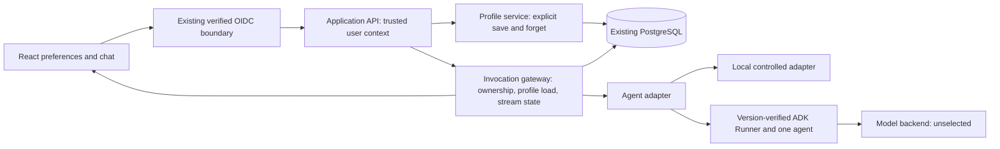

# Support assistant: saved language and streamed replies

Status: **draft**. Pilot requirements below are user-agreed; mechanisms and test boundaries are recommendations, pending implementation review. No application repository was inspected. No SDK, provider, cloud or application tests were run. This document uses the supplied brief and system-designer guidance only.

Canonical build plan: [Support assistant implementation plan](../plans/support-assistant.md).

## Purpose and agreed constraints

A signed-in user explicitly saves Spanish as their response language, leaves the application, starts a later conversation and receives replies using that preference. They can forget the preference. While an answer arrives progressively, the UI distinguishes completed text from a reply that failed or was interrupted.

The friction is repeatedly stating a preference and uncertainty about whether a partial response finished. Reducing repetition and ambiguity is the intended benefit; no baseline or improvement target has been supplied. Measure repeated preference corrections and whether users can identify interrupted responses separately from technical correctness.

**Agreed:** React, existing OIDC login, PostgreSQL, Cloud Run application hosting, Google ADK, a trusted user ID supplied by verified login, explicitly saved individual preferences, later-conversation use, forgetting and clear stream failures. Only local development and tests are authorized. This deliverable is design only: no coding now. Cloud credentials are absent and the ADK package version is unselected.

**Proposed:** application-owned profile records; ordinary code for preference writes, identity and stream state; one support agent; a thin custom streaming API compatible with the existing React UI; no new infrastructure for the pilot. The model produces support text and follows a trusted preference projection; it cannot save a preference on its own.

**Unknown:** actual modules, manifests, test conventions, local database availability, model/backend, ADK APIs, existing support tools, latency/traffic budgets and retention rules. Names below are conceptual integration points, not inspected file paths or verified SDK signatures.

The possible group-account feature is a future decision. Its uncertainty does not change individual ownership or block this pilot. Shared preference inheritance, group roles and precedence require a later design decision before implementation.

## Architecture

Cloud Run remains the agreed future host for the application API and ADK runtime. It is separate from model inference and PostgreSQL hosting. Existing PostgreSQL is the authority; this design does not require replacing it with Cloud SQL. The browser crosses a trust boundary at the authenticated API; model events cross a public-output boundary at the gateway. The workload identity is distinct from the end-user identity and cannot grant users access to one another's data.

### Decisions and rationale

| ID / status | Requirement → choice and reason | Tradeoff / credible alternative | Verification |
| --- | --- | --- | --- |
| D01 accepted constraint | Retain React, OIDC, PostgreSQL and Cloud Run. Add the behavior at their existing seams. | Do not reopen hosting selection without evidence that an agreed constraint cannot meet a requirement. | Inspect actual integration points in G01; verify Cloud Run transport later in G05. |
| D02 proposed | Exact, explicit settings → a PostgreSQL profile keyed by the verified individual user ID, with deterministic save/read/forget APIs. This supports exact lookup, replacement and erasure. | Compared with semantic memory or inferred chat preferences, this requires a preferences control but provides predictable ownership and deletion. No vector store or Memory Bank is needed. | Save, process restart, new conversation, other-user denial and forget tests. |
| D03 proposed | Apply later → load the profile for every admitted invocation and pass an ephemeral typed language setting to the agent adapter before generation. Do not treat conversation state as the profile authority. | One small database read per invocation avoids stale process caches. Existing conversation transcripts may still contain earlier language; context selection must not reinstate saved-setting authority from them. | Controlled adapter receives current setting; recording backend confirms outgoing ADK request after G02; real-model quality remains separate. |
| D04 proposed | Stream with honest outcomes → gateway-owned accepted/delta/completed/failed/interrupted schema plus durable invocation status. Only `completed` denotes an accepted answer. | More state than buffered JSON; less integration surface than adding AG-UI/CopilotKit for this limited UI. Revisit AG-UI if broader agent UI interoperability becomes a requirement. | Delayed real-socket events, disconnects, late errors and browser rendering in G03/G04. |
| D05 proposed | Identity and restart safety → backend ownership checks, per-conversation admission and monotonically fenced invocation writes in PostgreSQL. Reject overlapping turns with a visible busy result. | Rejection is simpler than a queue or concurrent conversation merge. No automatic execution recovery or stream replay is promised. | Cross-user endpoints, overlap, stale writer and restart tests. |
| D06 proposed | ADK integration → one agent behind an application adapter; investigate `LlmAgent`, `App`/`Runner`, `DatabaseSessionService` and relevant `RunConfig` controls after selecting a version. | A small adapter isolates SDK event/session contracts. Multiple agents add no distinct responsibility for this scope. | G02 records supported interfaces and evidence, then G04 exercises the real Runner path with a controlled model. |

## Data, identities and authority

| Data or operation | Authority and access | Freshness, lifecycle and erasure |
| --- | --- | --- |
| Preference | Profile service; trusted user ID is the key. The browser supplies language value and expected revision, never effective owner identity. Model/tool outputs cannot write it. | Proposed record: owner ID, nullable normalized language tag, monotonic revision, updated time. Validate supported values in ordinary code. Save and forget increment revision in a database transaction. |
| Forget marker | Profile service retains only owner key and revision needed to reject stale writes, with no language value. | Prevent an old delayed save from restoring a forgotten value using compare-and-set against the current revision. A later deliberate save fetches the current revision. An account-erasure workflow is separate from forgetting this setting. |
| Conversation | Application ownership mapping `(conversation_id, verified_user_id)`; ADK session mapping remains an adapter detail. | Load, send, cancel, status and history all require ownership checks. Persistence strategy for ADK events is version-dependent. Transcript retention is unresolved and must be set before live use. |
| Invocation | Server-generated invocation ID, linked to owner, conversation, request identity, status, deadline and fencing token. | Separate from conversation ID. Durable terminal status and completed answer are committed before a `completed` event. On restart, abandoned work becomes interrupted; never auto-reexecute it. |
| Request identity | Owner-scoped request ID binds a canonical message payload and conversation. | A repeated HTTP submit returns the original invocation/status; changed payload with the same ID is rejected. This prevents transport retries from silently generating again. A deliberate retry creates a new ID. Retention follows a documented retry window before live use. |
| Partial text | Browser preview and transient adapter buffers. | Not an accepted assistant answer. Do not inject it into future model context as a completed turn. If the selected ADK persists partial events, G02/G04 must enforce the same context-selection rule. |
| Model context and diagnostics | Gateway/adapter permits only authorized conversation content and current profile projection. | Do not persist the projection as a reusable profile fact in the transcript or log language values, tokens, raw prompts or raw ADK events by default. Use IDs, timings and safe error codes. |

Preference APIs are conceptual `GET`, `PUT`, `DELETE` on `/me/preferences/response-language`, reusing the existing login/CSRF contract as applicable. Return a saved/forgotten receipt only after the transaction commits. On a lost response, reload the current revision/value before deciding whether to repeat an operation. Ordinary local database transactions suffice; no external-write orchestration is needed for this preference.

**Forget semantics proposed for the pilot:** once forgetting is acknowledged, any newly admitted invocation reads no saved language. No profile-value cache or background writer may restore it. A generation already given the old setting may finish using it; the UI should state that forgetting applies to new replies and offer interruption of the active reply. Data already sent to a model cannot be retracted. Forgetting a setting does not delete prior messages or provider retention. If immediate cessation or deletion of historical text is required, that is a separate requirement to settle before making such a promise. This does not block the core local save/read/forget mechanics.

When no setting exists, use a configured application language policy; its exact default and supported language list remain product choices. For the first local checks, use explicitly labelled test values. Do not infer or auto-save a preference from chat. Whether a direct per-message language request overrides the saved default remains a small product decision before live behavior evaluation.

## Observable invariants

| ID / invariant | Enforcer and evidence | Failure outcome | Planned test |
| --- | --- | --- | --- |
| R01 only the signed-in owner can read/change their setting | Verified request context → profile service → owner-qualified database operation | Denied before profile/model disclosure | A/B users; spoofed owner payload; unauthenticated request; assert zero forbidden reads/writes/model calls |
| R02 save survives restart and applies to later conversations | Committed profile row; invocation loader passes current value/revision to adapter | Profile read failure is explicit; do not silently claim saved preference was applied | Save, stop/start real backend, new conversation, inspect controlled adapter input |
| R03 forget removes authoritative preference and prevents stale resurrection | Clear value + revision advance; conditional writes; no profile inference or cache | Stale write conflicts; subsequent replies use no saved setting | Race a delayed save against forget; restart; verify old value absent and new invocation has no preference |
| R04 partial output cannot be shown as complete after failure | Gateway terminal receipt + React reducer | Failed/interrupted label with retained partial preview and retry control | Deltas then error; premature EOF; terminal status lost; late provider failure |
| R05 one active attempt per conversation and no stale final write | Transactional admission and fence checked when committing final state | Busy response or interrupted old attempt | Concurrent requests and simulated worker replacement; stale completion rejected |
| R06 private runtime events never go straight to the browser | Explicit allowlisted projection from adapter to public event schema | Unrecognized/malformed event fails safely | Inject tool arguments, internal metadata and malformed events; verify no public leak |

## Successful request and stream state

1. React submits through the existing authenticated boundary. Backend derives the user ID and validates conversation ownership before reading history or a profile.
2. Gateway claims the conversation, creates/loads the owner-scoped request identity and invocation, and loads the current committed profile revision.
3. Agent adapter receives authorized context, a typed preference, invocation identity and remaining deadline. Ordinary code controls admission and persistence; the model produces text only within the established support capabilities.
4. Gateway emits `accepted` and ordered `text_delta` events with invocation ID, message ID and sequence number. React appends each sequence at most once, ignores duplicates, and marks gaps as interrupted rather than guessing missing text. Limits bound accumulated bytes/events.
5. After successful execution and required persistence, gateway commits the completed answer and terminal status, then emits `completed`. The answer becomes reusable conversation context only under that success policy.
6. Failure produces `failed` or `interrupted`, never `completed`. Transport EOF by itself is interrupted/unconfirmed delivery. React reads the owner-authorized invocation status: a durable completed answer can replace the partial preview; failed/interrupted status remains visible. If status is unavailable, show “connection interrupted; completion could not be confirmed.”

Proposed wire seam: an authenticated streaming POST using fetch with an SSE-formatted response, plus owner-authorized invocation status and cancel endpoints. This reuses existing auth rather than putting bearer tokens in URLs. This is an application contract to implement and verify, not an assertion that the chosen runtime/Cloud Run deployment already supports it. Reconnect observes status/final result; it does not replay missing deltas or restart generation in the pilot.

Cancel marks/cancels owned work and fences later commits. A remote model may continue after local cancellation; report interruption and account for possible consumed work. Browser backpressure or a size limit closes the owned stream and ends it explicitly. Define consistent typed public error codes while keeping diagnostics server-side.

## Failure and recovery

| Window | Visible outcome | Persisted state / possible effects | Permitted next action and owner |
| --- | --- | --- | --- |
| Save commits, response lost | Save is unconfirmed until reloaded | Preference may be committed | Profile service rereads owner row/revision; UI shows actual current value |
| Wrong user or conversation | Rejected, no protected content | No unauthorized state change or model call | User corrects session/login; gateway enforces all routes |
| Database read unavailable | Reply fails before model work; setting application not claimed | Existing profile remains intact | Bounded local retry within deadline; otherwise retry later |
| Model error after deltas | Partial preview labelled failed | Invocation failed; no accepted assistant reply; remote cost possible | New deliberate attempt, new invocation; gateway owns status |
| Browser disconnect, timeout or cancel | Interrupted; completion initially may be unknown to browser | Terminal record when possible; previously committed success stays success | Status lookup; cancellation closes owned tasks; no automatic resubmission |
| Process dies | Status unavailable briefly, then interrupted for abandoned invocation | Profile and durable completed answers survive; unfinished preview is not completed history | Expired-deadline reconciliation fences old worker; new user retry allowed |
| Forget races with stale save or queued invocation | Forget confirmed; stale save conflicts | Cleared value/revision; earlier in-flight model may already know old setting | Loader reads at admission; profile service enforces revision; explicit new save allowed |
| Duplicate or overlapping send | Existing invocation/status or busy result | No second accepted execution for same request; one active conversation claim | Observe status or retry after active attempt terminates |
| Stream breaks after completion commit | Preview interrupted until status lookup succeeds | Durable completed answer exists | UI retrieves owner-qualified completed result |

There are no new external business-write tools, deferred jobs, retrieval stores or generated artifacts in this request. Their replay, approval, ingestion and download machinery is therefore omitted. Existing support tools must be inspected before integrating the real agent; if they perform effects, their contracts are an explicit additional scope, not covered by this pilot's claims.

## Budgets, delivery and verification limits

No numeric SLO, workload, token allowance or pricing claim is agreed. In local tests, use finite, explicitly configured fixture deadlines and output/event bounds. The gateway owns a total request deadline including admission, profile/context access, generation and stream consumption; dependencies receive the remaining time. Avoid automatic model retries initially. G02 must inspect hidden SDK retries and call-limit behavior before selecting live bounds. Proposed per-conversation concurrency is one; global admission, database pool capacity and per-user limits require measurements before hosted use.

Measure time to first meaningful delta, full completed reply latency, failures, bytes/events, model calls and input/output tokens. Potential cost is model work plus application runtime, PostgreSQL and network costs; all provider/price/region inputs are unverified. Test fixtures establish correctness, not model quality, capacity or production cost.

Offline and local integration checks are authorized in a future coding session. Live model calls, deployment, IAM, remote migrations and hosted load tests are outside current scope. Cloud Run request/stream lifecycle, buffering, shutdown/drain behavior, database connectivity, workload identity, region and residency must be verified later on a named authorized target. Rollout must preserve profile revisions and event schema compatibility; backup/rollback and retention policy must account for erased values without restoring them into the live profile. No cloud evidence is claimed here.

## Open decisions and bounded investigations

| ID | Question / owner | Evidence or decision needed | Blocks |
| --- | --- | --- | --- |
| Q01 | ADK version and model backend — implementation maintainer | Select a version, record exact package pin and official version-matched API/event/session contracts; prove controlled Runner integration locally | Real ADK integration G04, not G01 or gateway/browser G03 |
| Q02 | Language list/default and override behavior — product owner | Choose supported values and default/explicit-message precedence | Live language-quality acceptance; core local mechanics use labelled test policy |
| Q03 | Forget semantics beyond future invocations — product/privacy owner | Confirm proposed boundary; specify broader history/provider deletion only if required | Any stronger erasure claim; does not block clearing the profile locally |
| Q04 | Shared group preferences — future product decision | Whether groups can share; if yes, ownership, role rights, precedence, withdrawal and erasure semantics | Future group feature only; **does not block the individual pilot** |
| Q05 | Existing support capabilities, retention and production bounds — maintainers | Inspect target repository; identify side-effect tools and history policy; measure workload | Extension beyond this pilot and live readiness |
| Q06 | Cloud Run/provider contracts — operations owner | Dated official evidence and later bounded hosted checks on an approved target | Hosted validation/deployment only |

Version and provider facts were deliberately not looked up in this design-only session. Candidate SDK names come from the skill's handoff reference and remain unverified for this application. Design review here establishes proposed mechanisms and tests, not implementation success.
