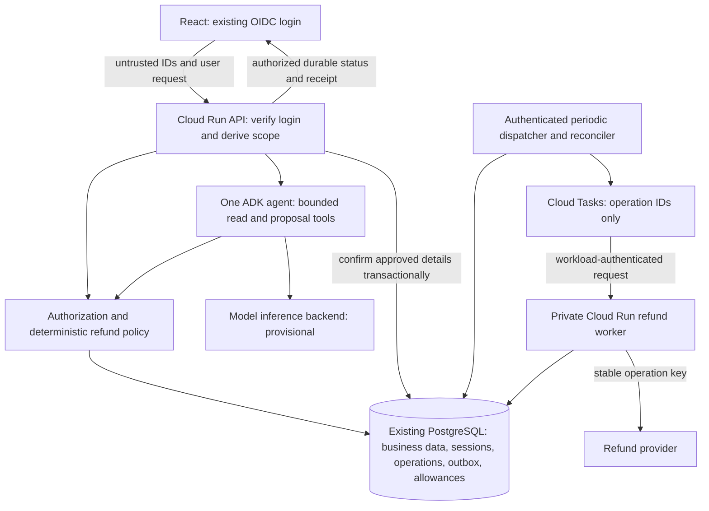

# ADK refund assistant: architecture review and revised design

**Status: draft — one-pass design; assumptions and implementation blockers remain.**  
**Review date:** 2026-09-25.  
**Scope:** design only. No application inspection, implementation, cloud changes, live tests or paid calls were performed. The supplied proposal is the evidence about the application; its claims are not verified deployment facts.

## Recommendation and consequential gaps

Keep React, the existing OIDC login and PostgreSQL. Use one bounded ADK agent for language interpretation and explanations. Put authorization, confirmation, refund execution and completion in ordinary backend code. Retain Cloud Run as the proposed application host, with a private refund worker and a durable PostgreSQL operation ledger. Give the browser an explicit refund status independent of the agent's text.

| Proposal | Consequence | Revised contract |
| --- | --- | --- |
| Browser supplies `customer_id` and `session_id` | Either identifier could name another customer's data. | Derive customer scope from verified login and current membership; check session ownership before loading it. |
| One service account for all tools | Workload privilege can exceed each tool's needs; it does not prove customer authority. | Separate refund execution from the agent/API; restrict identities and enforce business authorization on every tool call. |
| New UUID for each refund HTTP attempt; retry every timeout | A committed refund with a lost reply can be repeated as a new refund. | Persist one operation and provider replay key per confirmed business intent; ambiguous writes enter reconciliation. |
| PostgreSQL session history means safe restart | Chat history does not say which external writes committed or how to resume them. | Separate session history, invocation records, durable business operations and recovery ownership. |
| Receipt written by a coroutine after browser response | Success can be shown before durable evidence exists; process death loses work. | Persist the receipt and terminal operation state before exposing success; durably schedule recovery. |
| Any final-response event means success | Agent completion, tool errors, partial streams and business completion are different facts. | A backend public-result adapter emits success only from the verified operation record. |
| $100 monthly billing alert caps spend | The alert itself does not stop work. | Keep the alert; add durable application admission and work limits. Do not promise a $100 total bill. |
| Two workers with in-memory per-user locks | Separate processes can enter simultaneously; capacity is unproven. | Use database concurrency controls and measured admission limits. |
| Immediate preference deletion while retries remain queued | Old work can recreate or disclose deleted preferences. | Delete values, advance a durable deletion generation, and reject stale reads, writes and result release. |

## Purpose, fixed constraints and assumptions

**Journey:** a signed-in customer asks about their own payment, receives an eligible refund proposal, explicitly confirms its material details, and can later see either a durable receipt or an honest pending/uncertain result. Another customer's records must never enter their response or model context. One confirmation must not produce duplicate refunds.

**User decisions to preserve:** React, existing OIDC login, PostgreSQL; immediate deletion of stored preferences on request; no coding or deployment; no unsupported cost or latency guarantees. No new architecture recommendation below is presented as user-approved.

**Labelled assumptions:**

1. A remote payment/refund provider performs the financial effect. Its API, replay-key rules, lookup facilities, settlement states and retention windows are unknown. Safe automatic recovery depends on those facts.
2. PostgreSQL remains the authoritative application store for customer membership, payment/refund eligibility and operation records, or references the existing authoritative business service. Payment settlement evidence ultimately comes from the provider. No migration to a new database service is proposed.
3. Existing OIDC gives a verifiable stable subject. The backend can map that subject to current customer membership. Account sharing, administrators and delegated access are not specified; default access is the customer's own records only.
4. Explicit confirmation binds payment, amount in integer minor units, currency, destination, operation ID and material policy version. Confirmation is not permission; the backend rechecks authority and eligibility before execution.
5. Customers can receive an accepted/pending result and poll for completion. No completion-time target or queue-wait tolerance was supplied.
6. The supplied 30 requests/second and eight-second mean are estimates, not load-test evidence. The share of requests that make refunds, burst duration and token distributions are unknown.
7. Preferences are optional exact profile settings. No semantic memory, RAG, analytics agent or artifact store is needed for the described journey.
8. “Delete immediately” is preserved as a requirement. Its coverage of backups, existing transcripts and remote provider copies is unresolved; immediate physical erasure of every copy is not claimed by this draft.

## Architecture and responsibilities

The public boundary is the API. The private worker's workload authentication proves which service called it; the stored operation's principal and current business rules establish whose refund it may execute. Model content, browser IDs and task payloads cannot select credentials or expand authority.

| Decision | Recommendation and reason | Credible alternative / revisit condition |
| --- | --- | --- |
| Orchestration | One agent interprets requests; deterministic code owns calculations, policy and effects. Read/proposal tools do not issue refunds. | A form-only flow removes the model entirely if language assistance proves unnecessary. More agents require a distinct responsibility and measured benefit. |
| Hosting | Keep the proposed Cloud Run API and add a separately privileged worker. Existing React/OIDC integration remains. | Managed Agent Runtime could reduce runtime operations but must demonstrate compatibility and a useful benefit. GKE adds cluster responsibilities without an identified need. |
| Inference | Provisionally select a supported model/backend after quality, data-policy and cost comparison. It is separate from Cloud Run hosting. | Change provider/model when measured quality, regional availability or policy requires it. No model pin is invented here. |
| Sessions | Use a PostgreSQL-compatible ADK session backend with ownership checks, separate schema/roles and a verified version migration path. | A custom adapter is justified only if required tenancy/concurrency semantics cannot be met by the supported backend. |
| Durable work | Transactional operation/outbox in PostgreSQL; periodic authenticated dispatch to Cloud Tasks; private worker processes the operation. Reconciliation scans the ledger independently of queue health. | Synchronous execution is simpler, but still needs the ledger and recovery. It is suitable only if the eventual response/recovery contract remains acceptable. |
| Concurrency | Serialize or reject overlapping turns per session using shared database ownership/version checks; guard refunds by operation and payment-level balance reservation. | Optimistic concurrent conversation merging requires an explicit conflict policy; it is unnecessary initially. |
| Preferences | Deterministic profile, explicit deletion, generation checks; minimize propagation. | Semantic memory creates additional retrieval and erasure contracts without a stated need. |

Cloud Tasks can deliver duplicates and does not supply ordered execution. Its queue identity or task name is not the refund's business deduplication boundary. The worker must load the authoritative operation and enforce its state machine on every delivery. [Cloud Tasks limitations](https://docs.cloud.google.com/tasks/docs/common-pitfalls). Workload ID-token authentication is available for Cloud Run HTTP targets; exact service accounts, audience and invocation permissions need verification for the chosen project. [HTTP target authentication](https://docs.cloud.google.com/tasks/docs/creating-http-target-tasks).

The periodic dispatcher is a proposed authenticated scheduled HTTP trigger, such as Cloud Scheduler, with its own narrowly scoped workload identity. It claims outbox records, publishes operation IDs and marks delivery. A crash after publish can cause duplicate delivery, which is safe at the operation boundary. The scanner also finds overdue dispatched/unknown operations and missing receipts. Trigger configuration and retry limits remain a deployment verification task.

## Critical invariants and enforcement

| Invariant | Trusted owner and authoritative evidence | Failure outcome | Planned boundary test |
| --- | --- | --- | --- |
| A customer sees only authorized records, including sessions and refund status. | API verifies OIDC issuer/audience/signature/expiry, maps stable subject to current membership, and applies scope to every query. Tools recheck scope from trusted context. Database policies/restricted roles provide additional containment. | Reject before protected reads or model exposure; resource responses do not reveal another customer's existence. | Substitute customer, session, payment and operation IDs; revoke membership; verify no forbidden DB rows, model inputs or public events. |
| One confirmation cannot produce duplicate refunds. | Backend confirmation binding; unique logical-intent/operation record; immutable payload hash; stable provider key; verified provider replay contract. | Reuse existing status; reject conflicting payload; hold unknown outcome for reconciliation. | Duplicate clicks, concurrent delivery, crash before/after send, lost response, expired provider key and altered amount. Count provider effects. |
| Multiple distinct refunds cannot exceed the remaining refundable amount. | Authoritative payment balance plus transactional reservations and provider rules. | Reject or queue conflicting requests; do not release an uncertain reservation as though no effect occurred. | Two different operations target the same payment concurrently and after a prior uncertain outcome. |
| Success means a durable, authorized receipt representing the promised provider state. | Worker verifies provider outcome and commits receipt plus terminal operation state together; API reads that record. | Pending/unknown/failed state, never fabricated success. | Kill after provider commit and before DB commit; disconnect stream; final ADK text without receipt. |
| Deleted preferences cannot be restored by stale work. | Profile service atomically erases covered values and increments a durable generation; every writer, retry and release path checks generation in the same transaction as a write. | Stale work is rejected or recomputed without the values. Full deletion acknowledgement waits for the required copy inventory to be covered. | Race deletion with queued writes, cached reads, result release and restore; assert value absence and stale-write rejection. |
| Restart does not reset work limits or deadlines. | Durable invocation/operation allowance records, reservations and original deadlines. | Reject new work, degrade optional model use, retain reconciliation state. | Restart mid-attempt and concurrently reserve the last allowance from two workers. |

The duplicate-refund guarantee is **conditional on provider evidence**. A local unique key alone cannot atomically cover a remote write. If the provider cannot replay safely or conclusively identify the earlier outcome, allow only one dispatch and preserve uncertainty for manual reconciliation; do not automatically resend. This protects against duplicate dispatch at the cost of possibly uncompleted refunds. Automatic successful completion cannot be promised in that fallback.

## Identity, state and tool contracts

| Record or identity | Authority / lifecycle | Access and deletion |
| --- | --- | --- |
| OIDC subject and customer membership | Trusted login verification plus current membership; never inferred from prompt or browser `customer_id`. | Server-side mapping, rechecked for reads and before new effects. |
| Session ID | Conversation locator scoped to application and authenticated owner; survives turns. | Authorized session service only. Session history is not an operation journal. |
| Invocation ID | A particular agent run with its own public stream, policy versions, allowances and deadline. | Public events bind to the current invocation; retries cannot release a prior invocation's result as new success. |
| Operation ID | One confirmed refund intent across clicks, invocations, workers and transport attempts. | Durable unique mapping to the confirmation/intent; immutable canonical payload and provider key. Retain through the complete recovery/replay horizon. |
| HTTP attempt ID | One transport attempt for diagnostics. | New attempt IDs are permitted, but cannot replace the operation ID or provider replay key. |
| Receipt and operation ledger | Provider reference/status plus payment, amount, confirmation and current outcome. | Minimal financial data; retention policy separate from optional preferences. Do not erase replay protection when preferences are deleted. |
| Exact preferences and deletion generation | Deterministic profile; fresh authorized reads. | Keep values out of queue payloads and telemetry. Retain a non-content generation/tombstone sufficient to reject old writes. |
| Workload identity / provider credentials | API and worker have separate privileges; worker alone can access refund credentials. | Select credentials in trusted code. No credentials in model arguments, chat, task payload or logs. |

Read/proposal tools accept strictly validated resource selectors and bounded query parameters; scope is injected by the backend. They return only permitted fields. The confirmation endpoint loads a server-created immutable proposal and validates that confirmation covers its exact details. The private worker accepts an operation locator, not a caller-selected amount, customer or credential. It reloads all executable details and current preconditions from authoritative records.

Sharing a service account is not intrinsically proof of cross-customer access, but the proposed arrangement provides no stated least-privilege boundary. Splitting identities reduces the blast radius; deterministic per-customer authorization remains necessary even after that split. No delegated third-party OAuth use is assumed.

## Successful request and refund state machine

1. API verifies the existing login, resolves current customer scope and authorizes the session before loading history. It reserves invocation work allowance and records an original deadline.
2. Agent uses scoped read tools to interpret the request. Deterministic policy calculates eligibility and constructs a typed proposal. React displays authoritative confirmation details; model prose cannot silently change them.
3. On confirmation, a transaction atomically creates or loads the same logical operation, binds confirmation and payload hash, reserves refundable balance and writes its outbox record. Duplicate confirmation returns that operation. A changed payload is rejected and needs a new explicit confirmation.
4. API may return **accepted**, carrying an authorized operation locator. This response promises durable acceptance, not refund completion. If the confirmation response is lost, the same confirmation/intent identity retrieves the existing operation.
5. A worker claims the operation with database concurrency control. Immediately before first dispatch it rechecks current entitlement, confirmation freshness, payment eligibility and remaining allowance. It persists `dispatching` and the stable provider key before making the write.
6. Provider call uses exactly the stored canonical payload and key. The worker verifies response semantics. An accepted provider request may remain `pending` until the provider's required final state is observed; provider HTTP success alone does not define settlement.
7. In one transaction the worker persists the verified receipt, resolves the balance reservation and marks `succeeded`. Only then can React show refund success. The worker acknowledges durable processing to the queue; it does not leave receipt persistence to an unowned coroutine.

Conceptual states: `awaiting_confirmation → accepted → dispatching → pending | succeeded | failed_known | unknown`; unknown work moves to reconciliation and only then to a supported terminal state. State transitions require matching operation version/ownership. A terminal rejection on a later attempt cannot prove an earlier write failed.

Timeout, cancellation, socket loss and worker lease expiry after dispatch all permit a previous effect. An expired lease is permission to investigate, not proof that the old provider call stopped. Reconciliation first uses authoritative provider status lookup; safe replay uses the same key only within verified key scope and retention. Keep the local record longer than all allowed replay/recovery paths. Stop automated replay before provider deduplication expires. If lookup is inconclusive, a designated refund operations owner reconciles the provider ledger; no new key is generated to escape uncertainty.

Retry ownership is explicit: the operation coordinator decides whether another provider attempt is safe. SDK automatic write retries are disabled unless proven to preserve the key and counted in the same allowance. Queue redelivery merely revisits the state machine. Validation/authorization failures are not retried. Reads may retry transient errors with bounded backoff inside their deadline. No layer treats every timeout as permission to repeat a write.

## Public output and preference erasure

React consumes a small application-owned event/status contract: `working`, `needs_confirmation`, `accepted`, `pending`, `succeeded`, `failed`, `unknown`. Include invocation/operation identity and monotonically ordered status versions. Reconnect fetches authorized durable state; duplicate or old events cannot regress it.

Buffer model-generated customer-specific prose until its invocation completes, required release checks pass and the current preference/access generation is rechecked. Progress messages can be deterministic. Do not forward raw ADK events, internal tool arguments, diagnostics or credentials. If partial prose is later introduced, label it provisional and accept that already disclosed text cannot be recalled.

ADK's final-response helper identifies displayable agent output; it is not evidence of a committed refund. The public adapter also needs the intended author/invocation, a successfully completed application run, validated public content, and the independent operation status. [ADK events](https://adk.dev/events/).

For deletion, the profile transaction removes values and advances generation. Queued tasks carry locators/generations rather than preference snapshots. Every producer and consumer checks generation, including old deployments, delayed retries, caches and session writes. Re-created preferences require a new explicit user update under the current generation. In-flight results derived from an old generation are discarded before release. This cannot retract data already sent to an external model or browser.

Before claiming immediate deletion, inventory existing preferences in transcripts, session state, replicas, caches, task bodies, logs, backups, exports and model-provider storage. Either synchronously erase each covered copy before acknowledgement or resolve the upstream policy explicitly. A backup restore must reapply deletion tombstones before serving data, but that is not immediate physical erasure of the backup itself. If policy requires that too, compatible storage/cryptographic erasure and provider guarantees are blocking decisions. Do not redefine the requirement as eventual cleanup. Preference deletion does not silently delete the minimal refund evidence needed to prevent duplicates; any conflict requires an explicit retention decision.

Minimize sensitive content at ingress and before model requests, storage and public release. Log identifiers/status/timing without raw prompts, tokens or financial details. If a required screening/protection check is configured and unavailable, withhold the affected input/output and fail honestly. A screen applied after disclosure cannot undo it. No screening product is added without a stated data-policy need.

## Capacity, latency and spending

**Conditional sizing arithmetic:** at a stable 30 requests/second with mean time in flight of eight seconds, mean concurrent work is approximately `30 × 8 = 240`. This is Little's-law arithmetic, not a latency guarantee or sufficient capacity plan. If eight seconds excludes queueing or receipt completion, it measures a narrower boundary. Two processes would need roughly 120 overlapping requests each just to match that average. Two workers limited to one request each would supply only about 0.25 requests/second under the same service-time assumption. Actual asynchronous capacity depends on CPU, connections, model quotas and downstream service limits.

For sensitivity only, means of four/eight/sixteen seconds at the same arrival rate imply 120/240/480 mean in-flight requests. Tail latencies, bursts, hot customers, retries and DB contention need measurement. Per-user in-memory locks provide neither cross-worker exclusion nor capacity.

Cloud Run scales using CPU and request-concurrency signals; explicit instance and concurrency settings still need measurement against database connection capacity and downstream quotas. No autoscaling configuration is assumed to solve those bottlenecks. [Cloud Run autoscaling](https://docs.cloud.google.com/run/docs/about-instance-autoscaling).

Admission limits should exist at global, customer and invocation levels. Reserve allowance atomically before scheduling work; count model calls, tokens, tool attempts, hidden SDK retries, queue dispatch work, screening and recovery. Store remaining allowance and original deadline durably. Limit session overlap, queue depth/age and active provider calls; use bounded waiting followed by an explicit busy response when capacity is exhausted. Reject new effects after their execution deadline, while allowing a separately accounted recovery path to discover earlier effects.

Keep the $100 alert as an observation. Alerts-only budgets do not cap usage or spending, and the current documentation distinguishes them from newer spend-cap facilities. No such facility is assumed configured or comprehensive here. [Cloud Billing budgets](https://docs.cloud.google.com/billing/docs/how-to/budgets).

Application policy should use configurable spend/work reservations, conservative request bounds, optional-feature degradation, and a stop-admitting threshold with headroom for in-flight work. Preserve a separate reconciliation allowance so a shutdown does not strand unknown refunds. Actual billing also includes idle capacity, storage, network and costs outside request accounting; these controls do not establish a hard total bill.

Until model, region, currency and traffic distribution are known, use the symbolic estimate:

`monthly cost = fixed/minimum infrastructure + persistent storage/network + sum(all model input/output work + all tool/API attempts + queue/compute work + screening + recovery/evaluation work)`.

Expected request counts and enforced maximum work must be recorded separately. No price, monthly forecast, latency percentile or availability SLO is claimed. Measure first meaningful content and complete correct outcome from the browser, including queueing, streaming consumption, cold starts and failures. Prices and quotas must be checked for the selected model, region and billing account before a forecast is used.

## Failure and recovery review

| Failure window | User-visible result | Durable state / possible external effect | Safe next action and owner |
| --- | --- | --- | --- |
| Invalid login or another customer's ID | Rejection without protected content. | Sanitized denial signal; no protected model context or refund. | API owner fixes identity/policy failure; authenticated caller may submit an authorized request. |
| Model unavailable, malformed proposal or later agent failure | Honest failure; no refund success. | Invocation status and consumed allowance; no effect unless a separately confirmed operation already exists. | Bounded read/model retry within original allowance; never replay an already accepted refund through a new intent. |
| Database unavailable before acceptance commits | Unavailable; no acceptance claim. | Transaction did not establish a usable operation; commit outcome may itself need lookup. | Reload by stable confirmation identity before retrying creation. API owns recovery. |
| Commit succeeds but response is lost | Browser uncertain about acceptance. | Existing operation/outbox and reservation; worker might already act. | Fetch/retry with the same confirmation identity; API returns existing status. |
| Queue publish/ack fails or duplicate task arrives | Accepted/pending. | Outbox and operation survive; duplicate dispatch possible. | Dispatcher retries publication; worker loads operation and enforces provider replay rules. |
| Provider commits; reply or receipt transaction is lost | Pending/unknown, never known failure. | `dispatching`/unknown record with stable key; refund may exist remotely. | Reconciler performs verified lookup/safe replay; manual owner if inconclusive. |
| Browser disconnects or invocation deadline expires | Disconnected/incomplete; status available after reconnect. | Conversation work closes; accepted operation survives and may already have an effect. | Close owned streams; cancel dispensable model work. Worker/reconciler retains responsibility for the refund. |
| Process restart or overlapping workers | Pending until durable outcome. | Shared ledger, allowances, confirmation and outbox survive; earlier remote request may still run. | Database claims/versions prevent local conflicts; provider key protects overlapping uncertain requests. Lease expiry alone never authorizes unsafe replay. |
| Entitlement or eligibility revoked while queued | Rejected before new effect; or pending/unknown for an earlier dispatch. | Record decision and retain evidence of possible prior effect. | Worker rechecks before dispatch. Reconciler may inspect prior effect under restricted service authority without issuing a fresh refund. |
| Preference deletion races with old work | Deletion confirmation only for covered scope; old derived result withheld. | New deletion generation and minimal tombstone; previous external exposure may already exist. | Profile owner rejects stale writes/releases; deletion owner handles uncovered copies and blocks an unsupported all-copy claim. |
| Protection or telemetry dependency fails | Required protected content withheld; optional diagnostics may be dropped. | Sanitized failure and operation state retained. | Do not bypass required checks or send raw content to an alternate sink; operations owner repairs dependency. |
| Burst, exhausted allowance or downstream throttling | Busy/rejected before acceptance, or accepted/pending if already durable. | Original limits and deadlines persist; reservations prevent parallel overspend of application allowance. | Admission owner sheds new work; recovery owner continues bounded status reconciliation. |
| Rollback or old worker redelivery | Status remains truthful across versions. | Ledger and erasure generations remain authoritative. | Use compatible schemas/state versions; pause new dispatch if needed, keep reconciliation. Do not drop ledger/tombstones during rollback. |

Cloud Run instance-based CPU allocation can permit work after a response, but instances can still be terminated. This is why post-response receipt persistence needs durable ownership regardless of the selected billing setting. [Cloud Run background execution](https://docs.cloud.google.com/run/docs/configuring/billing-settings).

No deployment or cleanup is authorized by this document. A future rollout needs compatible schema changes, staged traffic, operation-age alerts and a tested rollback. Cleanup must identify owned queue/tasks, services and data; removing compute does not remove receipts, sessions or provider effects, and unrelated resources remain outside scope.

## Evidence, verification and handoff

Current official documentation was checked on **2026-09-25** for the general service claims linked above. Target region, Python/ADK version, model/API version, provider and deployed configuration were not supplied. These sources are not evidence that this application's configuration satisfies the design.

The current ADK documentation describes relational persistence through `DatabaseSessionService`, database-level locking for supported relational backends and version-specific session schema migrations. Verify the actual pinned Python ADK version, async driver, deployed entrypoint and migrations before selecting its exact interface. Event append locking alone does not establish whole-invocation serialization or refund recovery. [ADK sessions](https://adk.dev/sessions/session/).

**Planned checks, none executed:**

- **Offline:** real authorization/tool/Runner paths with controlled provider replies; allowed and denied customers; forged IDs; altered confirmation; duplicate logical intents; two refunds racing for one balance; lost provider reply; ambiguous cancellation; nested retry accounting; stale preference generation; final agent text without durable receipt. Assert attempted calls and absence of forbidden effects, not just answer wording.
- **Local integration:** PostgreSQL transactions under two real worker processes; crash/restart at every dispatch/receipt boundary; outbox publish duplication; process replacement after lease expiry; real socket disconnects and React reconnect/status ordering; concurrent deletion and late writers. Exercise the same policy path for permitted and denied cases.
- **Provider contract verification:** obtain written replay-key scope/retention/payload-conflict rules, lookup semantics, settlement definition and timeout behavior. Only after separate authorization, run bounded checks on an isolated provider sandbox; do not use a real-money refund for initial validation.
- **Hosted validation:** after separately authorized deployment, choose explicit request/time/cost ceilings and measure sustained/burst demand, cold/warm latency, DB pools, model quotas, complete browser outcomes and recovery age. No numerical experiment budget is invented as user approval.

**Smallest useful implementation slice, if later requested:** one customer's single-payment refund journey through existing React/OIDC, one scoped read/proposal path, explicit confirmation, PostgreSQL operation/outbox, controlled fake provider, durable receipt and reconnectable status. Acceptance requires a correct permitted receipt, denied cross-customer access, one effect after duplicate confirmation/delivery, truthful unknown status after lost provider reply, and no resurrection after a preference deletion race. Add live provider dispatch only after its replay/reconciliation contract is established.

Relevant implementation specialists are `adk-tool-auth-and-secrets`, `safe-api-tool-calls`, `adk-frontend-integration`, `adk-operational-guardrails` and `adk-agent-evaluation`; `adk-workflow-design` can verify Runner ownership, and `deploy-adk-on-google-cloud` / `optimise-adk-on-google-cloud` apply only to later authorized hosting and measurement. The optional `adk-engineer` entry skill can coordinate that work. No implementation begins from this handoff alone.

## Open decisions and blockers

| Decision/evidence needed | Owner | Impact / blocked step |
| --- | --- | --- |
| Provider replay retention, scope, lookup, settlement and concurrency semantics | Refund integration owner and provider documentation | Blocks automatic retry/reconciliation guarantees and live refund dispatch. Conservative unknown/manual recovery remains available. |
| Mapping OIDC subject to current customer/role membership; exact refund policy and confirmation validity | Identity and business owners | Blocks production authorization and executable refund eligibility. |
| Exact meaning and coverage of immediate deletion, including existing transcripts, backups and model storage | Data-policy owner and storage/provider evidence | Blocks claiming immediate erasure of every stored copy; stale-writer protection can be designed independently. |
| Refund ledger/tombstone retention and deletion-policy compatibility | Business/data-policy owners | Blocks destructive retention changes and replay-horizon promises. |
| Python/ADK pins, schema state, serving adapter and DB compatibility | Application owner | Blocks exact session integration choices and migration plan. No dependency change is proposed. |
| Model, region, data residency and network access to existing PostgreSQL | Platform/application owners | Blocks final inference/hosting configuration and price/availability verification. |
| Monthly volume, burst duration, refund proportion, latency objectives, error tolerance and actual $100 budget scope | Product/operations owners and measurements | Blocks validated capacity, cost forecast and any quantitative guarantee. |
| Named on-call owner and reconciliation escalation/age objective | Refund operations owner | Blocks operational readiness for unresolved effects. |

This review provides a complete draft decision structure and planned evidence. It does not establish implementation correctness, successful tests, an agreed architecture, or cost/latency guarantees.
